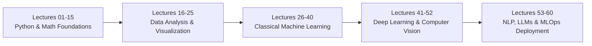

# 🧠 AI & Machine Learning Masterclass

[](https://www.python.org/)
[](https://jupyter.org/)
[](https://matplotlib.org/)
[](https://seaborn.pydata.org/)
[](#)
[](#)

A comprehensive, organized, and production-grade knowledge repository covering the complete **Artificial Intelligence & Machine Learning Journey (Lectures 1 to 60)**.

Each lecture module contains:
- 📝 **Structured Markdown Notes (`notes.md`)**: In-depth theoretical concepts, mathematical formulas, syntax breakdowns, and best practices.
- 📕 **High-Definition PDFs (`notes.pdf`)**: Formatted documents with rendered KaTeX formulas, tables, and Mermaid architecture diagrams for offline study.
- 💻 **Hands-On Jupyter Notebooks (`.ipynb`)**: Clean, reproducible, self-contained Python implementations with production-ready code examples.
- 📊 **Original Visuals & Diagrams**: High-clarity, code-generated diagrams and visual reference sheets.

---

## 📂 Repository Architecture

```plaintext
AI-ML/
├── .gitignore
├── README.md
├── lecture_1/ ... lecture_17/    # (Foundations, Python & Numerical Computing)
├── lecture_18/                   # Data Visualization (Part 1 - Matplotlib Fundamentals)
│   ├── Notes_18.1/ to 18.18/     # Sub-topics with notes.md, notes.pdf, .ipynb
│   └── reference_materials/      # Cheatsheets & references
├── lecture_19/                   # Data Visualization (Part 2 - Advanced Matplotlib & Seaborn)
│   ├── Notes_19.1/ to 19.16/     # Sub-topics with notes.md, notes.pdf, .ipynb, diagrams
│   └── reference_materials/      # Cheatsheets, slide notes & sample notebooks
└── lecture_20/ ... lecture_60/   # (Machine Learning, Deep Learning, NLP & Deployment)
```

---

## 📊 Detailed Module Breakdown

### 🎨 Day 18: Data Visualization (Part 1 — Matplotlib Mastery)
Focuses on data visualization theory, the anatomy of plots, and core 2D plotting with **Matplotlib**.

| Lecture | Topic Title | Core Concepts | Quick Links |
| :--- | :--- | :--- | :--- |
| **18.1** | What is Data Visualization? | Visual perception, exploratory vs explanatory, Anscombe's Quartet | [Notes](lecture_18/Notes_18.1/notes.md) \| [PDF](lecture_18/Notes_18.1/notes.pdf) \| [Notebook](lecture_18/Notes_18.1/lecture_18_1.ipynb) |
| **18.2** | How to Plot Data - Basic Structure | Coordinate systems, Data Prep $\to$ Canvas $\to$ Plot $\to$ Decoration $\to$ Render | [Notes](lecture_18/Notes_18.2/notes.md) \| [PDF](lecture_18/Notes_18.2/notes.pdf) \| [Notebook](lecture_18/Notes_18.2/lecture_18_2.ipynb) |
| **18.3** | Introduction to Matplotlib | Matplotlib history, architecture (`backend`, `artist`, `scripting`), Pyplot interface | [Notes](lecture_18/Notes_18.3/notes.md) \| [PDF](lecture_18/Notes_18.3/notes.pdf) \| [Notebook](lecture_18/Notes_18.3/lecture_18_3.ipynb) |
| **18.4** | Important Plot Methods | `plt.plot()`, `plt.title()`, `plt.xlabel()`, `plt.ylabel()`, `plt.grid()`, `plt.show()` | [Notes](lecture_18/Notes_18.4/notes.md) \| [PDF](lecture_18/Notes_18.4/notes.pdf) \| [Notebook](lecture_18/Notes_18.4/lecture_18_4.ipynb) |
| **18.5** | Multiple Datasets on Line Plot | Multi-series plotting, legends (`plt.legend`), color differentiation, z-order | [Notes](lecture_18/Notes_18.5/notes.md) \| [PDF](lecture_18/Notes_18.5/notes.pdf) \| [Notebook](lecture_18/Notes_18.5/lecture_18_5.ipynb) |
| **18.6** | Format Strings (`fmt`) | Fast syntax `[marker][line][color]`, e.g., `'ro--'`, `'b^:'`, hex colors | [Notes](lecture_18/Notes_18.6/notes.md) \| [PDF](lecture_18/Notes_18.6/notes.pdf) \| [Notebook](lecture_18/Notes_18.6/lecture_18_6.ipynb) |
| **18.7** | Styling & Saving Plots | Figure sizing (`figsize`), DPI scaling, `plt.savefig()` (PNG, SVG, PDF), styling themes | [Notes](lecture_18/Notes_18.7/notes.md) \| [PDF](lecture_18/Notes_18.7/notes.pdf) \| [Notebook](lecture_18/Notes_18.7/lecture_18_7.ipynb) |
| **18.8** | Chart Selection Taxonomy | Choosing the right chart: Comparison, Distribution, Composition, Relationship | [Notes](lecture_18/Notes_18.8/notes.md) \| [PDF](lecture_18/Notes_18.8/notes.pdf) \| [Notebook](lecture_18/Notes_18.8/lecture_18_8.ipynb) |
| **18.9** | Vertical Bar Charts (`plt.bar`) | Categorical discrete comparison, bar width, alignment, edge styling | [Notes](lecture_18/Notes_18.9/notes.md) \| [PDF](lecture_18/Notes_18.9/notes.pdf) \| [Notebook](lecture_18/Notes_18.9/lecture_18_9.ipynb) |
| **18.10** | Adding Labels to Bars | Direct data labels via `plt.text()` & `ax.bar_label()` container iteration | [Notes](lecture_18/Notes_18.10/notes.md) \| [PDF](lecture_18/Notes_18.10/notes.pdf) \| [Notebook](lecture_18/Notes_18.10/lecture_18_10.ipynb) |
| **18.11** | Grouped Bar Charts | Offset indexing with NumPy `np.arange()`, width offset calculations | [Notes](lecture_18/Notes_18.11/notes.md) \| [PDF](lecture_18/Notes_18.11/notes.pdf) \| [Notebook](lecture_18/Notes_18.11/lecture_18_11.ipynb) |
| **18.12** | Horizontal Bar Charts (`plt.barh`) | Long categorical labels, ranking, inverted axis sorting | [Notes](lecture_18/Notes_18.12/notes.md) \| [PDF](lecture_18/Notes_18.12/notes.pdf) \| [Notebook](lecture_18/Notes_18.12/lecture_18_12.ipynb) |
| **18.13** | Scatter Plots (`plt.scatter`) | Bivariate relationships, correlation, scatter vs line performance | [Notes](lecture_18/Notes_18.13/notes.md) \| [PDF](lecture_18/Notes_18.13/notes.pdf) \| [Notebook](lecture_18/Notes_18.13/lecture_18_13.ipynb) |
| **18.14** | Advanced Scatter Customizations | 4D visual encoding: Marker size (`s`), color mapping (`c`, `cmap`), alpha transparency | [Notes](lecture_18/Notes_18.14/notes.md) \| [PDF](lecture_18/Notes_18.14/notes.pdf) \| [Notebook](lecture_18/Notes_18.14/lecture_18_14.ipynb) |
| **18.15** | Annotations on Scatter Plots | Point labeling via `plt.annotate()`, bounding boxes, arrows (`arrowprops`) | [Notes](lecture_18/Notes_18.15/notes.md) \| [PDF](lecture_18/Notes_18.15/notes.pdf) \| [Notebook](lecture_18/Notes_18.15/lecture_18_15.ipynb) |
| **18.16** | Multiple Datasets on Scatter Plots | Multi-class scatter plots, category-wise legend separation | [Notes](lecture_18/Notes_18.16/notes.md) \| [PDF](lecture_18/Notes_18.16/notes.pdf) \| [Notebook](lecture_18/Notes_18.16/lecture_18_16.ipynb) |
| **18.17** | Pie Charts (`plt.pie`) | Composition plotting, `autopct`, `startangle`, shadow, limitations | [Notes](lecture_18/Notes_18.17/notes.md) \| [PDF](lecture_18/Notes_18.17/notes.pdf) \| [Notebook](lecture_18/Notes_18.17/lecture_18_17.ipynb) |
| **18.18** | Advanced Pie Charts | Donut charts (center circle wedge), `explode` slices, custom palettes | [Notes](lecture_18/Notes_18.18/notes.md) \| [PDF](lecture_18/Notes_18.18/notes.pdf) \| [Notebook](lecture_18/Notes_18.18/lecture_18_18.ipynb) |

---

### 📈 Day 19: Data Visualization (Part 2 — Advanced Matplotlib & Seaborn)
Advanced statistical visualizations, distributions, five-number summary, object-oriented Matplotlib API, and high-level **Seaborn** statistical graphics.

| Lecture | Topic Title | Core Concepts | Quick Links |
| :--- | :--- | :--- | :--- |
| **19.1** | Histograms (`plt.hist`) | Continuous distribution, bin count & width, density normalization, skewness | [Notes](lecture_19/Notes_19.1/notes.md) \| [PDF](lecture_19/Notes_19.1/notes.pdf) \| [Notebook](lecture_19/Notes_19.1/lecture_19_1.ipynb) |
| **19.2** | Multiple Datasets on Histogram | Side-by-side vs stacked histograms, overlapping distributions with alpha | [Notes](lecture_19/Notes_19.2/notes.md) \| [PDF](lecture_19/Notes_19.2/notes.pdf) \| [Notebook](lecture_19/Notes_19.2/lecture_19_2.ipynb) |
| **19.3** | Vertical Reference Lines (`plt.axvline`) | Statistical threshold benchmarks: Mean, Median, Mode lines & annotations | [Notes](lecture_19/Notes_19.3/notes.md) \| [PDF](lecture_19/Notes_19.3/notes.pdf) \| [Notebook](lecture_19/Notes_19.3/lecture_19_3.ipynb) |
| **19.4** | Box Plots (Five-Number Summary) | Tukey's 5-number summary ($Q_1, Q_2, Q_3, \text{IQR}$), $1.5 \times \text{IQR}$ outlier detection | [Notes](lecture_19/Notes_19.4/notes.md) \| [PDF](lecture_19/Notes_19.4/notes.pdf) \| [Notebook](lecture_19/Notes_19.4/lecture_19_4.ipynb) |
| **19.5** | Advanced Box Plot Operations | Notched box plots (median confidence), horizontal orientation, custom flier props | [Notes](lecture_19/Notes_19.5/notes.md) \| [PDF](lecture_19/Notes_19.5/notes.pdf) \| [Notebook](lecture_19/Notes_19.5/lecture_19_5.ipynb) |
| **19.6** | Stack Plots (Area Charts) | Cumulative part-to-whole trends over time via `plt.stackplot()` | [Notes](lecture_19/Notes_19.6/notes.md) \| [PDF](lecture_19/Notes_19.6/notes.pdf) \| [Notebook](lecture_19/Notes_19.6/lecture_19_6.ipynb) |
| **19.7** | Subplots in Matplotlib | Multi-panel figures via `plt.subplot()` and `plt.subplots()`, `tight_layout()` | [Notes](lecture_19/Notes_19.7/notes.md) \| [PDF](lecture_19/Notes_19.7/notes.pdf) \| [Notebook](lecture_19/Notes_19.7/lecture_19_7.ipynb) |
| **19.8** | Modern Matplotlib (Object-Oriented API) | Explicit `fig, ax = plt.subplots()`, axis methods (`ax.set_*()`), cleaner engineering | [Notes](lecture_19/Notes_19.8/notes.md) \| [PDF](lecture_19/Notes_19.8/notes.pdf) \| [Notebook](lecture_19/Notes_19.8/lecture_19_8.ipynb) |
| **19.9** | Practice Task: Weekly Weather Analysis | Multi-axis dual plotting ($Y_1$ temperature line, $Y_2$ precipitation bars) | [Notes](lecture_19/Notes_19.9/notes.md) \| [PDF](lecture_19/Notes_19.9/notes.pdf) \| [Notebook](lecture_19/Notes_19.9/lecture_19_9.ipynb) |
| **19.10** | Introduction to Seaborn | High-level statistical visualization library, themes (`darkgrid`, `whitegrid`), Pandas integration | [Notes](lecture_19/Notes_19.10/notes.md) \| [PDF](lecture_19/Notes_19.10/notes.pdf) \| [Notebook](lecture_19/Notes_19.10/lecture_19_10.ipynb) |
| **19.11** | Creating Plots with Seaborn | Semantic mapping attributes: `x`, `y`, `hue`, `style`, `size`, `palette` | [Notes](lecture_19/Notes_19.11/notes.md) \| [PDF](lecture_19/Notes_19.11/notes.pdf) \| [Notebook](lecture_19/Notes_19.11/lecture_19_11.ipynb) |
| **19.12** | Relational Plots in Seaborn | Figure-level `sns.relplot()`, `sns.scatterplot()`, `sns.lineplot()`, faceting (`col`, `row`) | [Notes](lecture_19/Notes_19.12/notes.md) \| [PDF](lecture_19/Notes_19.12/notes.pdf) \| [Notebook](lecture_19/Notes_19.12/lecture_19_12.ipynb) |
| **19.13** | Categorical Plots in Seaborn | Figure-level `sns.catplot()`, `sns.barplot()` (with CI error bars), `sns.boxplot()`, `violinplot` | [Notes](lecture_19/Notes_19.13/notes.md) \| [PDF](lecture_19/Notes_19.13/notes.pdf) \| [Notebook](lecture_19/Notes_19.13/lecture_19_13.ipynb) |
| **19.14** | Distribution Plots in Seaborn | Figure-level `sns.displot()`, Kernel Density Estimation (`kdeplot`), `histplot`, `rugplot` | [Notes](lecture_19/Notes_19.14/notes.md) \| [PDF](lecture_19/Notes_19.14/notes.pdf) \| [Notebook](lecture_19/Notes_19.14/lecture_19_14.ipynb) |
| **19.15** | Relational & Matrix Plots: Heatmaps | `sns.heatmap()`, correlation matrix (`df.corr()`), `annot=True`, diverging colormaps | [Notes](lecture_19/Notes_19.15/notes.md) \| [PDF](lecture_19/Notes_19.15/notes.pdf) \| [Notebook](lecture_19/Notes_19.15/lecture_19_15.ipynb) |
| **19.16** | Best Practices for Data Visualization | Edward Tufte principles (Data-Ink ratio, chartjunk), color accessibility, chart ethics | [Notes](lecture_19/Notes_19.16/notes.md) \| [PDF](lecture_19/Notes_19.16/notes.pdf) \| [Notebook](lecture_19/Notes_19.16/lecture_19_16.ipynb) |

---

## 🗺️ 60-Day Curriculum Roadmap

The repository is structured to take a learner from foundational mathematics and Python programming to cutting-edge AI architectures and real-world deployment:



- **Lectures 01 – 15**: Python Programming, Linear Algebra, Calculus, NumPy, and Data Manipulation.
- **Lectures 16 – 25**: Exploratory Data Analysis (EDA), Advanced Pandas, Matplotlib, Seaborn, Feature Engineering.
- **Lectures 26 – 40**: Supervised & Unsupervised Machine Learning (Linear/Logistic Regression, Decision Trees, Random Forests, XGBoost, Clustering, PCA).
- **Lectures 41 – 52**: Deep Learning Foundations (Neural Networks, Backpropagation, PyTorch/TensorFlow, CNNs, Transfer Learning).
- **Lectures 53 – 60**: Natural Language Processing (RNNs, Transformers, Attention Mechanism, LLM Fine-Tuning, MLOps, CI/CD & Model Deployment).

---

## ⚡ Quickstart & Setup Guide

### 1. Clone the Repository
```bash
git clone https://github.com/S1h2i3v4a/AI_ML.git
cd AI_ML
```

### 2. Environment Setup
Create and activate an isolated virtual environment:
```bash
# Using conda
conda create -n aiml python=3.10 -y
conda activate aiml

# Or using venv
python -m venv venv
# On Windows:
.\venv\Scripts\activate
# On Linux/macOS:
source venv/bin/activate
```

### 3. Install Dependencies
```bash
pip install numpy pandas matplotlib seaborn jupyter jupyterlab scipy scikit-learn
```

### 4. Launch Jupyter Lab
```bash
jupyter lab
```
Navigate to any lecture subfolder (e.g., `lecture_18/Notes_18.4/lecture_18_4.ipynb`) and run the interactive cells.

---

## 📜 Standards & Integrity

- **Original Illustrations**: All diagrams and schematics are custom-engineered in code to guarantee mathematical accuracy and eliminate third-party copyright concerns.
- **Reproducible Code**: Every notebook contains deterministic seed declarations where applicable and verified imports.
- **Dual Format Documentation**: High-resolution vector PDFs are accompanied by full Markdown notes for both quick reading and offline archival.

---

## 👤 Author & Maintainer
- **Shivam Keshari**
- GitHub: [@S1h2i3v4a](https://github.com/S1h2i3v4a)
- Repository: [AI_ML](https://github.com/S1h2i3v4a/AI_ML)
