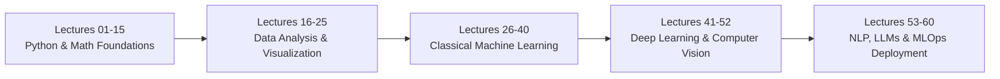

# 🧠 AI & Machine Learning Masterclass

[](https://www.python.org/)
[](https://jupyter.org/)
[](https://matplotlib.org/)
[](https://seaborn.pydata.org/)
[](#)
[](#)

🌐 **Language:** **English** | [हिंदी / Hinglish](README_HINGLISH.md)

A comprehensive, organized, and production-grade knowledge repository covering the complete **Artificial Intelligence & Machine Learning Journey (Lectures 00 to 60)**.

Each lecture module contains:
- 📝 **Structured Markdown Notes (`notes.md`)**: In-depth theoretical concepts, mathematical formulas, syntax breakdowns, and best practices.
- 📕 **High-Definition PDFs (`notes.pdf`)**: Formatted documents with rendered KaTeX formulas, tables, and Mermaid architecture diagrams for offline study.
- 💻 **Hands-On Jupyter Notebooks (`.ipynb`)**: Clean, reproducible, self-contained Python implementations with production-ready code examples.
- 📊 **Original Visuals & Diagrams**: High-clarity, code-generated diagrams and visual reference sheets.

---

## 📂 Repository Architecture

```plaintext
AI-ML/
├── .gitignore
├── README.md
├── lecture_00/                   # Course Orientation & Environment Setup
├── lecture_01/ ... lecture_17/   # (Foundations, Python & Numerical Computing)
├── lecture_18/                   # Data Visualization (Part 1 - Matplotlib Fundamentals)
│   ├── Notes_18.01/ to 18.18/    # Sub-topics with notes.md, notes.pdf, .ipynb
│   ├── Practice_Problems/        # Case Studies & Challenges (Questions & Solutions)
│   │   ├── Questions/            # questions.md, questions.pdf, questions.ipynb
│   │   └── Solutions/            # solutions.md, solutions.pdf, solutions.ipynb
├── lecture_19/                   # Data Visualization (Part 2 - Advanced Matplotlib & Seaborn)
│   ├── Notes_19.01/ to 19.16/    # Sub-topics with notes.md, notes.pdf, .ipynb, diagrams
│   └── reference_materials/      # Cheatsheets, slide notes & sample notebooks
├── lecture_20/                   # Mathematics for AI (Part 1 - Probability Theory)
│   ├── Notes_20.01/ to 20.20/    # Sub-topics with README.md, notes.pdf, .ipynb
│   └── Practice_Problems/        # Industry Case Studies (Questions & Solutions)
├── lecture_21/                   # Mathematics for AI (Part 2 - Linear Algebra Mastery)
│   ├── Notes_21.01/ to 21.15/    # Sub-topics with README.md, notes.pdf, .ipynb
│   └── Practice_Problems/        # Industry Case Studies (Questions & Solutions)
└── lecture_22/ ... lecture_60/   # (Machine Learning, Deep Learning, NLP & Deployment)
```

---

## 📊 Detailed Module Breakdown

### 🎨 Day 18: Data Visualization (Part 1 — Matplotlib Mastery)
*Module Guides:* [📖 English Guide](lecture_18/README.md) \| [हिंदी / Hinglish Guide](lecture_18/README_HINGLISH.md)

Focuses on data visualization theory, the anatomy of plots, and core 2D plotting with **Matplotlib**.

| Lecture | Topic Title | Core Concepts | Quick Links |
| :--- | :--- | :--- | :--- |
| **18.01** | What is Data Visualization? | Visual perception, exploratory vs explanatory, Anscombe's Quartet | [Notes](lecture_18/Notes_18.01/README.md) \| [PDF](lecture_18/Notes_18.01/notes.pdf) \| [Notebook](lecture_18/Notes_18.01/lecture_18_01.ipynb) |
| **18.02** | How to Plot Data - Basic Structure | Coordinate systems, Data Prep $\to$ Canvas $\to$ Plot $\to$ Decoration $\to$ Render | [Notes](lecture_18/Notes_18.02/README.md) \| [PDF](lecture_18/Notes_18.02/notes.pdf) \| [Notebook](lecture_18/Notes_18.02/lecture_18_02.ipynb) |
| **18.03** | Introduction to Matplotlib | Matplotlib history, architecture (`backend`, `artist`, `scripting`), Pyplot interface | [Notes](lecture_18/Notes_18.03/README.md) \| [PDF](lecture_18/Notes_18.03/notes.pdf) \| [Notebook](lecture_18/Notes_18.03/lecture_18_03.ipynb) |
| **18.04** | Important Plot Methods | `plt.plot()`, `plt.title()`, `plt.xlabel()`, `plt.ylabel()`, `plt.grid()`, `plt.show()` | [Notes](lecture_18/Notes_18.04/README.md) \| [PDF](lecture_18/Notes_18.04/notes.pdf) \| [Notebook](lecture_18/Notes_18.04/lecture_18_04.ipynb) |
| **18.05** | Multiple Datasets on Line Plot | Multi-series plotting, legends (`plt.legend`), color differentiation, z-order | [Notes](lecture_18/Notes_18.05/README.md) \| [PDF](lecture_18/Notes_18.05/notes.pdf) \| [Notebook](lecture_18/Notes_18.05/lecture_18_05.ipynb) |
| **18.06** | Format Strings (`fmt`) | Fast syntax `[marker][line][color]`, e.g., `'ro--'`, `'b^:'`, hex colors | [Notes](lecture_18/Notes_18.06/README.md) \| [PDF](lecture_18/Notes_18.06/notes.pdf) \| [Notebook](lecture_18/Notes_18.06/lecture_18_06.ipynb) |
| **18.07** | Styling & Saving Plots | Figure sizing (`figsize`), DPI scaling, `plt.savefig()` (PNG, SVG, PDF), styling themes | [Notes](lecture_18/Notes_18.07/README.md) \| [PDF](lecture_18/Notes_18.07/notes.pdf) \| [Notebook](lecture_18/Notes_18.07/lecture_18_07.ipynb) |
| **18.08** | Chart Selection Taxonomy | Choosing the right chart: Comparison, Distribution, Composition, Relationship | [Notes](lecture_18/Notes_18.08/README.md) \| [PDF](lecture_18/Notes_18.08/notes.pdf) \| [Notebook](lecture_18/Notes_18.08/lecture_18_08.ipynb) |
| **18.09** | Vertical Bar Charts (`plt.bar`) | Categorical discrete comparison, bar width, alignment, edge styling | [Notes](lecture_18/Notes_18.09/README.md) \| [PDF](lecture_18/Notes_18.09/notes.pdf) \| [Notebook](lecture_18/Notes_18.09/lecture_18_09.ipynb) |
| **18.10** | Adding Labels to Bars | Direct data labels via `plt.text()` & `ax.bar_label()` container iteration | [Notes](lecture_18/Notes_18.10/README.md) \| [PDF](lecture_18/Notes_18.10/notes.pdf) \| [Notebook](lecture_18/Notes_18.10/lecture_18_10.ipynb) |
| **18.11** | Grouped Bar Charts | Offset indexing with NumPy `np.arange()`, width offset calculations | [Notes](lecture_18/Notes_18.11/README.md) \| [PDF](lecture_18/Notes_18.11/notes.pdf) \| [Notebook](lecture_18/Notes_18.11/lecture_18_11.ipynb) |
| **18.12** | Horizontal Bar Charts (`plt.barh`) | Long categorical labels, ranking, inverted axis sorting | [Notes](lecture_18/Notes_18.12/README.md) \| [PDF](lecture_18/Notes_18.12/notes.pdf) \| [Notebook](lecture_18/Notes_18.12/lecture_18_12.ipynb) |
| **18.13** | Scatter Plots (`plt.scatter`) | Bivariate relationships, correlation, scatter vs line performance | [Notes](lecture_18/Notes_18.13/README.md) \| [PDF](lecture_18/Notes_18.13/notes.pdf) \| [Notebook](lecture_18/Notes_18.13/lecture_18_13.ipynb) |
| **18.14** | Advanced Scatter Customizations | 4D visual encoding: Marker size (`s`), color mapping (`c`, `cmap`), alpha transparency | [Notes](lecture_18/Notes_18.14/README.md) \| [PDF](lecture_18/Notes_18.14/notes.pdf) \| [Notebook](lecture_18/Notes_18.14/lecture_18_14.ipynb) |
| **18.15** | Annotations on Scatter Plots | Point labeling via `plt.annotate()`, bounding boxes, arrows (`arrowprops`) | [Notes](lecture_18/Notes_18.15/README.md) \| [PDF](lecture_18/Notes_18.15/notes.pdf) \| [Notebook](lecture_18/Notes_18.15/lecture_18_15.ipynb) |
| **18.16** | Multiple Datasets on Scatter Plots | Multi-class scatter plots, category-wise legend separation | [Notes](lecture_18/Notes_18.16/README.md) \| [PDF](lecture_18/Notes_18.16/notes.pdf) \| [Notebook](lecture_18/Notes_18.16/lecture_18_16.ipynb) |
| **18.17** | Pie Charts (`plt.pie`) | Composition plotting, `autopct`, `startangle`, shadow, limitations | [Notes](lecture_18/Notes_18.17/README.md) \| [PDF](lecture_18/Notes_18.17/notes.pdf) \| [Notebook](lecture_18/Notes_18.17/lecture_18_17.ipynb) |
| **18.18** | Advanced Pie Charts | Donut charts (center circle wedge), `explode` slices, custom palettes | [Notes](lecture_18/Notes_18.18/README.md) \| [PDF](lecture_18/Notes_18.18/notes.pdf) \| [Notebook](lecture_18/Notes_18.18/lecture_18_18.ipynb) |


> [!TIP]
> **🧪 Day 18 Comprehensive Case Studies & Practice Problem Set:**  
> *Module Guides:* [📖 English Guide](lecture_18/Practice_Problems/README.md) \| [हिंदी / Hinglish Guide](lecture_18/Practice_Problems/README_HINGLISH.md)  
> - 📝 **Problem Statements:** [Questions](lecture_18/Practice_Problems/Questions/README.md) \| [questions.pdf](lecture_18/Practice_Problems/Questions/questions.pdf) \| [Starter Notebook](lecture_18/Practice_Problems/Questions/questions.ipynb)
> - 💡 **Complete Solutions:** [Solutions](lecture_18/Practice_Problems/Solutions/README.md) \| [solutions.pdf](lecture_18/Practice_Problems/Solutions/solutions.pdf) \| [Executed Notebook](lecture_18/Practice_Problems/Solutions/solutions.ipynb)

---

### 📈 Day 19: Data Visualization (Part 2 — Advanced Matplotlib & Seaborn)
*Module Guides:* [📖 English Guide](lecture_19/README.md) \| [हिंदी / Hinglish Guide](lecture_19/README_HINGLISH.md)

Advanced statistical visualizations, distributions, five-number summary, object-oriented Matplotlib API, and high-level **Seaborn** statistical graphics.

| Lecture | Topic Title | Core Concepts | Quick Links |
| :--- | :--- | :--- | :--- |
| **19.01** | Histograms (`plt.hist`) | Continuous distribution, bin count & width, density normalization, skewness | [Notes](lecture_19/Notes_19.01/README.md) \| [PDF](lecture_19/Notes_19.01/notes.pdf) \| [Notebook](lecture_19/Notes_19.01/lecture_19_01.ipynb) |
| **19.02** | Multiple Datasets on Histogram | Side-by-side vs stacked histograms, overlapping distributions with alpha | [Notes](lecture_19/Notes_19.02/README.md) \| [PDF](lecture_19/Notes_19.02/notes.pdf) \| [Notebook](lecture_19/Notes_19.02/lecture_19_02.ipynb) |
| **19.03** | Vertical Reference Lines (`plt.axvline`) | Statistical threshold benchmarks: Mean, Median, Mode lines & annotations | [Notes](lecture_19/Notes_19.03/README.md) \| [PDF](lecture_19/Notes_19.03/notes.pdf) \| [Notebook](lecture_19/Notes_19.03/lecture_19_03.ipynb) |
| **19.04** | Box Plots (Five-Number Summary) | Tukey's 5-number summary ($Q_1, Q_2, Q_3, \text{IQR}$), $1.5 \times \text{IQR}$ outlier detection | [Notes](lecture_19/Notes_19.04/README.md) \| [PDF](lecture_19/Notes_19.04/notes.pdf) \| [Notebook](lecture_19/Notes_19.04/lecture_19_04.ipynb) |
| **19.05** | Advanced Box Plot Operations | Notched box plots (median confidence), horizontal orientation, custom flier props | [Notes](lecture_19/Notes_19.05/README.md) \| [PDF](lecture_19/Notes_19.05/notes.pdf) \| [Notebook](lecture_19/Notes_19.05/lecture_19_05.ipynb) |
| **19.06** | Stack Plots (Area Charts) | Cumulative part-to-whole trends over time via `plt.stackplot()` | [Notes](lecture_19/Notes_19.06/README.md) \| [PDF](lecture_19/Notes_19.06/notes.pdf) \| [Notebook](lecture_19/Notes_19.06/lecture_19_06.ipynb) |
| **19.07** | Subplots in Matplotlib | Multi-panel figures via `plt.subplot()` and `plt.subplots()`, `tight_layout()` | [Notes](lecture_19/Notes_19.07/README.md) \| [PDF](lecture_19/Notes_19.07/notes.pdf) \| [Notebook](lecture_19/Notes_19.07/lecture_19_07.ipynb) |
| **19.08** | Modern Matplotlib (Object-Oriented API) | Explicit `fig, ax = plt.subplots()`, axis methods (`ax.set_*()`), cleaner engineering | [Notes](lecture_19/Notes_19.08/README.md) \| [PDF](lecture_19/Notes_19.08/notes.pdf) \| [Notebook](lecture_19/Notes_19.08/lecture_19_08.ipynb) |
| **19.09** | Practice Task: Weekly Weather Analysis | Multi-axis dual plotting ($Y_1$ temperature line, $Y_2$ precipitation bars) | [Notes](lecture_19/Notes_19.09/README.md) \| [PDF](lecture_19/Notes_19.09/notes.pdf) \| [Notebook](lecture_19/Notes_19.09/lecture_19_09.ipynb) |
| **19.10** | Introduction to Seaborn | High-level statistical visualization library, themes (`darkgrid`, `whitegrid`), Pandas integration | [Notes](lecture_19/Notes_19.10/README.md) \| [PDF](lecture_19/Notes_19.10/notes.pdf) \| [Notebook](lecture_19/Notes_19.10/lecture_19_10.ipynb) |
| **19.11** | Creating Plots with Seaborn | Semantic mapping attributes: `x`, `y`, `hue`, `style`, `size`, `palette` | [Notes](lecture_19/Notes_19.11/README.md) \| [PDF](lecture_19/Notes_19.11/notes.pdf) \| [Notebook](lecture_19/Notes_19.11/lecture_19_11.ipynb) |
| **19.12** | Relational Plots in Seaborn | Figure-level `sns.relplot()`, `sns.scatterplot()`, `sns.lineplot()`, faceting (`col`, `row`) | [Notes](lecture_19/Notes_19.12/README.md) \| [PDF](lecture_19/Notes_19.12/notes.pdf) \| [Notebook](lecture_19/Notes_19.12/lecture_19_12.ipynb) |
| **19.13** | Categorical Plots in Seaborn | Figure-level `sns.catplot()`, `sns.barplot()` (with CI error bars), `sns.boxplot()`, `violinplot` | [Notes](lecture_19/Notes_19.13/README.md) \| [PDF](lecture_19/Notes_19.13/notes.pdf) \| [Notebook](lecture_19/Notes_19.13/lecture_19_13.ipynb) |
| **19.14** | Distribution Plots in Seaborn | Figure-level `sns.displot()`, Kernel Density Estimation (`kdeplot`), `histplot`, `rugplot` | [Notes](lecture_19/Notes_19.14/README.md) \| [PDF](lecture_19/Notes_19.14/notes.pdf) \| [Notebook](lecture_19/Notes_19.14/lecture_19_14.ipynb) |
| **19.15** | Relational & Matrix Plots: Heatmaps | `sns.heatmap()`, correlation matrix (`df.corr()`), `annot=True`, diverging colormaps | [Notes](lecture_19/Notes_19.15/README.md) \| [PDF](lecture_19/Notes_19.15/notes.pdf) \| [Notebook](lecture_19/Notes_19.15/lecture_19_15.ipynb) |
| **19.16** | Best Practices for Data Visualization | Edward Tufte principles (Data-Ink ratio, chartjunk), color accessibility, chart ethics | [Notes](lecture_19/Notes_19.16/README.md) \| [PDF](lecture_19/Notes_19.16/notes.pdf) \| [Notebook](lecture_19/Notes_19.16/lecture_19_16.ipynb) |


> [!TIP]
> **🧪 Day 19 Comprehensive Case Studies & Practice Problem Set:**  
> *Module Guides:* [📖 English Guide](lecture_19/Practice_Problems/README.md) \| [हिंदी / Hinglish Guide](lecture_19/Practice_Problems/README_HINGLISH.md)  
> - 📝 **Problem Statements:** [Questions](lecture_19/Practice_Problems/Questions/README.md) \| [questions.pdf](lecture_19/Practice_Problems/Questions/questions.pdf) \| [Starter Notebook](lecture_19/Practice_Problems/Questions/questions.ipynb)
> - 💡 **Complete Solutions:** [Solutions](lecture_19/Practice_Problems/Solutions/README.md) \| [solutions.pdf](lecture_19/Practice_Problems/Solutions/solutions.pdf) \| [Executed Notebook](lecture_19/Practice_Problems/Solutions/solutions.ipynb)

### 🎲 Day 20: Mathematics for AI (Part 1 — Probability Theory)
*Module Guides:* [📖 English Guide](lecture_20/README.md) | [हिंदी / Hinglish Guide](lecture_20/README_HINGLISH.md)

Rigorous mathematical foundations of probability for AI & Machine Learning: Kolmogorov axioms, conditional probability, Bayes' Theorem, random variables, expectation, variance, and parametric distributions (Binomial, Uniform, Gaussian).

| Lecture | Topic Title | Core Concepts | Quick Links |
| :--- | :--- | :--- | :--- |
| **20.01** | Math for AI & Why Probability Matters | Uncertainty quantification, MLE, cross-entropy, generative modeling | [Notes](lecture_20/Notes_20.01/README.md) \| [PDF](lecture_20/Notes_20.01/notes.pdf) \| [Notebook](lecture_20/Notes_20.01/lecture_20_01.ipynb) |
| **20.02** | Core Foundations of Probability | Random experiments, sample space, events, Kolmogorov's 3 axioms | [Notes](lecture_20/Notes_20.02/README.md) \| [PDF](lecture_20/Notes_20.02/notes.pdf) \| [Notebook](lecture_20/Notes_20.02/lecture_20_02.ipynb) |
| **20.03** | Classical vs. Empirical Probability | Theoretical symmetry, frequentist relative frequency, Law of Large Numbers | [Notes](lecture_20/Notes_20.03/README.md) \| [PDF](lecture_20/Notes_20.03/notes.pdf) \| [Notebook](lecture_20/Notes_20.03/lecture_20_03.ipynb) |
| **20.04** | Foundation Probability Practice Problems | Combinatorics, permutations $P(n,k)$, combinations $C(n,k)$, counting rules | [Notes](lecture_20/Notes_20.04/README.md) \| [PDF](lecture_20/Notes_20.04/notes.pdf) \| [Notebook](lecture_20/Notes_20.04/lecture_20_04.ipynb) |
| **20.05** | Types of Events | Mutually exclusive vs independent events, exhaustive events, partitions | [Notes](lecture_20/Notes_20.05/README.md) \| [PDF](lecture_20/Notes_20.05/notes.pdf) \| [Notebook](lecture_20/Notes_20.05/lecture_20_05.ipynb) |
| **20.06** | The Complementary Rule | Complement $P(A') = 1 - P(A)$, De Morgan's laws, at-least-one calculations | [Notes](lecture_20/Notes_20.06/README.md) \| [PDF](lecture_20/Notes_20.06/notes.pdf) \| [Notebook](lecture_20/Notes_20.06/lecture_20_06.ipynb) |
| **20.07** | The Addition Rule of Probability | General addition rule, double-counting correction, inclusion-exclusion | [Notes](lecture_20/Notes_20.07/README.md) \| [PDF](lecture_20/Notes_20.07/notes.pdf) \| [Notebook](lecture_20/Notes_20.07/lecture_20_07.ipynb) |
| **20.08** | The Multiplication Rule of Probability | Joint intersection, dependent vs independent, probability chain rule | [Notes](lecture_20/Notes_20.08/README.md) \| [PDF](lecture_20/Notes_20.08/notes.pdf) \| [Notebook](lecture_20/Notes_20.08/lecture_20_08.ipynb) |
| **20.09** | Probability Rules Practice Problems | Series vs parallel system reliability, fault tolerance, urn problems | [Notes](lecture_20/Notes_20.09/README.md) \| [PDF](lecture_20/Notes_20.09/notes.pdf) \| [Notebook](lecture_20/Notes_20.09/lecture_20_09.ipynb) |
| **20.10** | Conditional Probability | Reduced sample space, $P(A \mid B) = \frac{P(A \cap B)}{P(B)}$, contingency tables | [Notes](lecture_20/Notes_20.10/README.md) \| [PDF](lecture_20/Notes_20.10/notes.pdf) \| [Notebook](lecture_20/Notes_20.10/lecture_20_10.ipynb) |
| **20.11** | The Law of Total Probability | Sample space partition, marginalization, total defect calculations | [Notes](lecture_20/Notes_20.11/README.md) \| [PDF](lecture_20/Notes_20.11/notes.pdf) \| [Notebook](lecture_20/Notes_20.11/lecture_20_11.ipynb) |
| **20.12** | Bayes' Theorem | Prior, likelihood, marginal evidence, posterior belief updating | [Notes](lecture_20/Notes_20.12/README.md) \| [PDF](lecture_20/Notes_20.12/notes.pdf) \| [Notebook](lecture_20/Notes_20.12/lecture_20_12.ipynb) |
| **20.13** | Bayes' Theorem Practice Problems | Medical diagnosis paradox, base rate fallacy, false positives in AI | [Notes](lecture_20/Notes_20.13/README.md) \| [PDF](lecture_20/Notes_20.13/notes.pdf) \| [Notebook](lecture_20/Notes_20.13/lecture_20_13.ipynb) |
| **20.14** | Random Variables | Mapping $X: \mathcal{S} \to \mathbb{R}$, discrete vs continuous, PMF, PDF, CDF | [Notes](lecture_20/Notes_20.14/README.md) \| [PDF](lecture_20/Notes_20.14/notes.pdf) \| [Notebook](lecture_20/Notes_20.14/lecture_20_14.ipynb) |
| **20.15** | Mean, Median & Mode | Expected value $\mathbb{E}[X]$, linearity of expectation, skewness impact | [Notes](lecture_20/Notes_20.15/README.md) \| [PDF](lecture_20/Notes_20.15/notes.pdf) \| [Notebook](lecture_20/Notes_20.15/lecture_20_15.ipynb) |
| **20.16** | Variance & Standard Deviation | Dispersion $\text{Var}(X) = \mathbb{E}[(X-\mu)^2]$, shortcut $\mathbb{E}[X^2] - (\mathbb{E}[X])^2$ | [Notes](lecture_20/Notes_20.16/README.md) \| [PDF](lecture_20/Notes_20.16/notes.pdf) \| [Notebook](lecture_20/Notes_20.16/lecture_20_16.ipynb) |
| **20.17** | Probability Distributions & its Types | Discrete vs continuous families, PMF/PDF properties, AI loss mapping | [Notes](lecture_20/Notes_20.17/README.md) \| [PDF](lecture_20/Notes_20.17/notes.pdf) \| [Notebook](lecture_20/Notes_20.17/lecture_20_17.ipynb) |
| **20.18** | Binomial Distribution | Bernoulli trials, PMF $\binom{n}{k} p^k (1-p)^{n-k}$, mean $np$, variance $np(1-p)$ | [Notes](lecture_20/Notes_20.18/README.md) \| [PDF](lecture_20/Notes_20.18/notes.pdf) \| [Notebook](lecture_20/Notes_20.18/lecture_20_18.ipynb) |
| **20.19** | Uniform Distribution | Constant density $\mathcal{U}(a, b)$, PDF $\frac{1}{b-a}$, mean $\frac{a+b}{2}$, variance $\frac{(b-a)^2}{12}$ | [Notes](lecture_20/Notes_20.19/README.md) \| [PDF](lecture_20/Notes_20.19/notes.pdf) \| [Notebook](lecture_20/Notes_20.19/lecture_20_19.ipynb) |
| **20.20** | Normal Distribution | Bell curve PDF, 68-95-99.7 rule, Z-score standardization, CLT connection | [Notes](lecture_20/Notes_20.20/README.md) \| [PDF](lecture_20/Notes_20.20/notes.pdf) \| [Notebook](lecture_20/Notes_20.20/lecture_20_20.ipynb) |


> [!TIP]
> **🧪 Day 20 Comprehensive Case Studies & Practice Problem Set:**  
> *Module Guides:* [📖 English Guide](lecture_20/Practice_Problems/README.md) | [हिंदी / Hinglish Guide](lecture_20/Practice_Problems/README_HINGLISH.md)  
> - 📝 **Problem Statements:** [Questions](lecture_20/Practice_Problems/Questions/README.md) | [questions.pdf](lecture_20/Practice_Problems/Questions/questions.pdf) | [Starter Notebook](lecture_20/Practice_Problems/Questions/questions.ipynb)
> - 💡 **Complete Solutions:** [Solutions](lecture_20/Practice_Problems/Solutions/README.md) | [solutions.pdf](lecture_20/Practice_Problems/Solutions/solutions.pdf) | [Executed Notebook](lecture_20/Practice_Problems/Solutions/solutions.ipynb)

### 📐 Day 21: Mathematics for AI (Part 2 — Linear Algebra Mastery)
*Module Guides:* [📖 English Guide](lecture_21/README.md) | [हिंदी / Hinglish Guide](lecture_21/README_HINGLISH.md)

Rigorous mathematical foundations of Linear Algebra for AI, Machine Learning & Deep Learning: Vectors, matrices, tensors, inner products, norms, span, basis, rank, determinants, Gaussian elimination, Moore-Penrose pseudo-inverses, Gram-Schmidt orthogonalization, QR decomposition, eigenvalues, eigenvectors, symmetric spectral theorem, Singular Value Decomposition (SVD), PCA, and Deep Learning attention mechanisms (LoRA).

| Lecture | Topic Title | Core Concepts | Quick Links |
| :--- | :--- | :--- | :--- |
| **21.01** | Vectors, Scalars, Matrices & Tensors | Tensor rank hierarchy (0D to 4D), row/column vectors, batch tensors | [Notes](lecture_21/Notes_21.01/README.md) \| [PDF](lecture_21/Notes_21.01/notes.pdf) \| [Notebook](lecture_21/Notes_21.01/lecture_21_01.ipynb) |
| **21.02** | Vector Operations & Geometric Intuition | Vector addition, scalar multiplication, $\ell_1$ & $\ell_2$ norms, cosine similarity | [Notes](lecture_21/Notes_21.02/README.md) \| [PDF](lecture_21/Notes_21.02/notes.pdf) \| [Notebook](lecture_21/Notes_21.02/lecture_21_02.ipynb) |
| **21.03** | Matrix Operations & Special Matrices | Addition, scaling, transposes, symmetric, diagonal, identity, orthogonal matrices | [Notes](lecture_21/Notes_21.03/README.md) \| [PDF](lecture_21/Notes_21.03/notes.pdf) \| [Notebook](lecture_21/Notes_21.03/lecture_21_03.ipynb) |
| **21.04** | Matrix Multiplication & AI Forward Passes | Dot products vs outer products, linear composition, batch gemm $\mathcal{O}(mnp)$ | [Notes](lecture_21/Notes_21.04/README.md) \| [PDF](lecture_21/Notes_21.04/notes.pdf) \| [Notebook](lecture_21/Notes_21.04/lecture_21_04.ipynb) |
| **21.05** | Linear Combinations, Span & Basis | Linear combinations, span subspaces, linear independence, canonical basis | [Notes](lecture_21/Notes_21.05/README.md) \| [PDF](lecture_21/Notes_21.05/notes.pdf) \| [Notebook](lecture_21/Notes_21.05/lecture_21_05.ipynb) |
| **21.06** | Linear Independence & Matrix Rank | Row/column rank, rank-nullity theorem, full rank vs rank deficiency | [Notes](lecture_21/Notes_21.06/README.md) \| [PDF](lecture_21/Notes_21.06/notes.pdf) \| [Notebook](lecture_21/Notes_21.06/lecture_21_06.ipynb) |
| **21.07** | Determinants & Geometric Singularity | Oriented volume scaling, Laplace expansion, invertibility criterion $\det(A) \ne 0$ | [Notes](lecture_21/Notes_21.07/README.md) \| [PDF](lecture_21/Notes_21.07/notes.pdf) \| [Notebook](lecture_21/Notes_21.07/lecture_21_07.ipynb) |
| **21.08** | Systems of Linear Equations & Gaussian Elimination | Augmented matrix, forward elimination, back-substitution, REF & RREF | [Notes](lecture_21/Notes_21.08/README.md) \| [PDF](lecture_21/Notes_21.08/notes.pdf) \| [Notebook](lecture_21/Notes_21.08/lecture_21_08.ipynb) |
| **21.09** | Matrix Inverses & Moore-Penrose Pseudo-Inverse | Gauss-Jordan inversion, overdetermined systems, pseudo-inverse $A^+$, Least Squares | [Notes](lecture_21/Notes_21.09/README.md) \| [PDF](lecture_21/Notes_21.09/notes.pdf) \| [Notebook](lecture_21/Notes_21.09/lecture_21_09.ipynb) |
| **21.10** | Orthogonality, Orthonormality & Projections | Orthogonal projections, Gram-Schmidt orthogonalization, QR decomposition | [Notes](lecture_21/Notes_21.10/README.md) \| [PDF](lecture_21/Notes_21.10/notes.pdf) \| [Notebook](lecture_21/Notes_21.10/lecture_21_10.ipynb) |
| **21.11** | Eigenvalues & Eigenvectors | Invariant directions, characteristic equation $\det(A - \lambda I) = 0$, eigenspaces | [Notes](lecture_21/Notes_21.11/README.md) \| [PDF](lecture_21/Notes_21.11/notes.pdf) \| [Notebook](lecture_21/Notes_21.11/lecture_21_11.ipynb) |
| **21.12** | Diagonalization & Spectral Theorem | Modal matrix $P$, similarity transformation $A = P \Lambda P^{-1}$, symmetric spectral theorem | [Notes](lecture_21/Notes_21.12/README.md) \| [PDF](lecture_21/Notes_21.12/notes.pdf) \| [Notebook](lecture_21/Notes_21.12/lecture_21_12.ipynb) |
| **21.13** | Singular Value Decomposition (SVD) | Rectangular factorization $A = U \Sigma V^T$, Eckart-Young low-rank theorem | [Notes](lecture_21/Notes_21.13/README.md) \| [PDF](lecture_21/Notes_21.13/notes.pdf) \| [Notebook](lecture_21/Notes_21.13/lecture_21_13.ipynb) |
| **21.14** | Principal Component Analysis (PCA) via Linear Algebra | Covariance matrix $\mathbf{\Sigma}$, spectral projection, scree plot, dimensionality reduction | [Notes](lecture_21/Notes_21.14/README.md) \| [PDF](lecture_21/Notes_21.14/notes.pdf) \| [Notebook](lecture_21/Notes_21.14/lecture_21_14.ipynb) |
| **21.15** | Linear Algebra in Deep Learning & Attention | Dense layers, im2col gemm convolution, Transformer Scaled Dot-Product Attention, LoRA | [Notes](lecture_21/Notes_21.15/README.md) \| [PDF](lecture_21/Notes_21.15/notes.pdf) \| [Notebook](lecture_21/Notes_21.15/lecture_21_15.ipynb) |

> [!TIP]
> **🧪 Day 21 Comprehensive Case Studies & Practice Problem Set:**  
> *Module Guides:* [📖 English Guide](lecture_21/Practice_Problems/README.md) | [हिंदी / Hinglish Guide](lecture_21/Practice_Problems/README_HINGLISH.md)  
> - 📝 **Problem Statements:** [Questions](lecture_21/Practice_Problems/Questions/README.md) | [questions.pdf](lecture_21/Practice_Problems/Questions/questions.pdf) | [Starter Notebook](lecture_21/Practice_Problems/Questions/questions.ipynb)
> - 💡 **Complete Solutions:** [Solutions](lecture_21/Practice_Problems/Solutions/README.md) | [solutions.pdf](lecture_21/Practice_Problems/Solutions/solutions.pdf) | [Executed Notebook](lecture_21/Practice_Problems/Solutions/solutions.ipynb)

---

## 📐 Mathematical Formulations & Statistical Expressions

The mathematical formulations across these visualization modules adhere to formal academic and textbook definitions:

### 1. Data-Ink Principle (Tufte Formulation)
The efficiency of a visual graphic is formally measured by the **Data-Ink Ratio** $\eta$:

$$
\boxed{
\eta = \frac{\mathcal{I}_{\text{data}}}{\mathcal{I}_{\text{total}}} = 1.0 - \frac{\mathcal{I}_{\text{non-data}}}{\mathcal{I}_{\text{total}}}
}
$$

where $\mathcal{I}_{\text{data}}$ represents informative data-ink, $\mathcal{I}_{\text{total}}$ represents total graphic ink, and $\eta \in (0, 1]$.

---

### 2. Grouped Bar Clustered Coordinate Mathematics
For $K = 2$ comparative series across $N$ discrete categories with bar width constraint $w < \frac{1}{K} = 0.5$:

Let the baseline category coordinate be $x_i = i$ for $i \in \{0, 1, \dots, N-1\}$. The shifted bar coordinates $(y_{1, i}, y_{2, i})$ follow the symmetric piecewise system:

$$
\begin{cases}
y_{1, i} = x_i - \dfrac{w}{2} \\
y_{2, i} = x_i + \dfrac{w}{2}
\end{cases}
$$

where $y_{1, i}$ denotes the center coordinate for Series 1 (Budget) and $y_{2, i}$ denotes the center coordinate for Series 2 (Spend).

The category label tick mark $t_i$ satisfies the central symmetry theorem:

$$
\boxed{t_i = \frac{y_{1, i} + y_{2, i}}{2} = x_i}
$$

---

### 3. Tukey's Five-Number Summary & Box Plot Outlier Fences
Given an ordered sample $\mathcal{D} = \{x_{(1)}, x_{(2)}, \dots, x_{(n)}\}$, the Interquartile Range ($\text{IQR}$) and whisker fences are defined as:

$$
\boxed{\text{IQR} = Q_3 - Q_1}
$$

$$
\boxed{F_L = Q_1 - 1.5 \cdot \text{IQR} \qquad\text{and}\qquad F_U = Q_3 + 1.5 \cdot \text{IQR}}
$$

$$
\boxed{\mathcal{O} = \left\{ x_i \in \mathcal{D} \;\middle|\; x_i < F_L \;\lor\; x_i > F_U \right\}}
$$

---

### 4. Histogram Bin Estimation Models
For continuous feature distribution partitioning:

- **Sturges' Rule** (Normal distributions):

$$
  k = \left\lceil 1 + \log_2(n) \right\rceil
$$

- **Freedman-Diaconis Rule** (Robust against outliers):

$$
  h = 2 \cdot \frac{\text{IQR}}{\sqrt[3]{n}}, \qquad k = \left\lceil \frac{\max(x) - \min(x)}{h} \right\rceil
$$

Where $n$ is total sample count, $h$ is optimal bin width, and $k$ is the total bin count.

---

## 🗺️ 60-Day Curriculum Roadmap

The repository is structured to take a learner from foundational mathematics and Python programming to cutting-edge AI architectures and real-world deployment:



- **Lectures 01 – 15**: Python Programming, Linear Algebra, Calculus, NumPy, and Data Manipulation.
- **Lectures 16 – 25**: Exploratory Data Analysis (EDA), Advanced Pandas, Matplotlib, Seaborn, Feature Engineering.
- **Lectures 26 – 40**: Supervised & Unsupervised Machine Learning (Linear/Logistic Regression, Decision Trees, Random Forests, XGBoost, Clustering, PCA).
- **Lectures 41 – 52**: Deep Learning Foundations (Neural Networks, Backpropagation, PyTorch/TensorFlow, CNNs, Transfer Learning).
- **Lectures 53 – 60**: Natural Language Processing (RNNs, Transformers, Attention Mechanism, LLM Fine-Tuning, MLOps, CI/CD & Model Deployment).

---

## ⚡ Quickstart & Setup Guide

### 1. Clone the Repository
```bash
git clone https://github.com/S1h2i3v4a/AI_ML.git
cd AI_ML
```

### 2. Environment Setup
Create and activate an isolated virtual environment:
```bash
# Using conda
conda create -n aiml python=3.10 -y
conda activate aiml

# Or using venv
python -m venv venv
# On Windows:
.\venv\Scripts\activate
# On Linux/macOS:
source venv/bin/activate
```

### 3. Install Dependencies
```bash
pip install numpy pandas matplotlib seaborn jupyter jupyterlab scipy scikit-learn
```

### 4. Launch Jupyter Lab
```bash
jupyter lab
```
Navigate to any lecture subfolder (e.g., `lecture_18/Notes_18.4/lecture_18_4.ipynb`) and run the interactive cells.

---

## 📜 Standards & Integrity

- **Original Illustrations**: All diagrams and schematics are custom-engineered in code to guarantee mathematical accuracy and eliminate third-party copyright concerns.
- **Reproducible Code**: Every notebook contains deterministic seed declarations where applicable and verified imports.
- **Dual Format Documentation**: High-resolution vector PDFs are accompanied by full Markdown notes for both quick reading and offline archival.

---

## 👤 Author & Maintainer
- **Shivam Keshari**
- GitHub: [@S1h2i3v4a](https://github.com/S1h2i3v4a)
- Repository: [AI_ML](https://github.com/S1h2i3v4a/AI_ML)
