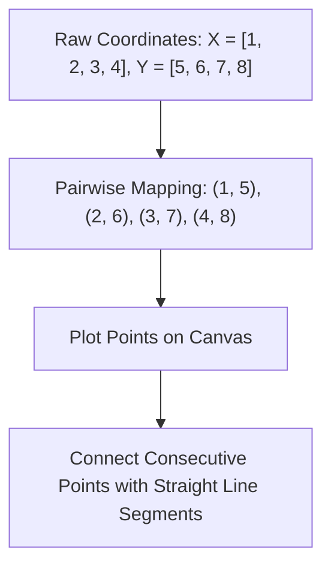

# Day 18 - Lecture 18.2: How to Plot Data - Basic Plot Structure

[](https://www.python.org/)
[](lecture_18_02.ipynb)
[](notes.pdf)

🌐 **Language:** **English** | [हिंदी / Hinglish](README_HINGLISH.md) | [⬅️ Back to Lecture 18 Module](../README.md)

---

## 1. Overview & The Cartesian Coordinate System
All 2D data plotting is founded upon the **2D Cartesian coordinate plane**:
- **X-axis (Abscissa):** Typically represents the independent variable, time, or sequence of observations.
- **Y-axis (Ordinate):** Typically represents the dependent variable, measured value, or response.
- **Origin $(0, 0)$:** The intersection of $x=0$ and $y=0$.



---

## 2. Simplest Plot in Python
The simplest plot requires two sequences of equal length:
```python
import matplotlib.pyplot as plt

X = [1, 2, 3, 4]
Y = [5, 6, 7, 8]

plt.plot(X, Y)
plt.show()
```

### Essential Rules of 2D Plotting:
1. **Length Equality:** `len(X)` must equal `len(Y)`. If one has 4 items and the other has 5, a `ValueError: x and y must have same first dimension` occurs.
2. **Order of Points:** Matplotlib draws line segments connecting points in the order they appear in the arrays. If $X$ is unordered (e.g. $[4, 1, 3, 2]$), lines will criss-cross back and forth!

---

## 3. Code Implementation

```python
import matplotlib.pyplot as plt

# A basic linear sequence
X = [1, 2, 3, 4]
Y = [5, 6, 7, 8]

plt.figure(figsize=(6, 4))
plt.plot(X, Y, marker='s', color='blue')
plt.title("Simple 2D Coordinate Plot", fontweight='bold')
plt.xlabel("X Axis Values")
plt.ylabel("Y Axis Values")
plt.grid(True)
plt.show()
```

---

## 4. Key Takeaways
- If you only pass a single list to `plt.plot(Y)`, Matplotlib automatically infers $X = [0, 1, 2, \dots, N-1]$ as index positions.
- Always ensure $X$ is monotonically increasing if plotting time-series or line graphs to prevent zig-zag lines.
