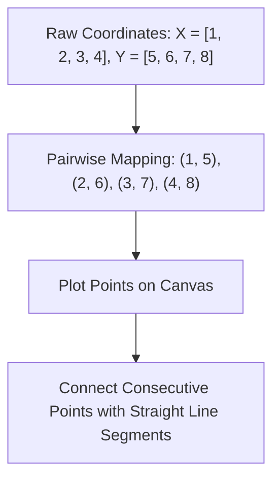

# Day 18 - Lecture 18.2: How to Plot Data - Basic Plot Structure [Hinglish]

[](https://www.python.org/)
[](lecture_18_02.ipynb)
[](notes.pdf)

🌐 **Language / भाषा:** [English](README.md) | **हिंदी / Hinglish** | [⬅️ Lecture 18 Module Par Wapas Jayein](../README_HINGLISH.md)

---

## 1. Overview & The Cartesian Coordinate System
All 2D data plotting is founded upon the **2D Cartesian coordinate plane**:
- **X-axis (Abscissa):** Independent variable, time sequence ya categories ko represent karta hai.
- **Y-axis (Ordinate):** Dependent variable, metric ya measured value ko darshata hai.
- **Origin $(0, 0)$:** The intersection of $x=0$ and $y=0$.



---

## 2. Simplest Plot in Python
Ek basic plot ke liye do equal length ke sequences (lists ya arrays) chahiye hote hain:
```python
import matplotlib.pyplot as plt

X = [1, 2, 3, 4]
Y = [5, 6, 7, 8]

plt.plot(X, Y)
plt.show()
```

### 2D Plotting Ke Zaruri Niyam:
1. **Length Equality:** `len(X)` must equal `len(Y)`. If one has 4 items and the other has 5, a `ValueError: x and y must have same first dimension` occurs.
2. **Order of Points:** Matplotlib draws line segments connecting points in the order they appear in the arrays. If $X$ is unordered (e.g. $[4, 1, 3, 2]$), lines will criss-cross back and forth!

---

## 3. Code Implementation

```python
import matplotlib.pyplot as plt

# A basic linear sequence
X = [1, 2, 3, 4]
Y = [5, 6, 7, 8]

plt.figure(figsize=(6, 4))
plt.plot(X, Y, marker='s', color='blue')
plt.title("Simple 2D Coordinate Plot", fontweight='bold')
plt.xlabel("X Axis Values")
plt.ylabel("Y Axis Values")
plt.grid(True)
plt.show()
```

---

## 📐 Ganitiya Coordinate Mapping aur Affine Transformation

Screen canvas par plot hone wala har continuous point continuous **Data Space** $\mathcal{D} = [x_{\min}, x_{\max}] \times [y_{\min}, y_{\max}]$ se discrete **Screen Pixel Coordinates** $\mathcal{S} = [0, W] \times [0, H]$ par map hota hai:

Pehle coordinates unit interval $[0, 1]^2$ par normalize kiye jaate hain:
$$
\boxed{u = \frac{x - x_{\min}}{x_{\max} - x_{\min}} \qquad\text{aur}\qquad v = \frac{y - y_{\min}}{y_{\max} - y_{\min}}}
$$

Phir affine viewport transformation matrix dwara display pixels calculate hote hain:
$$
\boxed{\begin{pmatrix} x_{\text{pixel}} \\ y_{\text{pixel}} \\ 1 \end{pmatrix} = \begin{pmatrix} W & 0 & 0 \\ 0 & -H & H \\ 0 & 0 & 1 \end{pmatrix} \begin{pmatrix} u \\ v \\ 1 \end{pmatrix}}
$$

jahan $-H$ inversion computer screen ke top-left $(0, 0)$ origin ko standard Cartesian coordinate plane ke sath align karta hai.

---
## 4. Mukhya Batein (Key Takeaways)
- Agar aap sirf ek hi list pass karte hain `plt.plot(Y)`, Matplotlib automatically consider karta hai $X = [0, 1, 2, \dots, N-1]$ index positions ke roop me.
- Hamesha dhyan rakhein $X$ is monotonically increasing if plotting time-series or line graphs to prevent zig-zag lines.
