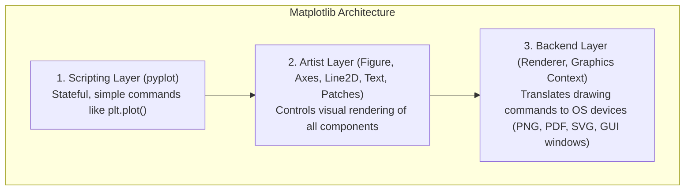

# Day 18 - Lecture 18.3: Introduction to Matplotlib

[](https://www.python.org/)
[](lecture_18_03.ipynb)
[](notes.pdf)

🌐 **Language:** **English** | [हिंदी / Hinglish](README_HINGLISH.md) | [⬅️ Back to Lecture 18 Module](../README.md)

---

## 1. History & Architecture
**Matplotlib** is the bedrock visualization library in the Python scientific stack.
- **Created by:** John D. Hunter in **2003**.
- **Motivation:** Designed originally to visualize electroencephalography (EEG) signals with a syntax familiar to **MATLAB** users.
- **Ecosystem:** Foundation upon which Pandas plotting, Seaborn, Yellowbrick, and many geospatial libraries are built.

---

## 2. The 3-Layer Architecture of Matplotlib



1. **Backend Layer:** Communicates with the hardware/operating system window (e.g., Agg for PNG raster images, PDF/SVG for vector graphics, TkAgg/Qt for GUI interaction).
2. **Artist Layer:** Everything seen on the screen is an **Artist** (lines, rectangles, text, spines, tick marks).
3. **Scripting Layer (`matplotlib.pyplot`):** A collection of functions that make Matplotlib work like MATLAB, maintaining state across calls.

---

## 3. Installation & Standard Import Convention

```bash
pip install matplotlib
```

Standard Python import convention:
```python
import matplotlib.pyplot as plt
import numpy as np
```

---

## 4. Key Takeaways
- `pyplot` is a module inside `matplotlib` providing the stateful scripting interface.
- Always use `import matplotlib.pyplot as plt`.
