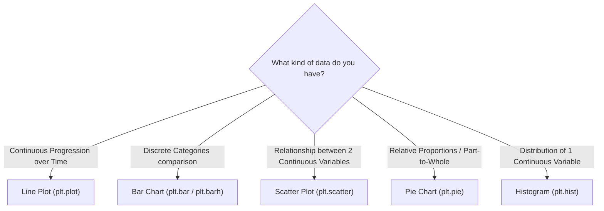

# Day 18 - Lecture 18.8: Common Plots & Charts Taxonomy [Hinglish]

🌐 **Language / भाषा:** [English](README.md) | **हिंदी / Hinglish** | [⬅️ Lecture 18 Module Par Wapas Jayein](../README_HINGLISH.md)

---

## 1. Overview & Chart Taxonomy
Choosing the right chart is the single most important skill in data visualization. Using the wrong chart distorts findings and confuses stakeholders.

---

## 2. Summary Chart Selection Guide

| Chart Type | Best Used When... | Avoid When... |
| :--- | :--- | :--- |
| **Line Plot** | Tracking trends and continuous sequential changes (time series) | Categories have no natural ordering |
| **Bar Chart** | Comparing numerical values across discrete categories | Data is continuous without groupings |
| **Scatter Plot** | Detecting correlations, clusters, and relationships between two continuous variables | Variables are pure categorical names |
| **Pie Chart** | Showing proportions of a whole for a very small number of categories (3–5 max) | More than 5 categories or comparing subtle differences |
| **Histogram** | Showing frequency distribution, skewness, and spread of continuous values | Data is discrete categories (use Bar Chart instead) |

---

## 3. Mukhya Batein (Key Takeaways)
- **The Golden Rule:** Always identify whether your variables are **continuous (quantitative)** or **categorical (qualitative)** before selecting a chart type.

---

## 📐 Visual Encoding Channel Capacity Ka Ganitiya Sutra

Data visualization me raw attributes $\mathcal{D} = \{d_1, d_2, \dots, d_m\}$ ko visual channels $\mathcal{V}$ par map kiya jata hai:

$$
\boxed{\Phi: \mathcal{D}_1 \times \mathcal{D}_2 \times \dots \times \mathcal{D}_m \to \mathcal{V}_1 \times \mathcal{V}_2 \times \dots \times \mathcal{V}_m}
$$

Cleveland & McGill hierarchy ke anusar decoding error $\epsilon$:

$$
\boxed{\epsilon_{\text{position}} < \epsilon_{\text{length}} < \epsilon_{\text{angle}} < \epsilon_{\text{area}} < \epsilon_{\text{color intensity}}}
$$

Bar charts sabse accurate hote hain kyunki yeh data ko position aur length ke zariye encode karte hain.
