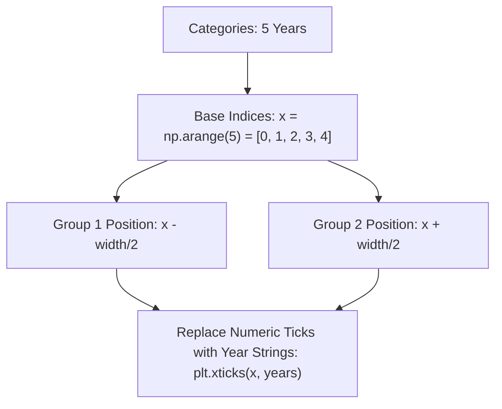

# Day 18 - Lecture 18.11: Grouped / Clustered Bar Charts [Hinglish]

[](https://www.python.org/)
[](lecture_18_11.ipynb)
[](notes.pdf)

🌐 **Language / भाषा:** [English](README.md) | **हिंदी / Hinglish** | [⬅️ Lecture 18 Module Par Wapas Jayein](../README_HINGLISH.md)

---

## 1. Overview & The Coordinate Offset Mechanism
When comparing two or more metrics across identical categories (e.g. Oscar vs Non-Oscar movie revenues across years), simply calling `plt.bar()` twice will cause the second set of bars to **overlap directly on top of the first**, hiding the data.

To create a **Grouped (Side-by-Side) Bar Chart**, we must manually calculate horizontal coordinate offsets using **NumPy**:



---

## 2. Mathematical Coordinate Formulation

Let $w$ be the individual bar width (e.g., $w = 0.4$):
$$\text{Position}_{\text{Group 1}} = x - \frac{w}{2}$$
$$\text{Position}_{\text{Group 2}} = x + \frac{w}{2}$$

The centers of the two bars are separated by exactly $w$, placing them neatly side-by-side without any gap or overlap between pair members.

---

## 3. Code Implementation

```python
import matplotlib.pyplot as plt
import numpy as np

oscar_revenue = [1005, 170, 427, 133, 232]       # Oscar Winners
non_oscar_revenue = [378, 2788, 829, 185, 275]   # Non-Oscar Blockbusters
years = [2008, 2009, 2010, 2011, 2012]

# 1. Generate numerical index array
x = np.arange(len(years))  # array([0, 1, 2, 3, 4])
width = 0.38               # Bar width

plt.figure(figsize=(10, 6))

# 2. Plot both groups with offset positions
plt.bar(x - width/2, oscar_revenue, width=width, label="Oscar Winners", color="#386cb0", edgecolor="black")
plt.bar(x + width/2, non_oscar_revenue, width=width, label="Non-Oscar Blockbusters", color="#fdc086", edgecolor="black")

# 3. Restore categorical x-axis labels
plt.xticks(x, years, fontsize=11)

plt.xlabel("Years", fontsize=12)
plt.ylabel("Revenue (in $M)", fontsize=12)
plt.title("Yearly Revenue: Oscar vs Non-Oscar Winners", fontsize=14, fontweight="bold")
plt.legend(fontsize=11)
plt.grid(axis='y', linestyle='--', alpha=0.5)
plt.tight_layout()
plt.show()
```

---

## 4. Mukhya Batein (Key Takeaways)
- Without `plt.xticks(x, years)`, the horizontal axis would display raw indices `[0, 1, 2, 3, 4]` instead of `[2008, 2009, 2010, 2011, 2012]`.
- For 3 groups, offset positions become $x - w$, $x$, and $x + w$ with a narrower width $w \approx 0.25$.
