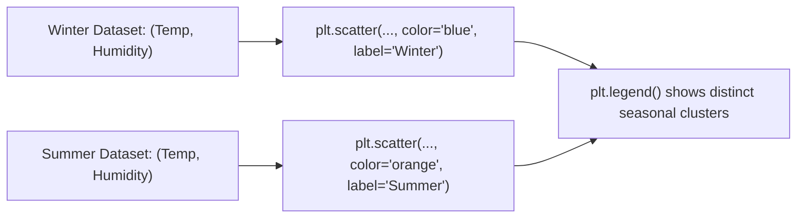

# Day 18 - Lecture 18.16: Multiple Datasets on Scatter Plots

[](https://www.python.org/)
[](lecture_18_16.ipynb)
[](notes.pdf)

🌐 **Language:** **English** | [हिंदी / Hinglish](README_HINGLISH.md) | [⬅️ Back to Lecture 18 Module](../README.md)

---

## 1. Overview & Purpose
Comparing multiple clusters or seasonal datasets on a single scatter plot reveals **group clustering, separation boundaries, and seasonal shifts**.

---

## 2. Case Study: Weather Conditions (Summer vs. Winter)

Analyzing temperature (°C) vs humidity (%) across 5 cities during two distinct seasons:
- **Winter:** Low temperature ($0°C - 10°C$), High humidity ($65% - 85%$) $\rightarrow$ Clustered at top-left.
- **Summer:** High temperature ($25°C - 35°C$), Moderate humidity ($45% - 65%$) $\rightarrow$ Clustered at bottom-right.



---

## 3. Code Implementation

```python
import matplotlib.pyplot as plt

cities = ["City A", "City B", "City C", "City D", "City E"]

# Winter: Temperature (°C) vs Humidity (%)
winter_temp = [5, 2, 10, 0, 7]
winter_humidity = [80, 75, 65, 85, 70]

# Summer: Temperature (°C) vs Humidity (%)
summer_temp = [25, 30, 28, 35, 27]
summer_humidity = [60, 50, 55, 45, 65]

plt.figure(figsize=(9, 6))

# Plot seasonal clusters
plt.scatter(winter_temp, winter_humidity, color="royalblue", s=90, label="Winter Season", marker='o', edgecolor="black")
plt.scatter(summer_temp, summer_humidity, color="darkorange", s=90, label="Summer Season", marker='s', edgecolor="black")

plt.title("Seasonal Weather Comparison: Temperature vs Humidity", fontsize=14, fontweight="bold")
plt.xlabel("Temperature (°C)", fontsize=12)
plt.ylabel("Humidity (%)", fontsize=12)
plt.legend(loc="upper right", fontsize=11)
plt.grid(True, linestyle="--", alpha=0.6)
plt.show()
```

---

## 📐 Multi-Class Scatter Clustering & Centroid Mathematics

When visualizing $C$ categorical classes on a scatter canvas, each class $c$ forms a point cloud with sample centroid $\boldsymbol{\mu}_c \in \mathbb{R}^2$:

$$
\boxed{\boldsymbol{\mu}_c = \frac{1}{N_c} \sum_{i \in \mathcal{C}_c} \mathbf{x}_i = \begin{pmatrix} \frac{1}{N_c} \sum x_{i} \\ \frac{1}{N_c} \sum y_{i} \end{pmatrix}}
$$

The Euclidean distance between two class centroids quantifies visual cluster separability:
$$
\boxed{d(\boldsymbol{\mu}_a, \boldsymbol{\mu}_b) = \|\boldsymbol{\mu}_a - \boldsymbol{\mu}_b\|_2 = \sqrt{(\mu_{a, x} - \mu_{b, x})^2 + (\mu_{a, y} - \mu_{b, y})^2}}
$$

---
## 4. Key Takeaways
- Using distinct markers (circles for Winter, squares for Summer) along with distinct colors makes the visualization accessible to colorblind readers.
- Scatter plots instantly expose whether two classes are linearly separable for classification models (e.g. SVM or Logistic Regression).
