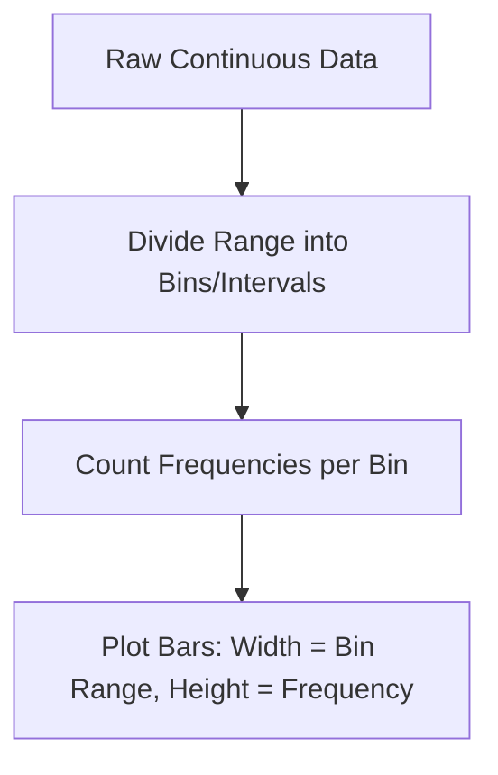

# Day 19 - Lecture 19.1: Histograms in Matplotlib

## 1. Overview & Purpose
A **Histogram** is a graphical representation of the distribution of numerical data. It groups continuous data into discrete ranges called **bins** and counts how many values fall into each bin (frequency).

### Why use a Histogram?
- **Understand Data Distribution:** Quickly observe whether data is symmetric (normal), skewed (left/right), bimodal, or uniform.
- **Identify Spread & Central Tendency:** See where the concentration of data lies (mean, median, mode region).
- **Detect Outliers & Gaps:** Identify unusual spikes or regions where no data exists.
- **Histogram vs. Bar Chart:**
  - **Bar Chart:** Used for categorical/discrete categories (e.g., fruits, cities, movie titles). Bars have gaps between them.
  - **Histogram:** Used for continuous quantitative variables (e.g., marks, age, height, salary). Bars typically touch each other because intervals are continuous.

---

## 2. Core Concepts & Parameters



### `plt.hist()` Function Syntax:
```python
plt.hist(
    x,                       # 1D array-like data
    bins=None,               # Integer (number of equal bins) or sequence (custom bin edges)
    range=None,              # (lower, upper) range of bins
    density=False,           # If True, returns probability density (area sums to 1)
    cumulative=False,        # If True, computes cumulative histogram
    color='skyblue',         # Fill color of the bars
    edgecolor='black',       # Outline color of bars (crucial for distinguishing adjacent bars!)
    linewidth=1.2,           # Border thickness
    alpha=1.0,               # Transparency level (0.0 transparent to 1.0 opaque)
    orientation='vertical'   # 'vertical' (default) or 'horizontal'
)
```

### Binning Strategies:
1. **Integer Bins:** `bins=10` splits $[\min(x), \max(x)]$ into 10 equally spaced intervals.
2. **Custom Bins (Sequence):** `bins=[0, 30, 70, 90, 100]` creates unequal bins: $[0, 30)$, $[30, 70)$, $[70, 90)$, $[90, 100]$. This is ideal for grade boundaries (e.g., Fail, Average, Good, Excellent).

---

## 3. Mathematical & Statistical Foundation

### 1. Bin Width Calculation:
$$\Delta = \frac{\max(x) - \min(x)}{k}$$
where $k$ is the number of bins.

### 2. Common Rules for Optimal Number of Bins ($k$):
- **Sturges' Rule** (Best for normal data):
  $$k = 1 + \lceil \log_2(n) \rceil$$
- **Freedman-Diaconis Rule** (Resistant to outliers):
  $$\text{Bin Width } h = 2 \cdot \frac{\text{IQR}(x)}{\sqrt[3]{n}}, \quad k = \left\lceil \frac{\max(x) - \min(x)}{h} \right\rceil$$

---

## 4. Code Implementation

```python
import matplotlib.pyplot as plt
import numpy as np

# Set random seed for reproducibility
np.random.seed(0)

# Generate 100 exam scores with mean = 70 and standard deviation = 10
scores = np.random.normal(loc=70, scale=10, size=100)

# 1. Basic Histogram
plt.figure(figsize=(8, 5))
plt.hist(scores, bins=10, color='skyblue', edgecolor='black', alpha=0.8)
plt.title("Distribution of Exam Scores (Equal Bins)")
plt.xlabel("Marks / Scores")
plt.ylabel("Number of Students (Frequency)")
plt.grid(axis='y', linestyle='--', alpha=0.7)
plt.show()

# 2. Custom Bins (Grading System)
marks = [
    25, 38, 42, 55, 61, 67, 72, 78, 83, 88,
    91, 95, 47, 53, 59, 64, 69, 74, 79, 85,
    92, 97, 33, 45, 58, 62, 71, 76, 81, 89
]
grade_bins = [0, 33, 60, 80, 100]

plt.figure(figsize=(8, 5))
plt.hist(marks, bins=grade_bins, color='lightgreen', edgecolor='black', linewidth=1.5)
plt.title("Grade Distribution of 30 Students (Custom Bins)")
plt.xlabel("Score Intervals")
plt.ylabel("Student Count")
plt.xticks(grade_bins)
plt.grid(True, linestyle=':', alpha=0.6)
plt.show()
```

---

## 5. Key Takeaways & Interview Points
1. **Always specify `edgecolor`:** Without `edgecolor='black'`, adjacent bars blend together into a single monochromatic block.
2. **Too many vs. Too few bins:**
   - *Too few bins (underfitting):* Oversimplifies the distribution, hiding modes and clusters.
   - *Too many bins (overfitting):* Creates a jagged, noisy plot dominated by sampling noise.
3. **Horizontal orientation:** Use `orientation='horizontal'` when comparing against vertical axes or side-by-side marginal distributions.
