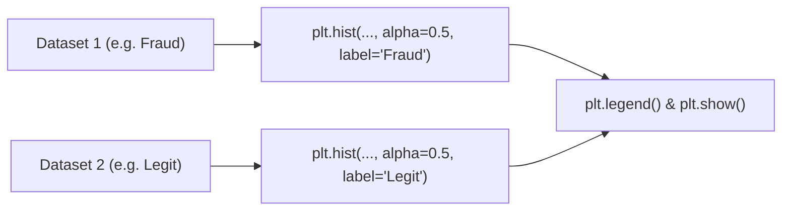

# Day 19 - Lecture 19.2: Multiple Datasets on Histogram [Hinglish]

[](https://www.python.org/)
[](lecture_19_02.ipynb)
[](notes.pdf)

🌐 **Language / भाषा:** [English](README.md) | **हिंदी / Hinglish** | [⬅️ Lecture 19 Module Par Wapas Jayein](../README_HINGLISH.md)

---

## 1. Overview & Purpose
In real-world data science, we frequently need to **compare the distributions of two or more populations** (e.g., Male vs. Female heights, Fraudulent vs. Legitimate transactions, Control vs. Treatment groups).

Plotting multiple datasets on the same histogram reveals:
- **Shift in central tendency:** Is one group systematically higher than the other?
- **Differences in variance/spread:** Is one group more dispersed or volatile?
- **Overlap & separability:** Can a classifier easily separate the two classes based on this feature?

---

## 2. Core Techniques & Parameters



### Key Parameters for Multiple Histograms:
1. **`alpha` (Transparency):** Set `alpha=0.5` or `0.6` so that overlapping regions between datasets are clearly visible rather than one dataset occluding the other.
2. **`label` and `plt.legend()`:** Essential for distinguishing which color corresponds to which group.
3. **Aligned Bins:** To make a fair visual comparison, ensure both datasets share either the same number of bins or identical bin edges.
4. **Side-by-side vs Overlaid:**
   - **Overlaid:** Call `plt.hist()` twice on the same axes with `alpha`.
   - **Side-by-side:** Pass a list of arrays: `plt.hist([data1, data2], label=['D1', 'D2'])`.

---

## 3. Real-World Case Study: Fraud Detection

In credit card transactions:
- **Legitimate transactions:** High volume of small everyday purchases ($2 - $50), with a long tail tapering off.
- **Fraudulent transactions:** Higher average amount, concentrated in round large values ($500, $1000, $2000).

```python
import matplotlib.pyplot as plt

legit_transactions = [
    2.99, 5.49, 8.99, 12.50, 14.99, 19.99, 23.45, 29.99, 34.99, 39.50,
    45.00, 49.99, 55.25, 60.00, 75.99, 89.99, 120.50, 150.00, 199.99,
    249.99, 300.75, 450.00, 600.00, 850.00, 1200.00
]

fraud_transactions = [
    50, 100, 150, 200, 300, 500, 500, 750, 1000, 1000,
    1200, 1500, 1500, 2000, 2500, 3000, 3000
]

plt.figure(figsize=(10, 6))
plt.hist(fraud_transactions, bins=10, label='Fraudulent', color='crimson', alpha=0.55, edgecolor='black')
plt.hist(legit_transactions, bins=10, label='Legitimate', color='seagreen', alpha=0.55, edgecolor='black')

plt.xlabel('Transaction Amount ($)', fontsize=12)
plt.ylabel('Frequency', fontsize=12)
plt.title('Transaction Amount Distribution: Legitimate vs Fraudulent', fontsize=14, fontweight='bold')
plt.legend(fontsize=11)
plt.grid(True, linestyle='--', alpha=0.5)
plt.show()
```

---

## 4. Mukhya Batein (Key Takeaways) & Best Practices
- When data scale varies dramatically (e.g. 1,000,000 legit vs 500 fraud), raw counts make the smaller class invisible. Use **`density=True`** (probability density) or a log scale (`plt.yscale('log')`).
- Keep colors intuitive: Red/Crimson for anomalies/fraud/errors, Green/Blue for normal/legitimate data.
