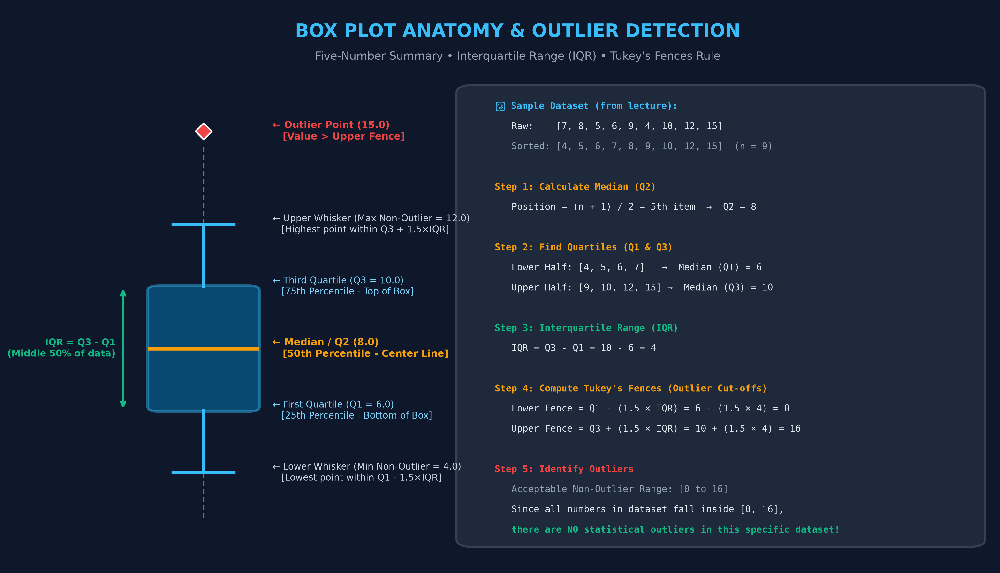
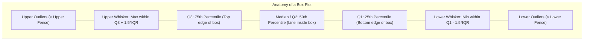

# Day 19 - Lecture 19.4: Box Plots (Five-Number Summary) [Hinglish]

[](https://www.python.org/)
[](lecture_19_04.ipynb)
[](notes.pdf)

🌐 **Language / भाषा:** [English](README.md) | **हिंदी / Hinglish** | [⬅️ Lecture 19 Module Par Wapas Jayein](../README_HINGLISH.md)

---

## 1. Overview & Purpose
A **Box Plot** (or Box-and-Whisker Plot), invented by mathematician **John Tukey** in 1977, is a standardized way of displaying the distribution of data based on a **five-number summary**:
1. **Minimum** (lowest non-outlier)
2. **First Quartile ($Q_1$)** (25th percentile)
3. **Median ($Q_2$)** (50th percentile)
4. **Third Quartile ($Q_3$)** (75th percentile)
5. **Maximum** (highest non-outlier)

Additionally, it explicitly detects and plots **Outliers** beyond the whiskers.

---

## 2. Anatomy of a Box Plot

### 📊 Visual Diagram & Derivation:




### Detailed Parts:
- **Interquartile Range (IQR):**
  $$\text{IQR} = Q_3 - Q_1$$
  Represents the middle 50% of the dataset.
- **Lower Whisker Limit (Lower Fence):**
  $$\text{Lower Fence} = Q_1 - 1.5 \times \text{IQR}$$
- **Upper Whisker Limit (Upper Fence):**
  $$\text{Upper Fence} = Q_3 + 1.5 \times \text{IQR}$$
- **Outliers:**
  Any point $x < \text{Lower Fence}$ or $x > \text{Upper Fence}$ is treated as an outlier and rendered as a distinct point (circle, diamond, cross).

---

## 3. When to Use a Box Plot?
- **Comparing Multiple Categories:** When you want to compare 5, 10, or 20 groups side by side. Histograms would get messy with 10 groups, whereas box plots sit neatly side by side.
- **Outlier Detection:** Immediate visual confirmation of extreme values.
- **Skewness Detection:**
  - If the median line is closer to $Q_1$, the data is right-skewed.
  - If the median line is closer to $Q_3$, the data is left-skewed.
  - If the median is centered and whiskers are equal, the distribution is symmetric.

---

## 4. Code Implementation

```python
import matplotlib.pyplot as plt

# Sample dataset
data = [7, 8, 5, 6, 9, 4, 10, 12, 15]

plt.figure(figsize=(6, 6))
plt.boxplot(data)
plt.title("Basic Box Plot (Five-Number Summary)", fontsize=14, fontweight="bold")
plt.ylabel("Observed Values", fontsize=12)
plt.grid(True, linestyle="--", alpha=0.6)
plt.show()
```

---

## 5. Key Interview Questions
1. **Why 1.5 * IQR?**
   John Tukey chose $1.5$ empirically. For a standard normal distribution, $\pm 1.5 \times \text{IQR}$ corresponds to approximately $\pm 2.7\sigma$ (covering 99.3% of the data). Points beyond it have a $<0.7\%$ probability under normality, making them plausible anomalies.
2. **Is the median sensitive to outliers?**
   No, the median and IQR are **robust statistics** (resistant to extreme outliers), unlike the mean and standard deviation.


---

## 📐 Tukey's Five-Number Summary aur Outliers Ka Ganitiya Sutra

Sorted data $X_{(1)} \le X_{(2)} \le \dots \le X_{(n)}$ ke liye John Tukey ka Five-Number Summary:

$$
\boxed{\text{Summary} = \left( X_{(1)}, \; Q_1, \; Q_2, \; Q_3, \; X_{(n)} \right)}
$$

jahan:
- $Q_2 = \text{Median} = \text{50th percentile}$
- $Q_1 = \text{First Quartile} = \text{25th percentile}$
- $Q_3 = \text{Third Quartile} = \text{75th percentile}$
- $\boxed{\text{IQR} = Q_3 - Q_1 \quad (\text{Interquartile Range})}$

Outlier detection ke liye Tukey's Fences:
$$
\boxed{\text{Lower Fence} = Q_1 - 1.5 \cdot \text{IQR} \qquad\text{aur}\qquad \text{Upper Fence} = Q_3 + 1.5 \cdot \text{IQR}}
$$

In boundaries ke bahar aane wale sabhi points ko outliers mark kiya jaata hai:
$$
\boxed{\text{Outlier}(x_i) \iff x_i < \text{Lower Fence} \quad\lor\quad x_i > \text{Upper Fence}}
$$
