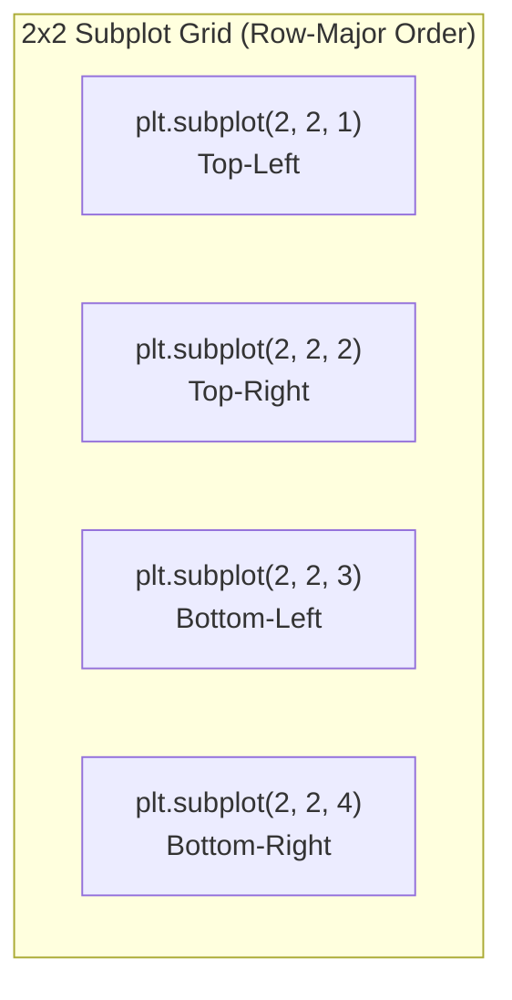

# Day 19 - Lecture 19.7: Subplots in Matplotlib

[](https://www.python.org/)
[](lecture_19_07.ipynb)
[](notes.pdf)

🌐 **Language:** **English** | [हिंदी / Hinglish](README_HINGLISH.md) | [⬅️ Back to Lecture 19 Module](../README.md)

---

## 1. Overview & Purpose
When communicating findings or building dashboards, putting all curves on a single plot can cause severe visual clutter and scale mismatch. **Subplots** allow us to place multiple separate graphs in a clean, organized **grid layout** within a single figure.

---

## 2. Syntax & Row-Major Indexing

```python
plt.subplot(nrows, ncols, index)
```
- `nrows`: Total number of rows in the grid.
- `ncols`: Total number of columns in the grid.
- `index`: 1-based index specifying which subplot is currently active.



> [!IMPORTANT]
> `index` starts at **1** (not 0) and counts row-wise from top-left to bottom-right.
> Shortcut notation: `plt.subplot(221)` is identical to `plt.subplot(2, 2, 1)`.

---

## 3. The Role of `plt.tight_layout()`
When creating multiple subplots, axis labels, tick marks, and titles from adjacent subplots often collide or overlap. 
Calling **`plt.tight_layout()`** automatically recalculates subplot margins, paddings, and font metrics to ensure zero overlap.

---

## 4. Code Implementation: Function Transformations

```python
import matplotlib.pyplot as plt
import numpy as np

x = [1, 2, 3, 4, 5, 6, 7, 8, 9, 10]
y1 = [np.sqrt(i) for i in x]  # Square root
y2 = [i * 2 for i in x]        # Linear / Double
y3 = [i ** 2 for i in x]       # Quadratic / Squares
y4 = [i ** 3 for i in x]       # Cubic / Cubes

plt.figure(figsize=(10, 8))

# Subplot 1: Square Root
plt.subplot(2, 2, 1)
plt.plot(x, y1, 'b-o')
plt.title("Plot 1: Square Root (√x)", fontweight="bold")
plt.grid(True)

# Subplot 2: Linear
plt.subplot(2, 2, 2)
plt.plot(x, y2, 'g-s')
plt.title("Plot 2: Linear (2x)", fontweight="bold")
plt.grid(True)

# Subplot 3: Quadratic
plt.subplot(2, 2, 3)
plt.plot(x, y3, 'r-^')
plt.title("Plot 3: Quadratic (x²)", fontweight="bold")
plt.grid(True)

# Subplot 4: Cubic
plt.subplot(2, 2, 4)
plt.plot(x, y4, 'm-d')
plt.title("Plot 4: Cubic (x³)", fontweight="bold")
plt.grid(True)

plt.tight_layout()
plt.show()
```

---

## 5. Limitations of Stateful `plt.subplot()`
The stateful approach relies on a global pointer to the "current active axis". For complex multi-panel figures or interactive code, this quickly leads to bugs. In the next lecture, we learn the superior **Object-Oriented API** (`fig, axes = plt.subplots()`).


---

## 📐 Violin Plot Geometry & Kernel Density Profile

A Violin Plot combines a box plot with a rotated, symmetric continuous Kernel Density Estimate $\hat{f}_h(y)$. The horizontal envelope width $w(y)$ at continuous elevation $y$ is:

$$
\boxed{x(y) = x_0 \pm \kappa \cdot \hat{f}_h(y)}
$$

where $x_0$ is the category anchor coordinate, $\kappa$ is a visual scaling factor, and $\hat{f}_h(y)$ is the normalized density satisfying:
$$
\boxed{\int_{-\infty}^{\infty} \hat{f}_h(y) \, dy = 1.0}
$$
