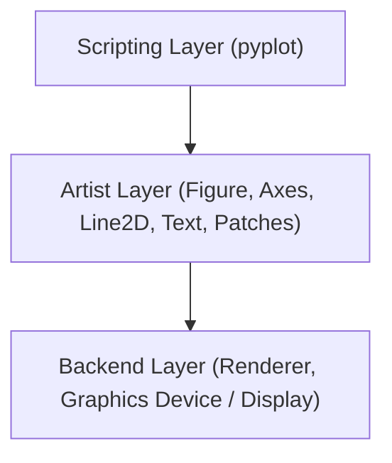

# Day 19 - Lecture 19.8: Modern Matplotlib (Object-Oriented API) [Hinglish]

[](https://www.python.org/)
[](lecture_19_08.ipynb)
[](notes.pdf)

🌐 **Language / भाषा:** [English](README.md) | **हिंदी / Hinglish** | [⬅️ Lecture 19 Module Par Wapas Jayein](../README_HINGLISH.md)

---

## 1. Overview & Architecture
Matplotlib offers two distinct programming paradigms:
1. **Pyplot / Stateful Interface (`plt.`):** Mimics MATLAB. Keeps track of the "current figure" and "current axes" implicitly in global memory. Fast for quick throwaway scripts, but error-prone for production.
2. **Object-Oriented (OO) Interface (`fig, ax = plt.subplots()`):** Modern standard. Explicitly assigns Figure and Axes objects to Python variables, giving direct, granular control.

### Matplotlib Layer Architecture:


- **Figure (`fig`):** The entire top-level window or canvas. Holds all subplots, legends, and global titles.
- **Axes (`ax`):** An individual plot or graph area with its own coordinate system, x/y axes, ticks, and data points.

---

## 2. Syntax Translation: Pyplot vs. Object-Oriented

| Stateful / Pyplot (`plt.`) | Modern Object-Oriented (`ax.`) |
| :--- | :--- |
| `plt.plot(x, y)` | `ax.plot(x, y)` |
| `plt.title("Title")` | `ax.set_title("Title")` |
| `plt.xlabel("X")` | `ax.set_xlabel("X")` |
| `plt.ylabel("Y")` | `ax.set_ylabel("Y")` |
| `plt.xlim(0, 10)` | `ax.set_xlim(0, 10)` |
| `plt.grid(True)` | `ax.grid(True)` |
| `plt.legend()` | `ax.legend()` |
| *(No single shortcut)* | `ax.set(title="...", xlabel="...", ylabel="...")` |
| `plt.title("Master Title")` | `fig.suptitle("Master Figure Title")` |

---

## 3. Code Implementation

```python
import matplotlib.pyplot as plt
import numpy as np

x = [1, 2, 3, 4, 5, 6, 7, 8, 9, 10]
y1 = [np.sqrt(i) for i in x]
y2 = [i * 2 for i in x]
y3 = [i ** 2 for i in x]
y4 = [i ** 3 for i in x]

# Create a 2x2 grid of subplots using OO style
fig, axes = plt.subplots(2, 2, figsize=(9, 8))

# Access individual subplots via 2D array indexing: axes[row, col]
axes[0, 0].plot(x, y1, 'b-o')
axes[0, 0].set_title("Square Root (√x)")
axes[0, 0].grid(True)

axes[0, 1].plot(x, y2, 'g-s')
axes[0, 1].set_title("Double (2x)")
axes[0, 1].grid(True)

axes[1, 0].plot(x, y3, 'r-^')
axes[1, 0].set_title("Square (x²)")
axes[1, 0].grid(True)

axes[1, 1].plot(x, y4, 'm-d')
axes[1, 1].set_title("Cube (x³)")
axes[1, 1].grid(True)

# Set super title for the overall figure
fig.suptitle("Mathematical Functions Grid (Object-Oriented API)", fontsize=16, fontweight="bold")
fig.tight_layout()
plt.show()

# Single subplot shortcut: ax.set()
fig, ax = plt.subplots(figsize=(6, 4))
vals = [1, 2, 3, 4, 5, 6]
ax.plot(vals, vals, color='navy', marker='o')
ax.set(
    title="Clean OO Configuration with ax.set()",
    xlabel="X Axis Values",
    ylabel="Y Axis Values"
)
ax.grid(True)
plt.show()
```

---

## 📐 Subplot Matrix Topology aur Indexing Ka Ganitiya Sutra

$(R \times C)$ grid me subplots ka 2D matrix structure hota hai:

$$
\mathbf{A} = (a_{r, c}) \in \mathcal{H}^{R \times C}, \quad r \in \{0, \dots, R-1\}, \; c \in \{0, \dots, C-1\}
$$

Linear 1D index $i$ se 2D row aur column calculate karne ka formula:

$$
\boxed{r = \lfloor i / C \rfloor \qquad\text{aur}\qquad c = i \pmod C}
$$

---

## 4. Mukhya Batein (Key Takeaways) & Best Practices
- In production, data pipelines, and dashboards, **always prefer `fig, ax = plt.subplots()`**.
- `ax.set(...)` saves multiple lines of code by setting titles, labels, and limits in a single method call.
