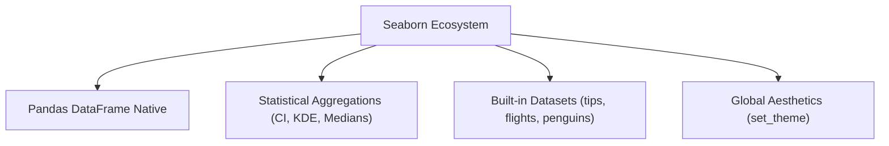

# Day 19 - Lecture 19.10: Introduction to Seaborn [Hinglish]

[](https://www.python.org/)
[](lecture_19_10.ipynb)
[](notes.pdf)

🌐 **Language / भाषा:** [English](README.md) | **हिंदी / Hinglish** | [⬅️ Lecture 19 Module Par Wapas Jayein](../README_HINGLISH.md)

---

## 1. Overview & What is Seaborn?
**Seaborn** is a Python data visualization library based on **Matplotlib**. It provides a high-level interface for drawing attractive and informative statistical graphics.

### Matplotlib vs. Seaborn:

| Feature | Matplotlib | Seaborn |
| :--- | :--- | :--- |
| **Level** | Low-level (Direct control over pixels, lines, axes) | High-level (Abstracted statistical functions) |
| **Data Format** | NumPy arrays, Python lists, series | Native Pandas DataFrame support (column names as strings) |
| **Statistical Computations** | Manual (user must calculate mean, error bars, regression) | Built-in (calculates confidence intervals, aggregation, KDE) |
| **Styling** | Plain default styling, requires manual configuration | Modern, aesthetic themes out-of-the-box |
| **Multi-dimensional Data** | Requires manual loops for colors/markers | Handled effortlessly with `hue`, `style`, `size`, `col` |

---

## 2. Core Features & Themes



### 1. Setting Themes (`sns.set_theme()`):
- **Styles:** `darkgrid` (default), `whitegrid`, `dark`, `white`, `ticks`
- **Palettes:** `deep`, `muted`, `bright`, `pastel`, `dark`, `colorblind`
- **Context:** `paper`, `notebook` (default), `talk`, `poster` (scales fonts for presentations)

### 2. Inbuilt Datasets:
Seaborn includes repository datasets accessible via `sns.load_dataset(name)`:
- `tips`: Waiter tips data (restaurant bills, tips, sex, smoker status, day, time).
- `flights`: Monthly airline passengers from 1949 to 1960.
- `penguins`: Palmer Archipelago penguin measurements (flipper length, bill length, body mass).
- `iris`: Classic Fisher Iris flower measurements.

---

## 3. Code Implementation

```python
import seaborn as sns
import matplotlib.pyplot as plt

# 1. Check version and available datasets
print("Seaborn Version:", sns.__version__)
print("First 10 datasets:", sns.get_dataset_names()[:10])

# 2. Setting modern aesthetic theme
sns.set_theme(style="whitegrid", palette="muted")

# 3. Loading the tips dataset
tips = sns.load_dataset("tips")
print("
Dataset Info:")
print(tips.head())
print(tips.info())

# 4. Quick introductory plot
plt.figure(figsize=(8, 5))
sns.scatterplot(data=tips, x="total_bill", y="tip", hue="time", style="time")
plt.title("Tips: Total Bill vs Tip Amount by Dining Time", fontsize=14, fontweight="bold")
plt.show()
```

---

## 📐 Dual-Axis Affine Transformation (`twinx`) Ka Ganitiya Sutra

Dual-axis plots me do alag-alag metrics $Y_1 \in [a_1, b_1]$ aur $Y_2 \in [a_2, b_2]$ shared physical height $H$ par alag-alag affine maps se project hote hain:

$$
\boxed{v_1(y_1) = H \cdot \frac{y_1 - a_1}{b_1 - a_1} \qquad\text{aur}\qquad v_2(y_2) = H \cdot \frac{y_2 - a_2}{b_2 - a_2}}
$$

Dono y-axes independent normalization use karte hain jisse unke units aapas me clash nahi karte.

---

## 4. Mukhya Batein (Key Takeaways)
- Seaborn does not replace Matplotlib—it **extends** it. Every Seaborn plot is drawn on Matplotlib `Figure` and `Axes` objects.
- Always use `sns.set_theme()` at the start of your notebooks to instantly upgrade plot aesthetics.
