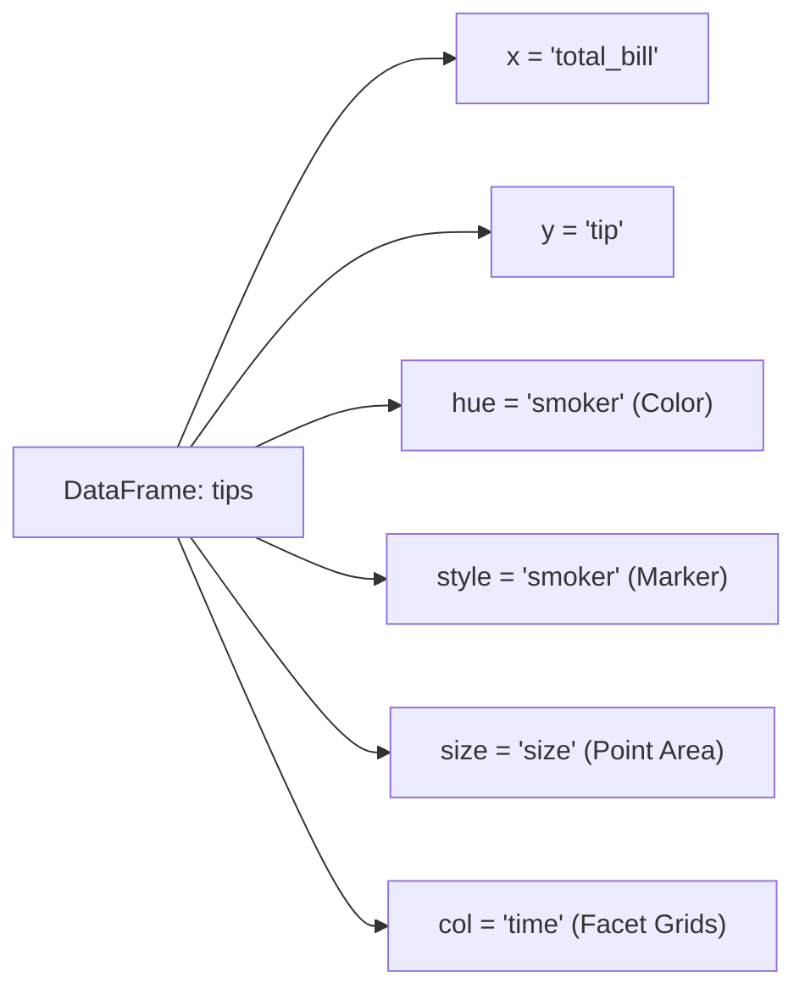

# Day 19 - Lecture 19.11: Creating Plots with Seaborn (Semantic Mapping)

[](https://www.python.org/)
[](lecture_19_11.ipynb)
[](notes.pdf)

🌐 **Language:** **English** | [हिंदी / Hinglish](README_HINGLISH.md) | [⬅️ Back to Lecture 19 Module](../README.md)

---

## 1. Overview & Semantic Dimensions
In standard plotting, each 2D chart represents 2 variables ($X$ and $Y$). Seaborn leverages the **Grammar of Graphics** to allow up to **5 or 6 dimensions of data** on a single 2D plot using **semantic mappings**:
1. **$X$-axis / $Y$-axis:** Continuous quantitative positions.
2. **`hue`:** Colors points/lines based on a categorical or continuous column.
3. **`style`:** Changes marker symbols (circles, crosses, triangles) or line dash styles.
4. **`size`:** Scales the area of markers or width of lines.
5. **`col` / `row`:** Splits data across subplots (Faceting).

---

## 2. Multi-Dimensional Semantic Mapping with `sns.relplot()`



### `sns.relplot()` Syntax:
```python
sns.relplot(
    data=tips,
    x="total_bill",      # Quantitative X
    y="tip",             # Quantitative Y
    col="time",          # Creates 2 subplots (Lunch & Dinner)
    hue="smoker",        # Color by smoker status (Yes / No)
    style="smoker",      # Different marker by smoker status
    size="size",         # Marker size proportional to party size (1 to 6 people)
    palette="Set2"       # Color palette
)
```

---

## 3. Code Implementation

```python
import seaborn as sns
import matplotlib.pyplot as plt

tips = sns.load_dataset("tips")

# Multi-dimensional relational plot
sns.set_theme(style="white")

g = sns.relplot(
    data=tips,
    x="total_bill",
    y="tip",
    col="time",
    hue="smoker",
    style="smoker",
    size="size",
    sizes=(30, 200),
    palette="Dark2",
    alpha=0.85
)

g.fig.subplots_adjust(top=0.85)
g.fig.suptitle("Multi-Dimensional Relationship: Bill vs Tip by Smoker, Party Size, and Time", fontsize=14, fontweight="bold")
plt.show()

# Line mapping with relplot
x_vals = list(range(1, 11))
y_vals = [i**2 for i in x_vals]

sns.relplot(x=x_vals, y=y_vals, kind="line", marker="o", color="crimson")
plt.title("Quadratic Growth with relplot(kind='line')")
plt.show()
```

---

## 📐 Matrix Grid Discretization & Colormap Transfer Function

In a matrix heatmap (`plt.imshow`), discrete array $\mathbf{M} \in \mathbb{R}^{m \times n}$ is mapped to normalized color intensity values $z_{ij} \in [0, 1]$:

$$
\boxed{z_{ij} = \frac{M_{ij} - M_{\min}}{M_{\max} - M_{\min}}}
$$

Each normalized scalar $z_{ij}$ is transformed into an RGB vector via transfer function $\Phi$:

$$
\boxed{\mathbf{C}_{ij} = \Phi(z_{ij}) \in [0, 1]^3}
$$

---

## 4. Key Takeaways
- **`hue` + `style` pairing:** When plotting scatter points, using `hue="smoker", style="smoker"` ensures both color and shape change together, making the chart **accessible to colorblind viewers**.
- `sns.relplot()` is a **Figure-level function** that returns a `FacetGrid` object, allowing automated subplot generation via `col` and `row`.
