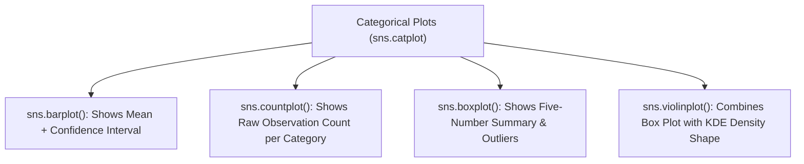

# Day 19 - Lecture 19.13: Categorical Plots in Seaborn (`barplot`, `boxplot`, `catplot`)

[](https://www.python.org/)
[](lecture_19_13.ipynb)
[](notes.pdf)

🌐 **Language:** **English** | [हिंदी / Hinglish](README_HINGLISH.md) | [⬅️ Back to Lecture 19 Module](../README.md)

---

## 1. Overview & Purpose
**Categorical Plots** are used when one variable is **categorical (discrete groups)** and the other is **numerical (continuous measurement)**.
Common questions answered:
- *Which day of the week generates the highest average total bill?*
- *Do men and women have different spending distributions across days?*

---

## 2. Core Categorical Plot Types



### Critical Distinction: `barplot` vs `countplot`
- **`sns.barplot(data, x='day', y='total_bill')`:** Aggregates numerical values (calculates the **mean** by default) and draws error bars.
- **`sns.countplot(data, x='day')`:** Simply counts how many rows exist for each category (frequency count).

---

## 3. Code Implementation

```python
import seaborn as sns
import matplotlib.pyplot as plt

tips = sns.load_dataset("tips")

# 1. Bar Plot: Average Total Bill by Day and Sex
plt.figure(figsize=(8, 5))
sns.barplot(data=tips, x="day", y="total_bill", hue="sex", palette="Blues", errorbar=None)
plt.title("Average Total Bill by Day and Sex (barplot)", fontsize=13, fontweight="bold")
plt.xlabel("Day of Week")
plt.ylabel("Mean Total Bill ($)")
plt.show()

# 2. Box Plot: Distribution of Total Bill by Day
plt.figure(figsize=(8, 5))
sns.boxplot(data=tips, x="day", y="total_bill", palette="Set3")
plt.title("Spread & Outliers of Total Bill Across Days (boxplot)", fontsize=13, fontweight="bold")
plt.xlabel("Day of Week")
plt.ylabel("Total Bill ($)")
plt.show()

# 3. Grouped Box Plot with hue
plt.figure(figsize=(9, 5))
sns.boxplot(data=tips, x="day", y="total_bill", hue="sex", palette="Pastel1")
plt.title("Box Plot Grouped by Day and Sex", fontsize=13, fontweight="bold")
plt.legend(title="Sex", loc="upper left")
plt.show()
```

---

## 📐 Categorical Estimator & Bootstrap Confidence Interval Mathematics

In Seaborn categorical plots (`sns.barplot`), the central tendency estimator is the sample mean $\bar{x} = \frac{1}{n}\sum x_i$. The Standard Error of the Mean ($\text{SE}$) is:

$$
\boxed{\text{SE}(\bar{x}) = \frac{s}{\sqrt{n}} = \sqrt{\frac{\sum_{i=1}^n (x_i - \bar{x})^2}{n(n - 1)}}}
$$

The 95% Confidence Interval error bar is given by:

$$
\boxed{\text{CI}_{95\%} = \bar{x} \pm t_{n-1, \; 0.025} \cdot \text{SE}(\bar{x})}
$$

---

## 4. Key Takeaways
- Seaborn's `barplot` calculates statistical aggregates (**mean**) automatically—do not confuse it with a Matplotlib bar chart which plots raw values passed to it.
- Adding `hue="sex"` automatically groups and dodges the bars or boxes side by side.
