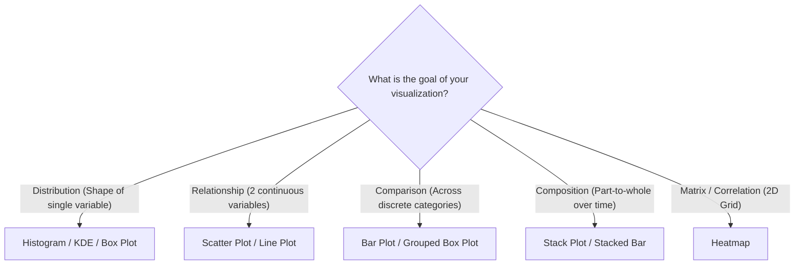

# Day 19 - Lecture 19.16: Best Practices for Data Visualization

[](https://www.python.org/)
[](lecture_19_16.ipynb)
[](notes.pdf)

🌐 **Language:** **English** | [हिंदी / Hinglish](README_HINGLISH.md) | [⬅️ Back to Lecture 19 Module](../README.md)

---

## 1. Overview: The Synergy of Matplotlib & Seaborn
The single most recommended industry workflow combines **Matplotlib's layout control** with **Seaborn's statistical power**:
```python
fig, ax = plt.subplots(figsize=(8, 5))
sns.lineplot(data=df, x='col1', y='col2', ax=ax)  # Pass ax=ax
ax.set_title(...)                                  # Fine-tune with ax methods
```

---

## 2. The Chart Selection Decision Matrix



---

## 3. Core Rules for Professional Visualizations

1. **Maximize the Data-to-Ink Ratio (Edward Tufte):**
   - Eliminate unnecessary borders, 3D effects, and garish background colors.
   - Use subtle gridlines (`linestyle=':'`, `alpha=0.5`).
2. **Accessible Color Choices:**
   - Avoid pure red-green combinations without shape/marker differences (affects 8% of male population with deuteranopia).
   - Use perceptual palettes: `colorblind`, `viridis`, or `cividis`.
3. **Always Label Units:**
   - Instead of `plt.xlabel("Revenue")`, use `plt.xlabel("Revenue (in $ Millions)")`.
4. **Sort Categorical Data:**
   - Unordered bars force the eye to jump back and forth. Always sort categories by value unless there is a natural temporal order (e.g. Mon, Tue, Wed).

---

## 4. Code Implementation: The Recommended Pattern

```python
import seaborn as sns
import matplotlib.pyplot as plt

tips = sns.load_dataset("tips")

# Create figure and axes explicitly using OO style
fig, ax = plt.subplots(figsize=(9, 5))

# Plot high-level Seaborn chart onto target axes
sns.lineplot(
    data=tips,
    x="day",
    y="total_bill",
    hue="sex",
    marker="o",
    markersize=8,
    errorbar=None,
    palette=["#2b5c8f", "#d95f02"],
    ax=ax
)

# Customize precisely using Axes methods
ax.set_title("Average Total Bill by Day and Sex", fontsize=14, fontweight="bold", pad=12)
ax.set_xlabel("Day of Week", fontsize=12)
ax.set_ylabel("Total Bill ($)", fontsize=12)
ax.set_ylim(0, 26)

# Refine legend
ax.legend(title="Customer Sex", frameon=True, facecolor='white', framealpha=0.9)
ax.grid(axis='y', linestyle='--', alpha=0.5)

plt.tight_layout()
plt.show()
```

---

## 5. Complete Solutions to Day-19 Assignment Problems

### Problem 1: Seaborn Tips Box Plot by Day & Sex
- **Task:** Create box plot of `total_bill` for each `day`, add `hue="sex"`, identify day with highest median bill, comment on outliers.
- **Answer:** Sunday (`Sun`) exhibits the highest median total bill (~$20). Multiple high outliers ($>\$40$) are observed on Saturday and Sunday nights.

### Problem 2: Total Bill vs Tip Scatter Plot
- **Task:** Color points by `sex`, marker styles by `smoker`, analyze if smokers tip differently.
- **Answer:** Smokers display greater variance in tipping behavior (some tip exceptionally high, others tip low), whereas non-smokers show a tighter linear relationship with bill size.

### Problem 3: Normal Distribution & Passing Threshold
- **Task:** Generate `np.random.normal(70, 10, 200)`, plot histogram, draw `axvline` at mean.
- **Answer:** Visualizes bell-shaped symmetric Gaussian distribution where Mean = Median = Mode $\approx 70$.

### Problem 4: Average Tip Heatmap Pivot Table
- **Task:** Pivot table of average tip with Rows=`day`, Columns=`time`, annotated heatmap.
- **Answer:** Sunday Dinner delivers the highest average tip.


---

## 📐 Edward Tufte's Visual Mathematics (Data-Ink & Lie Factor)

The quantitative foundation of graphics engineering was formulated by Edward Tufte (1983):

### 1. Data-Ink Ratio ($\eta$):
$$
\boxed{\eta = \frac{\mathcal{I}_{\text{data}}}{\mathcal{I}_{\text{total}}} = 1.0 - \frac{\mathcal{I}_{\text{non-data}}}{\mathcal{I}_{\text{total}}} \in (0, 1]}
$$

Goal: Maximize $\eta \to 1.0$ by removing non-data ink (redundant borders, 3D effects, dark background fills).

### 2. Lie Factor (LF):
$$
\boxed{\text{Lie Factor} = \frac{\text{Size of effect shown in graphic}}{\text{Size of effect in data}} = \frac{\dfrac{|G_2 - G_1|}{G_1}}{\dfrac{|D_2 - D_1|}{D_1}}}
$$

A truthful chart maintains $\boxed{\text{Lie Factor} = 1.0 \pm 0.05}$. If $\text{LF} > 1.05$ or $\text{LF} < 0.95$, the visualization systematically distorts reality.
