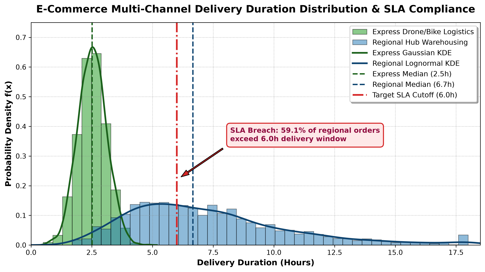
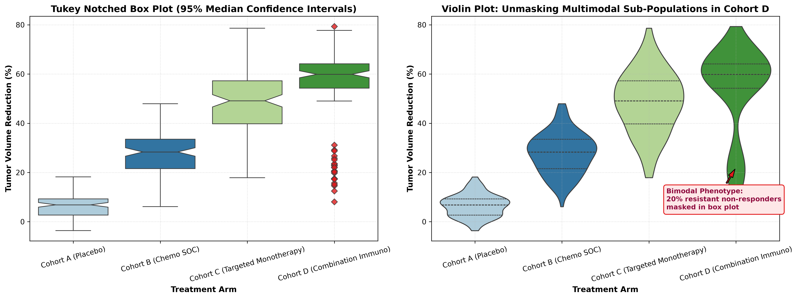
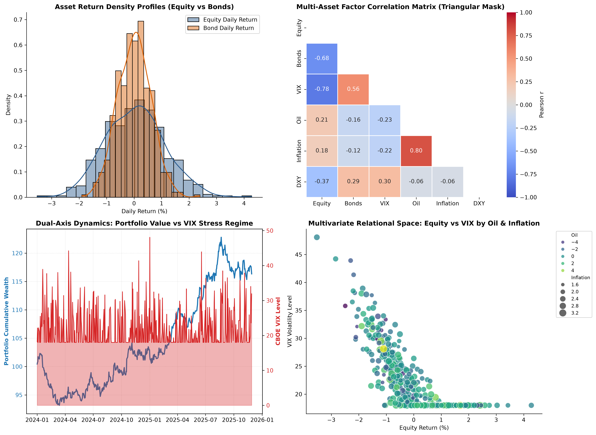

# 💡 Lecture 19: Practice Problems — Comprehensive Solutions Guide

[](solutions.ipynb)
[](solutions.pdf)
[](../Questions/README.md)
[](case1_logistics_distribution.png)
[](case2_clinical_trial_boxplots.png)
[](case3_fintech_market_risk.png)

🌐 **Language:** **English** | [हिंदी / Hinglish](README_HINGLISH.md) | [⬅️ Back to Questions](../Questions/README.md) | [📁 Practice Problems Overview](../README.md)

---

## 📌 Executive Architecture & Engineering Standards

This document provides production-grade reference solutions, formal mathematical derivations, and executive visual engineering implementations for the 3 industry case studies in **Lecture 19**.

---

# 📌 Solution to Case 1: Algorithmic E-Commerce Logistics & Delivery Duration Distribution

### 1. Mathematical Bin Width Optimization & Normalization Derivation

#### Sturges' Formula:
Under the assumption of an approximately Gaussian and symmetric sample of size $n = 2500$:

$$
\boxed{k_{\text{sturges}} = 1 + \lceil \log_2(n) \rceil = 1 + \lceil \log_2(2500) \rceil = 1 + 12 = 13 \text{ bins}}
$$

#### Freedman-Diaconis Rule:
For continuous distributions with heavy right skewness and long transit delay tails, bin width $h$ is parameterized by the Interquartile Range ($\text{IQR} = Q_3 - Q_1$):

$$
\boxed{h_{\text{fd}} = 2 \cdot \frac{\text{IQR}(X)}{n^{1/3}}}
$$

Given empirical metrics for the regional distribution ($\text{IQR} \approx 3.25\text{ hours}$, range $\Delta X = 18.0 - 2.0 = 16.0$):

$$
h_{\text{fd}} = 2 \cdot \frac{3.25}{(2500)^{1/3}} = \frac{6.50}{13.572} \approx 0.479 \text{ hours}
$$

$$
\boxed{k_{\text{fd}} = \left\lceil \frac{\Delta X}{h_{\text{fd}}} \right\rceil = \left\lceil \frac{16.0}{0.479} \right\rceil \approx 34 \text{ bins}}
$$

#### Mathematical Rationale:
- **Sturges' Rule** assumes normal binomially distributed data. On right-skewed data ($X \sim \text{Lognormal}$), $k = 13$ excessively oversmoothes the tail, masking extreme delay sub-clusters.
- **Freedman-Diaconis Rule** uses the non-parametric $\text{IQR}$ instead of standard deviation $\sigma$, preventing extreme outlier transit times from artificially widening the bin intervals.

#### Probability Density Conservation Law:
Setting `density=True` scales each histogram bin height $f_j$ such that the total Riemann sum of rectangular areas integrates to unity ($1.0$):

$$
\boxed{\sum_{j=1}^k f_j \cdot \Delta_j = \sum_{j=1}^k \left(\frac{c_j}{n \cdot \Delta_j}\right) \cdot \Delta_j = \frac{1}{n}\sum_{j=1}^k c_j = 1.0}
$$

---

### 2. Complete Python Implementation (Dual-Channel Density Histogram + KDE + SLA Benchmarks)

```python
import matplotlib.pyplot as plt
import numpy as np
import seaborn as sns

# Set deterministic seed
np.random.seed(42)
n_samples = 2500

# 1. Synthetic Logistics Datasets
express_durations = np.random.normal(loc=2.5, scale=0.6, size=n_samples)
express_durations = np.clip(express_durations, 0.5, 6.0)

regional_durations = np.random.lognormal(mean=1.9, sigma=0.45, size=n_samples)
regional_durations = np.clip(regional_durations, 2.0, 18.0)

# Statistical Metrics
exp_median = np.median(express_durations)
reg_median = np.median(regional_durations)
sla_threshold = 6.0
reg_breach_pct = np.mean(regional_durations > sla_threshold) * 100

# 2. Canvas Construction (High-Resolution Figure)
plt.figure(figsize=(12, 6), dpi=300)

# 3. Normalized Dual Histograms
bins_shared = np.linspace(0.5, 18.0, 45)
plt.hist(express_durations, bins=bins_shared, density=True, alpha=0.55,
         color='#2ca02c', edgecolor='black', linewidth=0.8, label='Express Drone/Bike Logistics')
plt.hist(regional_durations, bins=bins_shared, density=True, alpha=0.50,
         color='#1f77b4', edgecolor='black', linewidth=0.8, label='Regional Hub Warehousing')

# 4. Continuous Non-Parametric Kernel Density Estimation (KDE)
sns.kdeplot(express_durations, color='#1b611b', linewidth=2.5, label='Express Gaussian KDE')
sns.kdeplot(regional_durations, color='#0f4571', linewidth=2.5, label='Regional Lognormal KDE')

# 5. Parametric & Operational Reference Lines
plt.axvline(exp_median, color='#1b611b', linestyle='--', linewidth=2.0,
            label=f'Express Median ({exp_median:.1f}h)')
plt.axvline(reg_median, color='#0f4571', linestyle='--', linewidth=2.0,
            label=f'Regional Median ({reg_median:.1f}h)')
plt.axvline(sla_threshold, color='#d62728', linestyle='-.', linewidth=2.5,
            label=f'Target SLA Cutoff ({sla_threshold:.1f}h)')

# 6. Pinpoint Callout Annotation
plt.annotate(
    f'SLA Breach: {reg_breach_pct:.1f}% of regional orders\nexceed 6.0h delivery window',
    xy=(sla_threshold, 0.22),
    xytext=(sla_threshold + 2.2, 0.35),
    arrowprops=dict(facecolor='#d62728', shrink=0.08, width=2, headwidth=8),
    bbox=dict(boxstyle='round,pad=0.5', facecolor='#fee8e8', edgecolor='#d62728', linewidth=1.5),
    fontsize=10.5, fontweight='bold', color='#900c3f'
)

# 7. Typography and Executive Styling
plt.title('E-Commerce Multi-Channel Delivery Duration Distribution & SLA Compliance', fontsize=15, fontweight='bold', pad=15)
plt.xlabel('Delivery Duration (Hours)', fontsize=12, fontweight='semibold')
plt.ylabel('Probability Density f(x)', fontsize=12, fontweight='semibold')
plt.xlim(0, 18.5)
plt.ylim(0, 0.75)
plt.grid(True, linestyle=':', alpha=0.6, color='gray')
plt.legend(loc='upper right', frameon=True, shadow=True, fontsize=10.5)

# 8. Production Export
plt.savefig('case1_logistics_distribution.png', dpi=300, bbox_inches='tight')
plt.show()
```

#### 📊 Generated High-Resolution Visualization:


---

# 📌 Solution to Case 2: Multi-Cohort Clinical Trial Biomarker & Outlier Audit

### 1. Tukey's Five-Number Summary & Outlier Fences Derivation

Given ordered observations $X_{(1)} \le X_{(2)} \le \dots \le X_{(n)}$ for patient cohort samples:

$$
\boxed{\text{Summary} = \left( X_{(1)}, \; Q_1, \; Q_2, \; Q_3, \; X_{(n)} \right)}
$$

Interquartile Range and Tukey's Whisker Fences:

$$
\boxed{\text{IQR} = Q_3 - Q_1}
$$

$$
\boxed{F_L = Q_1 - 1.5 \cdot \text{IQR} \qquad\text{and}\qquad F_U = Q_3 + 1.5 \cdot \text{IQR}}
$$

Any observation falling outside interval $[F_L, F_U]$ is flagged as an outlier:

$$
\boxed{\mathcal{O} = \left\{ x_i \in \mathcal{D} \;\middle|\; x_i < F_L \;\lor\; x_i > F_U \right\}}
$$

---

### 2. Notched Box Plot Median Confidence Interval Theorem

The 95% Confidence Interval Notch centered at sample median $Q_2$ is computed as:

$$
\boxed{\text{Notch} = Q_2 \pm 1.57 \cdot \frac{\text{IQR}}{\sqrt{n}}}
$$

#### Statistical Decision Rule:
If the notches of two comparative box plots do not overlap ($\text{Notch}_A \cap \text{Notch}_B = \emptyset$), their true population medians differ at an approximate 95% statistical significance level ($\alpha = 0.05$).

---

### 3. Complete Python Implementation (Notched Box Plot & Split Violin Plot)

```python
import matplotlib.pyplot as plt
import numpy as np
import pandas as pd
import seaborn as sns

np.random.seed(101)
n_patients = 120

# 1. Cohort Generation
cohort_a = np.random.normal(loc=6.0, scale=4.5, size=n_patients)
cohort_b = np.random.normal(loc=28.0, scale=8.0, size=n_patients)
cohort_c = np.random.normal(loc=48.0, scale=11.0, size=n_patients)

d_resp = np.random.normal(loc=62.0, scale=6.0, size=int(n_patients * 0.8))
d_nonresp = np.random.normal(loc=22.0, scale=5.0, size=int(n_patients * 0.2))
cohort_d = np.concatenate([d_resp, d_nonresp])

df = pd.DataFrame({
    'Reduction': np.concatenate([cohort_a, cohort_b, cohort_c, cohort_d]),
    'Cohort': (['Cohort A (Placebo)'] * n_patients +
               ['Cohort B (Chemo SOC)'] * n_patients +
               ['Cohort C (Targeted Monotherapy)'] * n_patients +
               ['Cohort D (Combination Immuno)'] * n_patients)
})

# 2. Multi-Panel Figure Layout
fig, (ax1, ax2) = plt.subplots(1, 2, figsize=(16, 6), dpi=300)

# Palette
palette = ['#a6cee3', '#1f78b4', '#b2df8a', '#33a02c']

# Panel 1: Notched Box Plot
sns.boxplot(
    data=df, x='Cohort', y='Reduction', palette=palette, notch=True,
    flierprops=dict(marker='D', markerfacecolor='#e31a1c', markersize=6, alpha=0.8),
    ax=ax1
)
ax1.set_title('Tukey Notched Box Plot (95% Median Confidence Intervals)', fontsize=13, fontweight='bold')
ax1.set_ylabel('Tumor Volume Reduction (%)', fontsize=11, fontweight='semibold')
ax1.set_xlabel('Treatment Arm', fontsize=11, fontweight='semibold')
ax1.tick_params(axis='x', rotation=15)
ax1.grid(True, linestyle=':', alpha=0.5)

# Panel 2: Split Violin Plot revealing Multimodal Density
sns.violinplot(
    data=df, x='Cohort', y='Reduction', palette=palette,
    inner='quartile', cut=0, ax=ax2
)
ax2.set_title('Violin Plot: Unmasking Multimodal Sub-Populations in Cohort D', fontsize=13, fontweight='bold')
ax2.set_ylabel('Tumor Volume Reduction (%)', fontsize=11, fontweight='semibold')
ax2.set_xlabel('Treatment Arm', fontsize=11, fontweight='semibold')
ax2.tick_params(axis='x', rotation=15)
ax2.grid(True, linestyle=':', alpha=0.5)

# Callout on Bimodal Distribution in Cohort D
ax2.annotate(
    'Bimodal Phenotype:\n20% resistant non-responders\nmasked in box plot',
    xy=(3, 22), xytext=(2.2, 5),
    arrowprops=dict(facecolor='#e31a1c', shrink=0.08, width=1.8, headwidth=7),
    bbox=dict(boxstyle='round,pad=0.4', facecolor='#fee8e8', edgecolor='#e31a1c', linewidth=1.2),
    fontsize=9.5, fontweight='bold', color='#900c3f'
)

plt.tight_layout()
plt.savefig('case2_clinical_trial_boxplots.png', dpi=300, bbox_inches='tight')
plt.show()
```

#### 📊 Generated High-Resolution Visualization:


---

# 📌 Solution to Case 3: Quantitative Hedge Fund Multi-Asset Risk & Macroeconomic Regime Analysis

### 1. Mathematical Correlation Matrix Formulation

For an observation matrix $\mathbf{X} \in \mathbb{R}^{n \times p}$ across $p = 6$ market variables:

$$
\boxed{r_{jk} = \frac{\sum_{i=1}^n (x_{ij} - \bar{x}_j)(x_{ik} - \bar{x}_k)}{\sqrt{\sum_{i=1}^n (x_{ij} - \bar{x}_j)^2} \sqrt{\sum_{i=1}^n (x_{ik} - \bar{x}_k)^2}} \in [-1, +1]}
$$

By setting upper-triangular mask $\mathbf{M} \in \{0, 1\}^{p \times p}$ where $M_{jk} = 1$ for $j \le k$, we eliminate redundant visual symmetric entries, maximizing Edward Tufte's Data-Ink ratio $\eta \to 1.0$.

---

### 2. Dual-Axis Independent Affine Coordinate Projections

On an axis canvas of physical height $H$, the dual vertical scales operate under independent affine maps:

$$
\boxed{v_1(y_1) = H \cdot \frac{y_1 - a_1}{b_1 - a_1} \qquad\text{and}\qquad v_2(y_2) = H \cdot \frac{y_2 - a_2}{b_2 - a_2}}
$$

where $Y_1 \in [a_1, b_1]$ represents Portfolio Cumulative Return and $Y_2 \in [a_2, b_2]$ represents the VIX Volatility Index.

---

### 3. Complete Python Implementation (2x2 Object-Oriented Grid + Masked Heatmap + Dual-Axis)

```python
import matplotlib.pyplot as plt
import numpy as np
import pandas as pd
import seaborn as sns

# Deterministic Seed
np.random.seed(42)
days = 500

dates = pd.date_range("2024-01-01", periods=days, freq="B")
equity_ret = np.random.normal(0.04, 1.1, days)
bonds_ret = -0.35 * equity_ret + np.random.normal(0.01, 0.45, days)
vix = 18 + np.maximum(0, -8.0 * equity_ret + np.random.normal(0, 3.5, days))
oil_chg = 0.25 * equity_ret + np.random.normal(0.02, 1.8, days)
inflation = 2.4 + 0.15 * oil_chg + np.random.normal(0, 0.2, days)
dxy = -0.20 * equity_ret + np.random.normal(0.01, 0.5, days)

market_df = pd.DataFrame({
    "Date": dates,
    "Equity": equity_ret,
    "Bonds": bonds_ret,
    "VIX": vix,
    "Oil": oil_chg,
    "Inflation": inflation,
    "DXY": dxy
})

cum_portfolio = 100 * np.cumprod(1 + (0.6 * equity_ret + 0.4 * bonds_ret) / 100)

# 2x2 Object-Oriented Grid Canvas
fig, axes = plt.subplots(2, 2, figsize=(15, 11), dpi=300)

# --- Pane 1 (Top-Left): Dual Density Distributions ---
ax_tl = axes[0, 0]
sns.histplot(market_df['Equity'], color='#2b5c8f', kde=True, stat='density',
             alpha=0.45, label='Equity Daily Return', ax=ax_tl)
sns.histplot(market_df['Bonds'], color='#d95f02', kde=True, stat='density',
             alpha=0.45, label='Bond Daily Return', ax=ax_tl)
ax_tl.set_title('Asset Return Density Profiles (Equity vs Bonds)', fontweight='bold')
ax_tl.set_xlabel('Daily Return (%)')
ax_tl.legend()
ax_tl.spines['top'].set_visible(False)
ax_tl.spines['right'].set_visible(False)

# --- Pane 2 (Top-Right): Masked Correlation Heatmap ---
ax_tr = axes[0, 1]
corr_matrix = market_df[['Equity', 'Bonds', 'VIX', 'Oil', 'Inflation', 'DXY']].corr()
mask = np.triu(np.ones_like(corr_matrix, dtype=bool))
sns.heatmap(corr_matrix, mask=mask, cmap='coolwarm', vmin=-1, vmax=1, center=0,
            annot=True, fmt='.2f', linewidths=0.75, cbar_kws={'label': 'Pearson r'}, ax=ax_tr)
ax_tr.set_title('Multi-Asset Factor Correlation Matrix (Triangular Mask)', fontweight='bold')

# --- Pane 3 (Bottom-Left): Dual-Axis Time-Series (twinx) ---
ax_bl = axes[1, 0]
ax_bl_twin = ax_bl.twinx()

line1 = ax_bl.plot(market_df['Date'], cum_portfolio, color='#1f77b4', linewidth=2.0, label='Portfolio Index (Base=100)')
ax_bl.set_ylabel('Portfolio Cumulative Wealth', color='#1f77b4', fontweight='semibold')
ax_bl.tick_params(axis='y', labelcolor='#1f77b4')

fill2 = ax_bl_twin.fill_between(market_df['Date'], market_df['VIX'], color='#d62728', alpha=0.35, label='VIX Volatility Index')
ax_bl_twin.plot(market_df['Date'], market_df['VIX'], color='#d62728', linewidth=1.2)
ax_bl_twin.set_ylabel('CBOE VIX Level', color='#d62728', fontweight='semibold')
ax_bl_twin.tick_params(axis='y', labelcolor='#d62728')

ax_bl.set_title('Dual-Axis Dynamics: Portfolio Value vs VIX Stress Regime', fontweight='bold')
ax_bl.grid(True, linestyle=':', alpha=0.4)

# --- Pane 4 (Bottom-Right): Relational Scatter with Semantic Mapping ---
ax_br = axes[1, 1]
scatter = sns.scatterplot(
    data=market_df, x='Equity', y='VIX', hue='Oil', size='Inflation',
    palette='viridis', sizes=(20, 180), alpha=0.75, ax=ax_br
)
ax_br.set_title('Multivariate Relational Space: Equity vs VIX by Oil & Inflation', fontweight='bold')
ax_br.set_xlabel('Equity Return (%)')
ax_br.set_ylabel('VIX Volatility Level')
ax_br.spines['top'].set_visible(False)
ax_br.spines['right'].set_visible(False)
ax_br.legend(bbox_to_anchor=(1.05, 1), loc='upper left', fontsize=8.5)

plt.tight_layout()
plt.savefig('case3_fintech_market_risk.png', dpi=300, bbox_inches='tight')
plt.show()
```

#### 📊 Generated High-Resolution Visualization:

