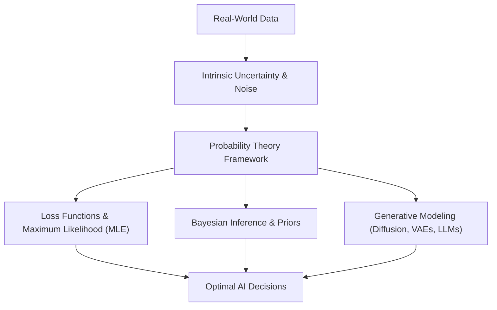

# Day 20 - Lecture 20.1: Math for AI & Why Probability Matters

[](https://www.python.org/)
[](lecture_20_01.ipynb)
[](notes.pdf)

🌐 **Language:** **English** | [हिंदी / Hinglish](README_HINGLISH.md) | [⬅️ Back to Lecture 20 Module](../README.md)

---

## 1. Overview & Conceptual Architecture

Artificial Intelligence and Machine Learning operate in environments characterized by imperfect information, stochastic sensor readings, missing attributes, and inherent natural randomness. Deterministic logic (classical rule-based programming) fails when confronted with non-deterministic phenomena. **Probability Theory** provides the rigorous mathematical framework for quantifying, reasoning about, and acting under **uncertainty**.



### Why Probability Governs Modern AI
1. **Uncertainty Quantification:** Deterministic algorithms output binary decisions; probabilistic models output well-calibrated confidence measures $P(Y = y \mid X = \mathbf{x})$.
2. **Loss Function Formulation:** The omnipresent cross-entropy loss function is derived directly from negative log-likelihood minimization under Bernoulli/Categorical probability distributions.
3. **Generative AI Systems:** State-of-the-art architectures (Diffusion models, Variational Autoencoders, Large Language Models) model high-dimensional joint probability distributions $p(\mathbf{x})$.
4. **Regularization & Prior Knowledge:** Bayesian frameworks incorporate domain constraints as prior probability distributions, preventing catastrophic overfitting.

---

## 2. Mathematical Formalism: Maximum Likelihood Estimation (MLE)

In supervised learning, given an independent and identically distributed (i.i.d.) dataset $\mathcal{D} = \{(\mathbf{x}_1, y_1), \dots, (\mathbf{x}_n, y_n)\}$, the objective is to find model parameters $oldsymbol{	heta}$ that maximize the likelihood of the observed targets:

$$
oxed{\mathcal{L}(oldsymbol{	heta}) = \prod_{i=1}^n P(y_i \mid \mathbf{x}_i; oldsymbol{	heta})}
$$

Because the product of numerous probabilities leads to numerical floating-point underflow, optimization is universally performed over the **Negative Log-Likelihood (NLL)**:

$$
oxed{\mathcal{J}(oldsymbol{	heta}) = -\log \mathcal{L}(oldsymbol{	heta}) = -\sum_{i=1}^n \log P(y_i \mid \mathbf{x}_i; oldsymbol{	heta})}
$$

For binary classification where $y_i \in \{0, 1\}$ and $\hat{y}_i = \sigma(\mathbf{w}^T \mathbf{x}_i + b) \in [0, 1]$, the NLL simplifies directly to the canonical **Binary Cross-Entropy Loss**:

$$
oxed{\mathcal{L}_{	ext{BCE}}(oldsymbol{	heta}) = -rac{1}{n} \sum_{i=1}^n \left[ y_i \log(\hat{y}_i) + (1 - y_i) \log(1 - \hat{y}_i) 
ight]}
$$

---

## 3. Python Implementation: Likelihood vs. Log-Likelihood Stability

```python
import numpy as np
import matplotlib.pyplot as plt

# Simulate 100 independent Bernoulli outcomes with true p = 0.70
np.random.seed(42)
n_trials = 100
true_p = 0.70
data = np.random.binomial(1, true_p, size=n_trials)
k_successes = np.sum(data)

# Candidate parameter space
p_candidates = np.linspace(0.01, 0.99, 200)

# 1. Raw Likelihood (subject to numerical underflow)
raw_likelihood = (p_candidates ** k_successes) * ((1 - p_candidates) ** (n_trials - k_successes))

# 2. Log-Likelihood (numerically robust)
log_likelihood = k_successes * np.log(p_candidates) + (n_trials - k_successes) * np.log(1 - p_candidates)

# Optimal MLE analytical parameter
p_mle = k_successes / n_trials

print(f"Sample Successes: {k_successes}/{n_trials}")
print(f"Analytical MLE Estimate: p_hat = {p_mle:.3f}")
print(f"Peak Log-Likelihood: {np.max(log_likelihood):.2f}")
```

---

## 4. Key Takeaways & Interview Points
- **Uncertainty is Non-Negotiable:** Real-world machine learning deals with aleatoric (data noise) and epistemic (model lack of knowledge) uncertainty.
- **Cross-Entropy IS Probability:** Whenever neural networks minimize cross-entropy loss, they are directly maximizing the likelihood of a categorical probability distribution.
- **Underflow Protection:** Multiplying small probabilities causes floating point values to collapse to 0; taking logarithms converts products to additions while preserving monotonicity.
