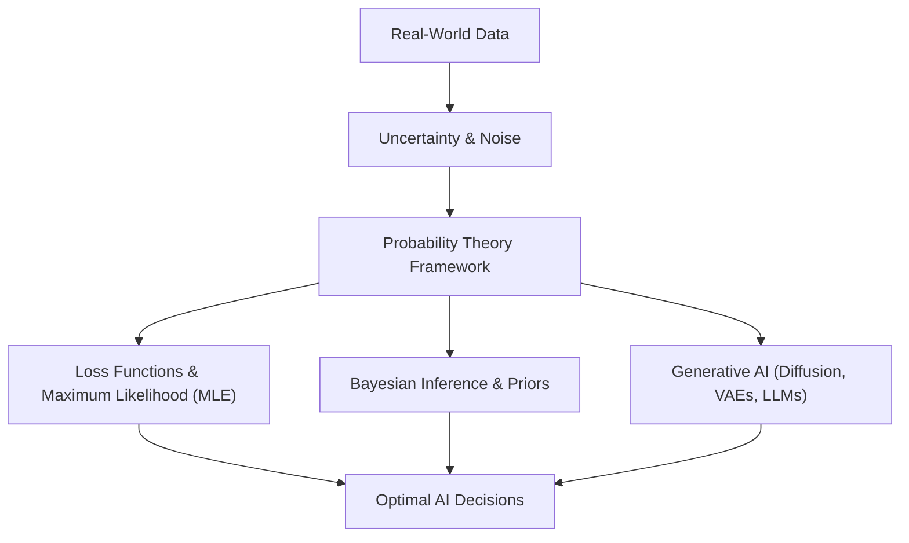

# Day 20 - Lecture 20.1: Math for AI & Probability Kyu Zaroori Hai [Hinglish]

[](https://www.python.org/)
[](lecture_20_01.ipynb)
[](notes.pdf)

🌐 **Language / भाषा:** [English](README.md) | **हिंदी / Hinglish** | [⬅️ Lecture 20 Module Par Wapas Jayein](../README_HINGLISH.md)

---

## 1. Overview & AI me Probability ka Role

Artificial Intelligence aur Machine Learning real-world problems par kaam karte hain jahan noisy data, missing values aur inherent randomness hoti hai. Traditional deterministic programming (rule-based if-else) yahan fail ho jati hai. **Probability Theory** hume uncertainty ko measure karne aur mathematical reasoning ke sath optimal decisions lene ka foundation deti hai.



### Probability AI ke liye kyu critical hai?
1. **Uncertainty Quantification:** Model sirf yes/no prediction nahi deta, balki confidence measure $P(Y = y \mid X = \mathbf{x})$ provide karta hai.
2. **Loss Functions ka Math:** Machine learning ka sabse common loss function—Cross-Entropy Loss—direct probability distribution ke Maximum Likelihood se derive hota hai.
3. **Generative Modeling:** Diffusion models, VAEs aur LLMs continuous probability density functions $p(\mathbf{x})$ ko model karte hain.
4. **Overfitting se Bachav:** Bayesian methods prior belief ke zariye parameters ko restrict karke overfitting rokte hain.

---

## 2. Ganitiya Niyam: Maximum Likelihood Estimation (MLE)

Supervised machine learning me i.i.d. dataset $\mathcal{D} = \{(\mathbf{x}_1, y_1), \dots, (\mathbf{x}_n, y_n)\}$ ke liye model parameters $oldsymbol{	heta}$ choose kiye jate hain jo total likelihood ko maximize karein:

$$
oxed{\mathcal{L}(oldsymbol{	heta}) = \prod_{i=1}^n P(y_i \mid \mathbf{x}_i; oldsymbol{	heta})}
$$

Kyunki choti probabilities ko multiply karne par computer me floating-point numerical underflow (zero ban jana) hota hai, isliye hum **Negative Log-Likelihood (NLL)** minimize karte hain:

$$
oxed{\mathcal{J}(oldsymbol{	heta}) = -\log \mathcal{L}(oldsymbol{	heta}) = -\sum_{i=1}^n \log P(y_i \mid \mathbf{x}_i; oldsymbol{	heta})}
$$

Binary classification me $y_i \in \{0, 1\}$ hone par yeh seedhe **Binary Cross-Entropy Loss** ban jata hai:

$$
oxed{\mathcal{L}_{	ext{BCE}}(oldsymbol{	heta}) = -rac{1}{n} \sum_{i=1}^n \left[ y_i \log(\hat{y}_i) + (1 - y_i) \log(1 - \hat{y}_i) 
ight]}
$$

---

## 3. Python Implementation: Likelihood vs. Log-Likelihood

```python
import numpy as np
import matplotlib.pyplot as plt

# 100 Bernoulli trials simulate karte hain (True p = 0.70)
np.random.seed(42)
n_trials = 100
true_p = 0.70
data = np.random.binomial(1, true_p, size=n_trials)
k_successes = np.sum(data)

p_candidates = np.linspace(0.01, 0.99, 200)

# Raw Likelihood
raw_likelihood = (p_candidates ** k_successes) * ((1 - p_candidates) ** (n_trials - k_successes))

# Numerically stable Log-Likelihood
log_likelihood = k_successes * np.log(p_candidates) + (n_trials - k_successes) * np.log(1 - p_candidates)

p_mle = k_successes / n_trials
print(f"Sample Successes: {k_successes}/{n_trials}")
print(f"Analytical MLE Estimate: p_hat = {p_mle:.3f}")
print(f"Peak Log-Likelihood: {np.max(log_likelihood):.2f}")
```

---

## 4. Mukhya Batein (Key Takeaways) & Interview Points
- **Uncertainty Real Hai:** AI models aleatoric (data noise) aur epistemic (knowledge ki kami) dono tarah ki uncertainty ko handle karte hain.
- **Cross-Entropy = Log Probability:** Jab bhi hum neural network me Cross-Entropy minimize karte hain, hum mathematical roop se Negative Log-Likelihood ko minimize kar rahe hote hain.
- **Log Transformation:** Probability values $(0, 1)$ ke beech hoti hain; unhe multiply karne par precision loss hota hai, log lene se product sum ban jata hai.
