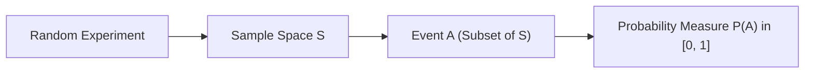

# Day 20 - Lecture 20.2: Core Foundations of Probability

[](https://www.python.org/)
[](lecture_20_02.ipynb)
[](notes.pdf)

🌐 **Language:** **English** | [हिंदी / Hinglish](README_HINGLISH.md) | [⬅️ Back to Lecture 20 Module](../README.md)

---

## 1. Random Experiments, Sample Space, and Events

A **random experiment** is an observational process whose outcome cannot be predicted with absolute certainty prior to execution, but whose set of all possible outcomes is known in advance.



### Core Definitions:
1. **Sample Space ($\mathcal{S}$ or $\Omega$):** The set containing all mutually exclusive, exhaustive primitive outcomes $\omega$ of a random experiment.
   - Example (Fair 6-sided die): $\mathcal{S} = \{1, 2, 3, 4, 5, 6\}$.
   - Example (Two successive coin tosses): $\mathcal{S} = \{HH, HT, TH, TT\}$.
2. **Event ($\mathcal{E}$ or $A$):** Any subset of the sample space ($A \subseteq \mathcal{S}$).
   - Example: An even roll on a die: $A = \{2, 4, 6\} \subseteq \mathcal{S}$.
3. **Null Event ($\emptyset$):** The empty set representing an impossible outcome ($P(\emptyset) = 0$).
4. **Certain Event ($\mathcal{S}$):** The entire sample space representing an inevitable outcome ($P(\mathcal{S}) = 1$).

---

## 2. Kolmogorov's Axioms of Probability

Modern probability theory rests upon three fundamental axioms established by Andrey Kolmogorov in 1933. Let $\mathcal{S}$ be the sample space and $\mathcal{F}$ be the event space ($\sigma$-algebra of subsets):

### Axiom 1: Non-Negativity
For every event $A \subseteq \mathcal{S}$, the assigned probability is non-negative:

$$
oxed{P(A) \ge 0}
$$

### Axiom 2: Unit Measure (Normalization)
The probability of the entire sample space is equal to unity:

$$
oxed{P(\mathcal{S}) = 1.0}
$$

### Axiom 3: Countable Additivity (Disjoint Events)
If $A_1, A_2, A_3, \dots$ is a countable sequence of pairwise mutually exclusive (disjoint) events such that $A_i \cap A_j = \emptyset$ for all $i 
e j$, then:

$$
oxed{P\left(igcup_{i=1}^\infty A_i
ight) = \sum_{i=1}^\infty P(A_i)}
$$

---

## 3. Fundamental Derivative Properties

From Kolmogorov's axioms, standard probability calculus theorems are derived:

$$
oxed{P(\emptyset) = 0.0}
$$

$$
oxed{0 \le P(A) \le 1.0 \quad orall A \subseteq \mathcal{S}}
$$

$$
oxed{A \subseteq B \implies P(A) \le P(B) \quad 	ext{(Monotonicity)}}
$$

---

## 4. Python Implementation: Verifying Kolmogorov's Axioms

```python
import numpy as np

# Sample space for a standard 6-sided fair die
sample_space = {1, 2, 3, 4, 5, 6}
n_s = len(sample_space)

# Define events
event_even = {2, 4, 6}
event_prime = {2, 3, 5}
event_odd = {1, 3, 5}

# Probability measure for uniform discrete sample space
def prob(event, s=sample_space):
    return len(event.intersection(s)) / len(s)

# Axiom 1: Non-negativity
print(f"P(Even) = {prob(event_even)} >= 0: {prob(event_even) >= 0}")

# Axiom 2: Normalization
print(f"P(S) = {prob(sample_space)} == 1.0: {prob(sample_space) == 1.0}")

# Axiom 3: Additivity of disjoint events (Even and Odd are disjoint)
is_disjoint = len(event_even.intersection(event_odd)) == 0
union_event = event_even.union(event_odd)
p_union = prob(union_event)
p_sum = prob(event_even) + prob(event_odd)

print(f"Events Disjoint: {is_disjoint}")
print(f"P(Even U Odd) = {p_union:.4f}, P(Even) + P(Odd) = {p_sum:.4f}")
print(f"Additivity holds: {np.isclose(p_union, p_sum)}")
```

---

## 5. Key Takeaways & Interview Points
- **Probability is a Measure:** Probability maps subsets of sample space to the closed interval $[0, 1]$.
- **Kolmogorov Foundation:** All advanced machine learning probability theorems (Bayes, CLT, Markov chains) are derived directly from Kolmogorov's three axioms.
- **Event vs Outcome:** An outcome is an elementary point $\omega \in \mathcal{S}$; an event is a set of outcomes $A \subseteq \mathcal{S}$.
