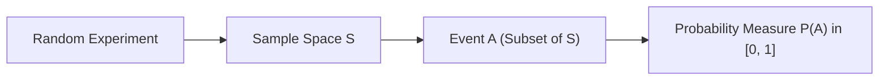

# Day 20 - Lecture 20.2: Probability ke Buniyadi Siddhant [Hinglish]

[](https://www.python.org/)
[](lecture_20_02.ipynb)
[](notes.pdf)

🌐 **Language / भाषा:** [English](README.md) | **हिंदी / Hinglish** | [⬅️ Lecture 20 Module Par Wapas Jayein](../README_HINGLISH.md)

---

## 1. Random Experiments, Sample Space aur Events

**Random Experiment** ek aisa process hota hai jiska final outcome pehle se 100% fix nahi hota, lekin uske sabhi possible outcomes ka set pehle se pata hota hai.



### Mukhya Paribhashayein (Definitions):
1. **Sample Space ($\mathcal{S}$ ya $\Omega$):** Sabhi possible outcomes ka complete set.
   - Example (Fair 6-sided die): $\mathcal{S} = \{1, 2, 3, 4, 5, 6\}$.
   - Example (Two coin tosses): $\mathcal{S} = \{HH, HT, TH, TT\}$.
2. **Event ($A$):** Sample space ka koi bhi subset ($A \subseteq \mathcal{S}$).
   - Example: Die par even number aana: $A = \{2, 4, 6\} \subseteq \mathcal{S}$.
3. **Null Event ($\emptyset$):** Asambhav event jiski probability $0$ hoti hai ($P(\emptyset) = 0$).
4. **Certain Event ($\mathcal{S}$):** Nischit event jiski probability $1.0$ hoti hai ($P(\mathcal{S}) = 1$).

---

## 2. Kolmogorov ke Teeno Axioms (1933)

Modern Probability Theory Andrey Kolmogorov ke 3 fundamental axioms par tiki hui hai:

### Axiom 1: Non-Negativity (Gair-Nakarātmakta)
Kisi bhi event $A$ ki probability hamesha zero ya zero se badi hoti hai:

$$
oxed{P(A) \ge 0}
$$

### Axiom 2: Normalization (Unit Measure)
Pura sample space $\mathcal{S}$ hone ki probability $1.0$ hoti hai:

$$
oxed{P(\mathcal{S}) = 1.0}
$$

### Axiom 3: Countable Additivity (Disjoint Events)
Agar events $A_1, A_2, \dots$ aapas me mutually exclusive (disjoint) hain ($A_i \cap A_j = \emptyset$ for $i 
e j$), toh unke union ki probability individual probabilities ke sum ke barabar hoti hai:

$$
oxed{P\left(igcup_{i=1}^\infty A_i
ight) = \sum_{i=1}^\infty P(A_i)}
$$

---

## 3. Derivative Properties

Inhi axioms se yeh basic properties derive hoti hain:

$$
oxed{P(\emptyset) = 0.0}
$$

$$
oxed{0 \le P(A) \le 1.0}
$$

$$
oxed{A \subseteq B \implies P(A) \le P(B)}
$$

---

## 4. Python Implementation: Kolmogorov Axioms Verification

```python
import numpy as np

sample_space = {1, 2, 3, 4, 5, 6}

event_even = {2, 4, 6}
event_odd = {1, 3, 5}

def prob(event, s=sample_space):
    return len(event.intersection(s)) / len(s)

# Axiom 1 Check
print(f"P(Even) = {prob(event_even)} >= 0: {prob(event_even) >= 0}")

# Axiom 2 Check
print(f"P(S) = {prob(sample_space)} == 1.0: {prob(sample_space) == 1.0}")

# Axiom 3 Check (Even and Odd are mutually exclusive)
p_union = prob(event_even.union(event_odd))
p_sum = prob(event_even) + prob(event_odd)
print(f"P(Even U Odd) == P(Even) + P(Odd): {np.isclose(p_union, p_sum)}")
```

---

## 5. Mukhya Batein (Key Takeaways) & Interview Points
- **Range of Probability:** Kisi bhi event ki probability hamesha $[0, 1]$ interval me hoti hai, na kabhi negative aur na kabhi 1 se badi.
- **Axioms ka Mahatva:** Machine learning ke saare complex models (Bayes Rule, Gaussian distributions) inhi 3 axioms ke foundation par bante hain.
