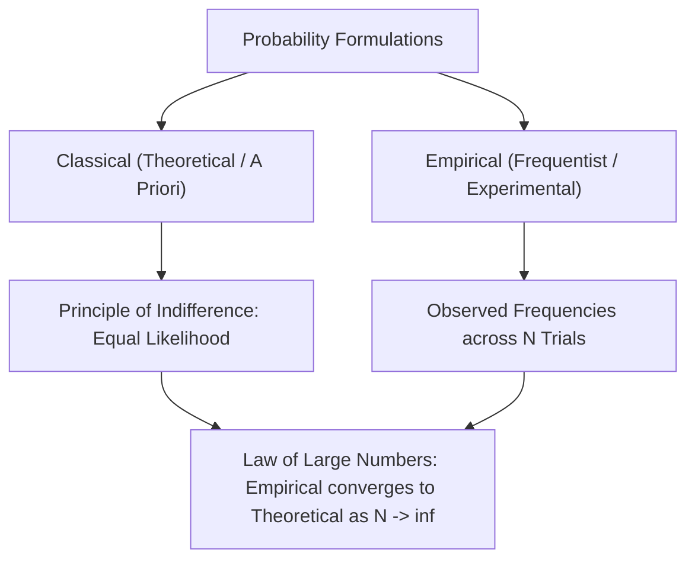

# Day 20 - Lecture 20.3: Classical vs. Empirical Probability

[](https://www.python.org/)
[](lecture_20_03.ipynb)
[](notes.pdf)

🌐 **Language:** **English** | [हिंदी / Hinglish](README_HINGLISH.md) | [⬅️ Back to Lecture 20 Module](../README.md)

---

## 1. Two Philosophical Interpretations of Probability

In statistics and machine learning, probability is quantified through two complementary frameworks: **Classical (A Priori)** and **Empirical (Frequentist)**.



### Comparison Matrix:
| Dimension | Classical Probability ($P_{	ext{class}}$) | Empirical Probability ($P_{	ext{emp}}$) |
| :--- | :--- | :--- |
| **Origin** | Theoretical deduction prior to experiment | Observation of actual experiment outcomes |
| **Assumption** | All elementary outcomes are equally likely | No assumption of symmetry; learned from data |
| **Formula** | $P(A) = rac{n(A)}{n(\mathcal{S})}$ | $P(A) = rac{	ext{Count of } A}{N 	ext{ total trials}}$ |
| **Domain** | Games of chance (Dice, Cards, Coins) | Machine Learning training datasets |

---

## 2. Mathematical Formalism

### Classical (Laplacian) Probability:
For a finite sample space $\mathcal{S}$ with $|\mathcal{S}|$ equally likely outcomes:

$$
oxed{P(A) = rac{|A|}{|\mathcal{S}|} = rac{	ext{Number of favorable outcomes}}{	ext{Total number of possible outcomes}}}
$$

### Empirical (Frequentist) Probability:
In an experiment repeated independently $N$ times under identical conditions, let $n_N(A)$ denote the frequency of event $A$:

$$
oxed{\hat{P}_N(A) = rac{n_N(A)}{N}}
$$

### The Law of Large Numbers (Convergence Theorem):
As the number of experimental repetitions $N$ approaches infinity, the empirical relative frequency converges almost surely to the true theoretical probability $P(A)$:

$$
oxed{\lim_{N 	o \infty} P\left(\left| rac{n_N(A)}{N} - P(A) 
ight| \ge \epsilon
ight) = 0 \quad orall \epsilon > 0}
$$

---

## 3. Python Simulation: Law of Large Numbers

```python
import numpy as np
import matplotlib.pyplot as plt

np.random.seed(42)
n_flips = 10000

# Simulate coin tosses where 1 = Heads, 0 = Tails (Fair coin: P(H) = 0.5)
tosses = np.random.binomial(1, 0.5, size=n_flips)
cumulative_heads = np.cumsum(tosses)
trial_numbers = np.arange(1, n_flips + 1)
empirical_probabilities = cumulative_heads / trial_numbers

print(f"After 10 flips:    P_hat(H) = {empirical_probabilities[9]:.4f}")
print(f"After 100 flips:   P_hat(H) = {empirical_probabilities[99]:.4f}")
print(f"After 1,000 flips: P_hat(H) = {empirical_probabilities[999]:.4f}")
print(f"After 10,000 flips: P_hat(H) = {empirical_probabilities[-1]:.4f}")
print(f"Theoretical Target: P(H)    = 0.5000")
```

---

## 4. Key Takeaways & Interview Points
- **Machine Learning is Empirical:** Machine learning algorithms estimate probability distributions from finite training data ($P_{	ext{emp}}$), not theoretical proofs.
- **Law of Large Numbers (LLN):** With larger datasets, empirical estimates stabilize toward the true underlying data-generating distribution.
