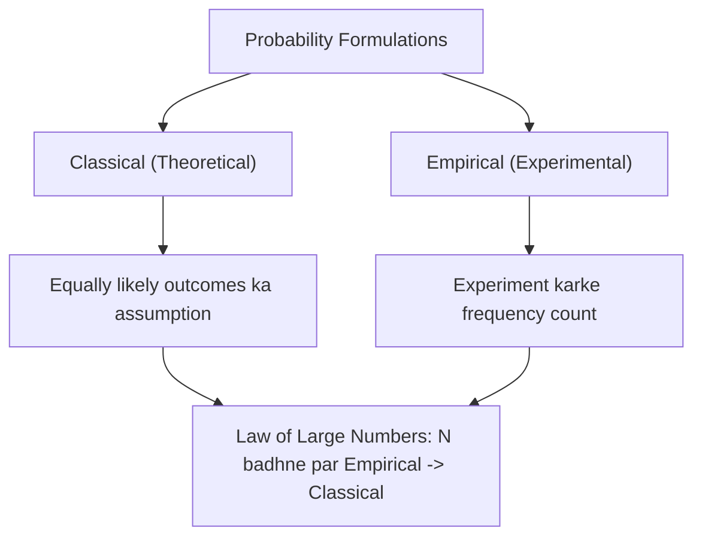

# Day 20 - Lecture 20.3: Classical vs. Empirical Probability [Hinglish]

[](https://www.python.org/)
[](lecture_20_03.ipynb)
[](notes.pdf)

🌐 **Language / भाषा:** [English](README.md) | **हिंदी / Hinglish** | [⬅️ Lecture 20 Module Par Wapas Jayein](../README_HINGLISH.md)

---

## 1. Probability ke Do Mukhya Raste: Classical aur Empirical

Data science aur machine learning me probability calculate karne ke do mukhya tareeqe hote hain: **Classical (Theoretical)** aur **Empirical (Frequentist)**.



### Tulna (Comparison):
| Mudda | Classical Probability | Empirical Probability |
| :--- | :--- | :--- |
| **Adhaar** | Theoretical logic (experiment se pehle) | Actual experiment ke data records |
| **Symmetry** | Sabhi outcomes barabar likely maane jate hain | Data se frequency calculate hoti hai |
| **Formula** | $P(A) = rac{n(A)}{n(\mathcal{S})}$ | $P(A) = rac{	ext{Count of } A}{N 	ext{ total trials}}$ |
| **Real Use** | Fair dice, coin, cards | Machine Learning model training datasets |

---

## 2. Ganitiya Niyam

### Classical Probability:
Equally likely sample space $\mathcal{S}$ ke liye:

$$
oxed{P(A) = rac{|A|}{|\mathcal{S}|} = rac{	ext{Favorable Outcomes ki Sankhya}}{	ext{Total Possible Outcomes}}}
$$

### Empirical Probability:
Jab experiment ko $N$ baar repeat kiya jaye aur event $A$ kul $n_N(A)$ baar aaye:

$$
oxed{\hat{P}_N(A) = rac{n_N(A)}{N}}
$$

### Law of Large Numbers (LLN Theorem):
Jaise-jaise sample size $N 	o \infty$ badhta hai, empirical relative frequency theoretical probability ke bilkul barabar ho jati hai:

$$
oxed{\lim_{N 	o \infty} \hat{P}_N(A) = P(A)}
$$

---

## 3. Python Simulation: Law of Large Numbers

```python
import numpy as np

np.random.seed(42)
n_flips = 10000

tosses = np.random.binomial(1, 0.5, size=n_flips)
cumulative_heads = np.cumsum(tosses)
trial_numbers = np.arange(1, n_flips + 1)
empirical_probabilities = cumulative_heads / trial_numbers

print(f"10 flips ke baad:    P_hat(H) = {empirical_probabilities[9]:.4f}")
print(f"100 flips ke baad:   P_hat(H) = {empirical_probabilities[99]:.4f}")
print(f"1,000 flips ke baad: P_hat(H) = {empirical_probabilities[999]:.4f}")
print(f"10,000 flips ke baad: P_hat(H) = {empirical_probabilities[-1]:.4f}")
print("Theoretical Target:  P(H)    = 0.5000")
```

---

## 4. Mukhya Batein (Key Takeaways) & Interview Points
- **ML is Data-Driven:** Machine Learning hamesha empirical probabilities par kaam karta hai kyunki hum real-world data observe karte hain.
- **Data Size Matters:** Chote dataset me variance zyada hota hai; bada dataset Law of Large Numbers ki wajah se reliable estimates deta hai.
