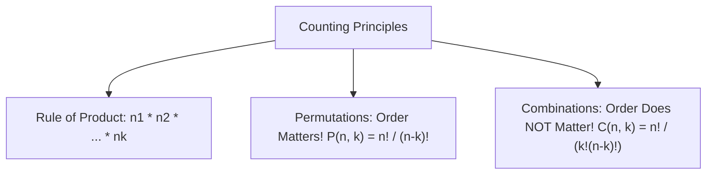

# Day 20 - Lecture 20.4: Solving Foundation Probability Practice Problems

[](https://www.python.org/)
[](lecture_20_04.ipynb)
[](notes.pdf)

🌐 **Language:** **English** | [हिंदी / Hinglish](README_HINGLISH.md) | [⬅️ Back to Lecture 20 Module](../README.md)

---

## 1. Combinatorics & Counting Principles in Probability

Calculating probabilities in discrete sample spaces requires the fundamental principles of combinatorics: the **Rule of Product**, **Permutations**, and **Combinations**.



### Mathematical Definitions:

#### Permutations (Order is Distinct):
The number of ordered sequences of $k$ distinct elements chosen from an $n$-element set:

$$
oxed{P(n, k) = rac{n!}{(n - k)!}}
$$

#### Combinations (Order is Irrelevant):
The number of subsets of size $k$ chosen from an $n$-element set:

$$
oxed{C(n, k) = inom{n}{k} = rac{n!}{k!(n - k)!}}
$$

---

## 2. Classic Problem Formulations & Analytical Solutions

### Problem 1: Rolling Two Dice (Sum = 7 or 8)
- Sample space size: $|\mathcal{S}| = 6 	imes 6 = 36$.
- Event $A$ (Sum = 7): $\{(1,6), (2,5), (3,4), (4,3), (5,2), (6,1)\} \implies |A| = 6$.
- Event $B$ (Sum = 8): $\{(2,6), (3,5), (4,4), (5,3), (6,2)\} \implies |B| = 5$.
- Because $A \cap B = \emptyset$ (a sum cannot be both 7 and 8 simultaneously):

$$
oxed{P(	ext{Sum} \in \{7, 8\}) = rac{6 + 5}{36} = rac{11}{36} pprox 0.3056}
$$

### Problem 2: Card Drawing Without Replacement
From a standard 52-card deck, draw 2 cards sequentially without replacement. What is the probability that both are Kings?
- Total 2-card hands: $inom{52}{2} = rac{52 	imes 51}{2} = 1326$.
- Favorable 2-King hands: $inom{4}{2} = rac{4 	imes 3}{2} = 6$.

$$
oxed{P(	ext{Both Kings}) = rac{6}{1326} = rac{1}{221} pprox 0.004525}
$$

---

## 3. Python Implementation & Verification

```python
import math
from itertools import product, combinations

# Problem 1: Two Dice Sum Simulation
die = list(range(1, 7))
sample_space_dice = list(product(die, die))
favorable_dice = [pair for pair in sample_space_dice if sum(pair) in (7, 8)]
p_dice_analytical = len(favorable_dice) / len(sample_space_dice)

print(f"Problem 1: |S| = {len(sample_space_dice)}, |Favorable| = {len(favorable_dice)}")
print(f"P(Sum 7 or 8) = {p_dice_analytical:.4f} (Exact: 11/36)")

# Problem 2: Combinatorial Poker Hand
deck_size = 52
kings_in_deck = 4
total_hands = math.comb(deck_size, 2)
king_hands = math.comb(kings_in_deck, 2)
p_two_kings = king_hands / total_hands

print(f"
Problem 2: Total 2-Card Hands = {total_hands}, 2-King Hands = {king_hands}")
print(f"P(Both Kings) = {p_two_kings:.6f} (Exact: 1/221 = {1/221:.6f})")
```

---

## 4. Key Takeaways & Interview Points
- **Permutations vs. Combinations:** If the order of assignment affects the outcome (e.g., passwords, rankings), use permutations; if only group membership matters (e.g., committee, feature subsets), use combinations.
- **Denominator Discipline:** In conditional or sequential draws, always check whether replacement alters the sample space cardinality $|\mathcal{S}|$.
