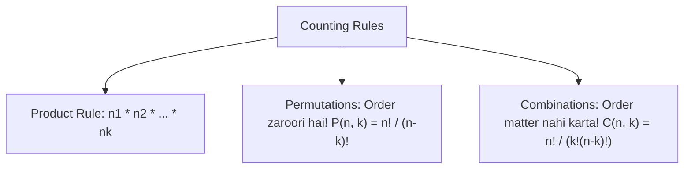

# Day 20 - Lecture 20.4: Foundation Probability Practice Problems [Hinglish]

[](https://www.python.org/)
[](lecture_20_04.ipynb)
[](notes.pdf)

🌐 **Language / भाषा:** [English](README.md) | **हिंदी / Hinglish** | [⬅️ Lecture 20 Module Par Wapas Jayein](../README_HINGLISH.md)

---

## 1. Combinatorics & Counting Siddhant

Discrete probability solve karne ke liye counting rules aur combinatorics ka clear gyaan hona anivarya hai: **Product Rule**, **Permutations**, aur **Combinations**.



### Ganitiya Sutra:

#### Permutations (Kram / Order Matter Karta Hai):

$$
oxed{P(n, k) = rac{n!}{(n - k)!}}
$$

#### Combinations (Group Selection / Order Matter Nahi Karta):

$$
oxed{C(n, k) = inom{n}{k} = rac{n!}{k!(n - k)!}}
$$

---

## 2. Standard Practice Problems

### Problem 1: Do Dice Roll Karna (Sum = 7 ya 8)
- Total possible outcomes: $|\mathcal{S}| = 6 	imes 6 = 36$.
- Event $A$ (Sum = 7): $\{(1,6), (2,5), (3,4), (4,3), (5,2), (6,1)\} \implies 6$ jode.
- Event $B$ (Sum = 8): $\{(2,6), (3,5), (4,4), (5,3), (6,2)\} \implies 5$ jode.
- Dono mutually exclusive hain:

$$
oxed{P(	ext{Sum} \in \{7, 8\}) = rac{6 + 5}{36} = rac{11}{36} pprox 0.3056}
$$

### Problem 2: Bina Replacement Ke 2 Kings Draw Karna
52 taash ke patto me se bina wapas dale 2 patte nikale gaye:
- Total combinations: $inom{52}{2} = 1326$.
- 4 Kings me se 2 Kings chunne ke tarike: $inom{4}{2} = 6$.

$$
oxed{P(	ext{Dono Kings}) = rac{6}{1326} = rac{1}{221} pprox 0.004525}
$$

---

## 3. Python Implementation

```python
import math
from itertools import product

# Problem 1 Verification
die = list(range(1, 7))
sample_space = list(product(die, die))
favorable = [pair for pair in sample_space if sum(pair) in (7, 8)]
print(f"P(Sum 7 ya 8) = {len(favorable)}/{len(sample_space)} = {len(favorable)/len(sample_space):.4f}")

# Problem 2 Verification
total_hands = math.comb(52, 2)
king_hands = math.comb(4, 2)
print(f"P(Dono Kings) = {king_hands}/{total_hands} = {king_hands/total_hands:.6f}")
```

---

## 4. Mukhya Batein (Key Takeaways) & Interview Points
- **Selection Rule:** Jab arrangement matter kare toh $P(n, k)$, jab sirf grouping ya selection ho toh $inom{n}{k}$.
- **Without Replacement Trap:** Bina replacement wale sawalo me denominator har draw ke sath 1 kam hota hai ($52 	o 51$).
