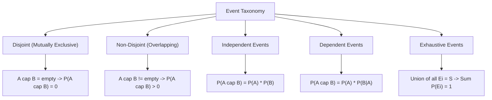

# Day 20 - Lecture 20.5: Types of Events

[](https://www.python.org/)
[](lecture_20_05.ipynb)
[](notes.pdf)

🌐 **Language:** **English** | [हिंदी / Hinglish](README_HINGLISH.md) | [⬅️ Back to Lecture 20 Module](../README.md)

---

## 1. Taxonomic Classification of Events

In probability theory, events are classified based on their logical relationships, intersection characteristics, and probabilistic dependencies.



---

## 2. Mathematical Formalism & Theorems

### 1. Mutually Exclusive (Disjoint) Events
Two events $A$ and $B$ cannot occur simultaneously:

$$
oxed{A \cap B = \emptyset \implies P(A \cap B) = 0}
$$

### 2. Independent Events
The occurrence of event $A$ provides zero information regarding the likelihood of event $B$:

$$
oxed{P(A \cap B) = P(A) \cdot P(B) \iff P(A \mid B) = P(A)}
$$

> [!WARNING]
> **Common Trap:** Mutually exclusive events are **NOT** independent! In fact, if $P(A) > 0$ and $P(B) > 0$ and $A, B$ are mutually exclusive, then $P(A \cap B) = 0 
e P(A)P(B)$. Thus, mutually exclusive events with positive probabilities are strictly **dependent**!

### 3. Exhaustive Events
A collection of events $\{E_1, E_2, \dots, E_k\}$ whose union completely spans the entire sample space:

$$
oxed{igcup_{i=1}^k E_i = \mathcal{S} \implies P\left(igcup_{i=1}^k E_i
ight) = 1.0}
$$

### 4. Partition of Sample Space
A collection $\{B_1, \dots, B_k\}$ that is simultaneously **mutually exclusive** and **collectively exhaustive**:

$$
oxed{B_i \cap B_j = \emptyset \quad orall i 
e j \qquad	ext{and}\qquad igcup_{i=1}^k B_i = \mathcal{S}}
$$

---

## 3. Python Implementation: Verifying Independence vs. Disjointness

```python
import numpy as np

# Sample Space: Fair 6-sided die rolls (1 to 6)
die_space = {1, 2, 3, 4, 5, 6}
p_unit = 1 / 6

# Event definitions
A = {2, 4, 6}         # Even roll: P(A) = 3/6 = 0.5
B = {1, 3, 5}         # Odd roll: P(B) = 3/6 = 0.5
C = {1, 2, 3, 4}      # Roll <= 4: P(C) = 4/6 = 2/3

def prob(e): return len(e) / len(die_space)

# Test 1: A and B are Mutually Exclusive
p_a_cap_b = prob(A.intersection(B))
print(f"Events A and B: A cap B = {A.intersection(B)}")
print(f"P(A cap B) = {p_a_cap_b} -> Mutually Exclusive: {p_a_cap_b == 0}")

# Test 2: Are A and B Independent?
print(f"P(A)*P(B) = {prob(A)*prob(B):.4f} vs P(A cap B) = {p_a_cap_b:.4f}")
print(f"Independent? {np.isclose(prob(A)*prob(B), p_a_cap_b)}")

# Test 3: Events A and C (Overlapping)
p_a_cap_c = prob(A.intersection(C))
p_a_times_c = prob(A) * prob(C)
print(f"
Events A and C: A cap C = {A.intersection(C)}")
print(f"P(A cap C) = {p_a_cap_c:.4f}, P(A)*P(C) = {p_a_times_c:.4f}")
print(f"Independent? {np.isclose(p_a_cap_c, p_a_times_c)}")
```

---

## 4. Key Takeaways & Interview Points
- **Mutually Exclusive $
e$ Independent:** Mutually exclusive means they cannot happen together ($P(A \cap B) = 0$). Independent means one happening doesn't alter the odds of the other ($P(A \cap B) = P(A)P(B)$).
- **Partition:** A set of events that splits the universe without overlap and without gaps; the bedrock foundation of the Law of Total Probability.
