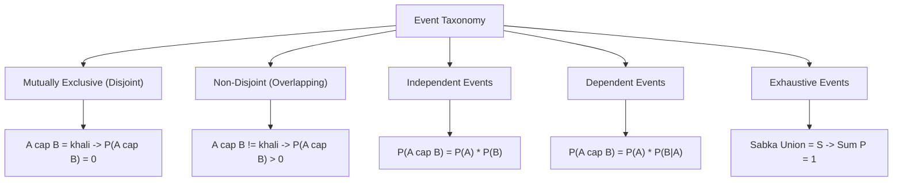

# Day 20 - Lecture 20.5: Events ke Prakar (Types of Events) [Hinglish]

[](https://www.python.org/)
[](lecture_20_05.ipynb)
[](notes.pdf)

🌐 **Language / भाषा:** [English](README.md) | **हिंदी / Hinglish** | [⬅️ Lecture 20 Module Par Wapas Jayein](../README_HINGLISH.md)

---

## 1. Events ka Vargikaran (Classification)

Probability theory me events ko unke sambandho aur mathematical properties ke adhaar par classify kiya jata hai:



---

## 2. Mukhya Ganitiya Niyam

### 1. Mutually Exclusive (Disjoint) Events
Yeh do events ek sath kabhi nahi ghatit ho sakte:

$$
oxed{A \cap B = \emptyset \implies P(A \cap B) = 0}
$$

### 2. Independent Events
Ek event ke hone ya na hone se doosre event ki probability par koi asar nahi padta:

$$
oxed{P(A \cap B) = P(A) \cdot P(B) \iff P(A \mid B) = P(A)}
$$

> [!WARNING]
> **Interview Trap:** Mutually exclusive events kabhi independent nahi hote! Agar do positive probability wale events mutually exclusive hain, toh unka $P(A \cap B) = 0$ hoga, jo ki $P(A) \cdot P(B) 
e 0$ ke barabar nahi ho sakta. Yaani mutually exclusive events strictly **dependent** hote hain!

### 3. Exhaustive Events
Aise events jinka union pura sample space bana de:

$$
oxed{igcup_{i=1}^k E_i = \mathcal{S} \implies P\left(igcup_{i=1}^k E_i
ight) = 1.0}
$$

### 4. Partition
Aisa collection jo mutually exclusive bhi ho aur exhaustive bhi ho (sample space ke tukde bina kisi overlap ke).

---

## 3. Python Code

```python
import numpy as np

sample_space = {1, 2, 3, 4, 5, 6}
A = {2, 4, 6}  # Even
B = {1, 3, 5}  # Odd
C = {1, 2, 3, 4} # <= 4

def p(e): return len(e) / len(sample_space)

# Mutually Exclusive Check
print(f"P(A cap B) = {p(A.intersection(B))} -> Disjoint: {p(A.intersection(B)) == 0}")

# Independent Check for A and B
print(f"Independent? {np.isclose(p(A)*p(B), p(A.intersection(B)))}")

# Independent Check for A and C
print(f"P(A cap C) = {p(A.intersection(C))}, P(A)*P(C) = {p(A)*p(C)}")
print(f"A and C Independent? {np.isclose(p(A)*p(C), p(A.intersection(C)))}")
```

---

## 4. Mukhya Batein (Key Takeaways) & Interview Points
- **Difference:** Mutually exclusive matlab "ek sath nahi ho sakte". Independent matlab "ek doosre ko prabhavit nahi karte".
- **Law of Total Probability ka Adhaar:** Partition concept Bayes Theorem aur Law of Total Probability ka basic building block hai.
