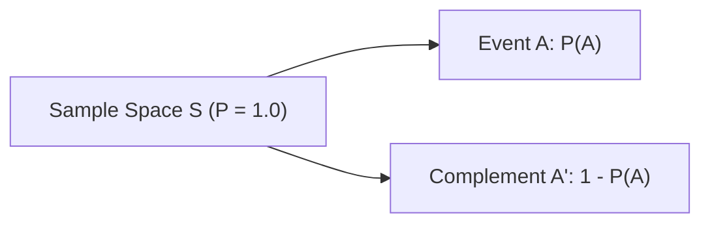

# Day 20 - Lecture 20.6: The Complementary Rule (Poorak Niyam) [Hinglish]

[](https://www.python.org/)
[](lecture_20_06.ipynb)
[](notes.pdf)

🌐 **Language / भाषा:** [English](README.md) | **हिंदी / Hinglish** | [⬅️ Lecture 20 Module Par Wapas Jayein](../README_HINGLISH.md)

---

## 1. Overview & Concept

**Complementary Rule** probability calculus ka sabse bada time-saver hai. Kisi bhi event $A$ ke liye, uska complement $A'$ (ya $A^c$) un sabhi outcomes ka set hota hai jo sample space $\mathcal{S}$ me hain par $A$ me nahi hain.



### Machine Learning me Use:
Jab kisi complex event ko directly calculate karna lamba aur kathin ho, toh uske ulte (complement) ko calculate karke 1 me se minus kar dena sabse aasan hota hai:

$$
oxed{P(	ext{Kam se kam ek success}) = 1 - P(	ext{Zero success})}
$$

---

## 2. Ganitiya Sutra

Kyunki $A$ aur $A'$ aapas me mutually exclusive aur exhaustive hote hain:

$$
oxed{A \cap A' = \emptyset \qquad	ext{aur}\qquad A \cup A' = \mathcal{S}}
$$

Kolmogorov ke axioms se:

$$
oxed{P(A) + P(A') = 1.0}
$$

Jisse mukhya **Complement Rule** milta hai:

$$
oxed{P(A') = 1 - P(A) \iff P(A) = 1 - P(A')}
$$

### De Morgan's Laws:

$$
oxed{P(A \cup B) = 1 - P(A' \cap B')}
$$

---

## 3. Real-World Case Study: "Kam Se Kam Ek" Failure

Ek AI cluster me 10 GPUs independent chal rahe hain. Har GPU ke crash hone ki probability $p = 0.05$ (5%) hai. Kya probability hai ki aaj **kam se kam ek** GPU crash ho jaye?

- Direct tareeqa: 1 crash + 2 crash + ... + 10 crash (10 combinations jodna).
- Complement tareeqa:
  Let $A = 	ext{"Kam se kam 1 crash"}$.
  Ulta event $A' = 	ext{"Koi bhi GPU crash na ho"}$.

$$
oxed{P(A') = (0.95)^{10} pprox 0.5987}
$$

$$
oxed{P(A) = 1 - 0.5987 = 0.4013 \quad (40.13\%)}
$$

---

## 4. Python Implementation

```python
import numpy as np

n_gpus = 10
p_fail = 0.05
p_safe = 1 - p_fail

p_zero_fails = p_safe ** n_gpus
p_at_least_one = 1.0 - p_zero_fails

print(f"P(Zero Failures):    {p_zero_fails:.4f}")
print(f"P(At Least 1 Fail):  {p_at_least_one:.4f} ({p_at_least_one * 100:.2f}%)")

# Monte Carlo Simulation
sims = np.random.binomial(n=n_gpus, p=p_fail, size=1_000_000)
print(f"Simulation Result:   {np.mean(sims >= 1):.4f}")
```

---

## 5. Mukhya Batein (Key Takeaways) & Interview Points
- **"At Least One" Rule:** Jab bhi sawal me "at least one" dikhe, 99% cases me seedhe $1 - P(	ext{None})$ lagana chahiye.
- **Complexity Reduction:** Yeh rule 10-15 steps ke calculation ko 1 step me badal deta hai.
