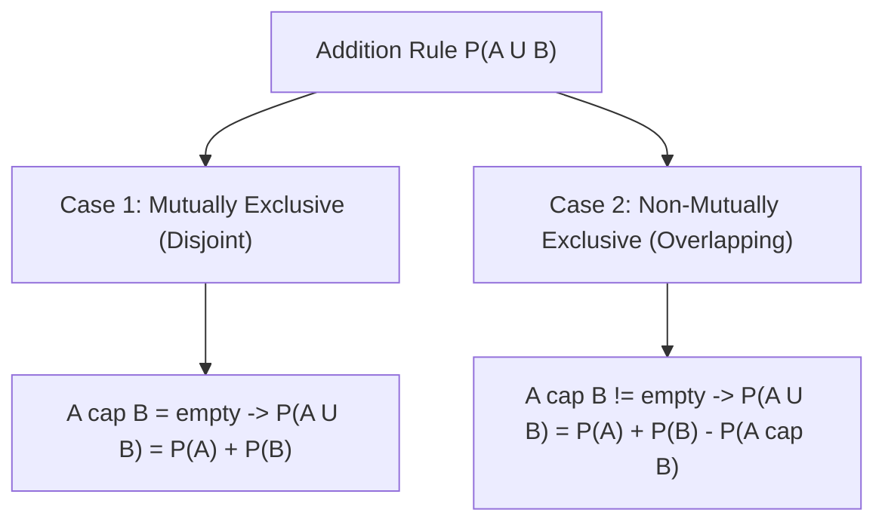

# Day 20 - Lecture 20.7: The Addition Rule of Probability

[](https://www.python.org/)
[](lecture_20_07.ipynb)
[](notes.pdf)

🌐 **Language:** **English** | [हिंदी / Hinglish](README_HINGLISH.md) | [⬅️ Back to Lecture 20 Module](../README.md)

---

## 1. Overview & Venn Diagram Topology

The **Addition Rule** governs the probability of the union of events ($A \cup B$), representing the likelihood that event $A$ occurs, event $B$ occurs, or **both** occur simultaneously.



### The Double-Counting Correction:
When calculating $P(A) + P(B)$, elements belonging to the mutual intersection $A \cap B$ are counted twice: once inside $A$ and once inside $B$. Subtracting $P(A \cap B)$ restores the exact measure.

---

## 2. Mathematical Formalism

### General Addition Rule (Arbitrary Events):
For any two events $A$ and $B$:

$$
oxed{P(A \cup B) = P(A) + P(B) - P(A \cap B)}
$$

### Special Case: Mutually Exclusive (Disjoint) Events:
If $A \cap B = \emptyset$, then $P(A \cap B) = 0$:

$$
oxed{P(A \cup B) = P(A) + P(B)}
$$

### Generalization: Principle of Inclusion-Exclusion for 3 Events:
For events $A$, $B$, and $C$:

$$
oxed{P(A \cup B \cup C) = P(A) + P(B) + P(C) - P(A \cap B) - P(A \cap C) - P(B \cap C) + P(A \cap B \cap C)}
$$

---

## 3. Real-World Demonstrative Example

A customer visiting an e-commerce platform has:
- Probability of browsing Mobile Phones ($A$): $P(A) = 0.40$
- Probability of browsing Laptops ($B$): $P(B) = 0.30$
- Probability of browsing **both** ($A \cap B$): $P(A \cap B) = 0.15$

What is the probability that the customer browses **at least one** of these categories?

$$
oxed{P(A \cup B) = 0.40 + 0.30 - 0.15 = 0.55 \quad (55\%)}
$$

What is the probability that the customer browses **neither** category?

$$
oxed{P((A \cup B)') = 1 - P(A \cup B) = 1 - 0.55 = 0.45 \quad (45\%)}
$$

---

## 4. Python Implementation

```python
import numpy as np

# Sample of 100,000 synthetic e-commerce customer browsing sessions
np.random.seed(42)
n_users = 100_000

# Generating correlated Bernoulli variables
browsed_mobile = np.random.binomial(1, 0.40, size=n_users)
# Correlated browsing: 15% browse both
browsed_both = np.random.binomial(1, 0.15, size=n_users)
browsed_laptop = np.where(browsed_both == 1, 1, np.random.binomial(1, 0.15 / 0.85, size=n_users))

p_a = np.mean(browsed_mobile)
p_b = np.mean(browsed_laptop)
p_cap = np.mean(browsed_mobile & browsed_laptop)

# General Addition Rule
p_union_formula = p_a + p_b - p_cap
p_union_empirical = np.mean(browsed_mobile | browsed_laptop)

print(f"P(Mobile A):          {p_a:.4f}")
print(f"P(Laptop B):          {p_b:.4f}")
print(f"P(Both A cap B):      {p_cap:.4f}")
print(f"Formula P(A U B):     {p_union_formula:.4f}")
print(f"Empirical P(A | B):   {p_union_empirical:.4f}")
print(f"Exact Match: {np.isclose(p_union_formula, p_union_empirical, atol=1e-3)}")
```

---

## 5. Key Takeaways & Interview Points
- **Subtract Overlap:** Forgetting to subtract $P(A \cap B)$ leads to probabilities exceeding $1.0$, violating Kolmogorov's second axiom.
- **Boole's Inequality (Union Bound):** $P(A \cup B) \le P(A) + P(B)$. In deep learning and optimization theory, the Union Bound is widely used to place worst-case upper bounds on error rates.
