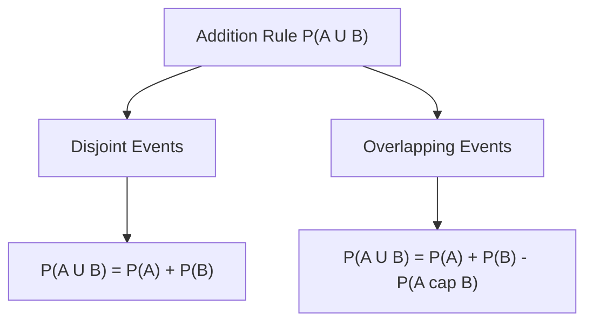

# Day 20 - Lecture 20.7: The Addition Rule (Yog Niyam) [Hinglish]

[](https://www.python.org/)
[](lecture_20_07.ipynb)
[](notes.pdf)

🌐 **Language / भाषा:** [English](README.md) | **हिंदी / Hinglish** | [⬅️ Lecture 20 Module Par Wapas Jayein](../README_HINGLISH.md)

---

## 1. Overview & Concept

**Addition Rule** do events ke union ($A \cup B$) ki probability calculate karne ka rule hai, yaani event $A$ ho, ya event $B$ ho, ya **dono** ho jayein.



### Double Counting ko Hatana:
Jab hum $P(A) + P(B)$ jodte hain, toh jo beech ka hissa ($A \cap B$) hota hai, woh do baar count ho jata hai. Isliye $P(A \cap B)$ ko ek baar ghatana (subtract karna) zaroori hota hai.

---

## 2. Ganitiya Sutra

### General Addition Rule:

$$
oxed{P(A \cup B) = P(A) + P(B) - P(A \cap B)}
$$

### Mutually Exclusive (Disjoint) Case:
Agar $A \cap B = \emptyset$ ho:

$$
oxed{P(A \cup B) = P(A) + P(B)}
$$

### 3 Events ke liye (Inclusion-Exclusion Principle):

$$
oxed{P(A \cup B \cup C) = P(A) + P(B) + P(C) - P(A \cap B) - P(A \cap C) - P(B \cap C) + P(A \cap B \cap C)}
$$

---

## 3. Real-World Example

E-commerce user browsing:
- Mobile Phone dekhne ki probability: $P(A) = 0.40$
- Laptop dekhne ki probability: $P(B) = 0.30$
- Dono dekhne ki probability: $P(A \cap B) = 0.15$

Kam se kam ek category browse karne ki probability:

$$
oxed{P(A \cup B) = 0.40 + 0.30 - 0.15 = 0.55 \quad (55\%)}
$$

---

## 4. Python Code

```python
import numpy as np

p_a = 0.40
p_b = 0.30
p_cap = 0.15

p_union = p_a + p_b - p_cap
print(f"P(Mobile U Laptop) = {p_union:.2f} ({p_union*100:.0f}%)")
print(f"P(Neither)         = {1 - p_union:.2f} ({(1 - p_union)*100:.0f}%)")
```

---

## 5. Mukhya Batein (Key Takeaways) & Interview Points
- **Double Counting Rule:** Overlap ko subtract karna kabhi mat bhoolo, varna probability 1.0 se upar nikal jayegi jo mathematically galat hai.
- **Boole's Inequality (Union Bound):** $P(A \cup B) \le P(A) + P(B)$. Yeh machine learning error bound analysis me bohot use hoti hai.
