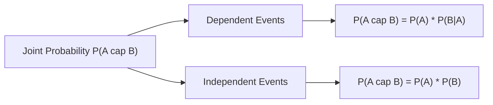

# Day 20 - Lecture 20.8: The Multiplication Rule of Probability

[](https://www.python.org/)
[](lecture_20_08.ipynb)
[](notes.pdf)

🌐 **Language:** **English** | [हिंदी / Hinglish](README_HINGLISH.md) | [⬅️ Back to Lecture 20 Module](../README.md)

---

## 1. Overview & Joint Event Dynamics

The **Multiplication Rule** (or Product Rule) determines the probability of the simultaneous joint intersection of multiple events ($A \cap B$). It accounts for sequential dependencies and time-ordered causality.



---

## 2. Mathematical Formalism

### General Multiplication Rule (Dependent Events):
For any two events $A$ and $B$ where $P(A) > 0$:

$$
\boxed{P(A \cap B) = P(A) \cdot P(B \mid A) = P(B) \cdot P(A \mid B)}
$$

### Independent Events:
If $A$ and $B$ are statistically independent, then $P(B \mid A) = P(B)$:

$$
\boxed{P(A \cap B) = P(A) \cdot P(B)}
$$

### General Chain Rule of Probability ($n$ Events):
The foundational backbone of autoregressive language models (such as GPT and Transformers):

$$
\boxed{P(A_1 \cap A_2 \cap \dots \cap A_n) = P(A_1) \cdot P(A_2 \mid A_1) \cdot P(A_3 \mid A_1 \cap A_2) \dots P(A_n \mid A_1 \cap \dots \cap A_{n-1})}
$$

In Large Language Models, text sequence likelihood is decomposed via this exact chain rule:

$$
\boxed{P(w_1, w_2, \dots, w_T) = \prod_{t=1}^T P(w_t \mid w_1, \dots, w_{t-1})}
$$

---

## 3. Real-World Demonstrative Example

Consider an urn containing 5 Red balls and 3 Green balls (Total = 8 balls). Draw 2 balls sequentially **without replacement**. What is the probability that both balls are Red?
- Event $A$: First ball is Red $\implies P(A) = \frac{5}{8}$.
- Event $B \mid A$: Second ball is Red given first was Red $\implies P(B \mid A) = \frac{4}{7}$.

$$
\boxed{P(A \cap B) = P(A) \cdot P(B \mid A) = \frac{5}{8} \cdot \frac{4}{7} = \frac{20}{56} = \frac{5}{14} \approx 0.3571}
$$

If drawn **with replacement** (Independent events):

$$
\boxed{P(A \cap B) = \frac{5}{8} \cdot \frac{5}{8} = \frac{25}{64} \approx 0.3906}
$$

---

## 4. Python Implementation

```python
import numpy as np

# Urn simulation: 1 = Red (5), 0 = Green (3)
urn = np.array([1, 1, 1, 1, 1, 0, 0, 0])
n_simulations = 1_000_000

# Draw 2 balls WITHOUT replacement
draws_without = np.array([np.random.choice(urn, size=2, replace=False) for _ in range(n_simulations)])
both_red_without = np.mean((draws_without[:, 0] == 1) & (draws_without[:, 1] == 1))

# Analytical values
p_without_analytical = (5 / 8) * (4 / 7)
p_with_analytical = (5 / 8) * (5 / 8)

print(f"Without Replacement Analytical: {p_without_analytical:.4f} (5/14)")
print(f"Without Replacement Empirical:  {both_red_without:.4f}")
print(f"With Replacement Analytical:    {p_with_analytical:.4f} (25/64)")
```

---

## 5. Key Takeaways & Interview Points
- **Autoregressive AI Foundation:** The probabilistic foundation of modern LLMs is the Chain Rule of Probability, factorizing the joint sequence into conditional next-token probabilities.
- **Replacement Dictates Independence:** Sampling with replacement implies independence; sampling without replacement induces statistical dependence.
