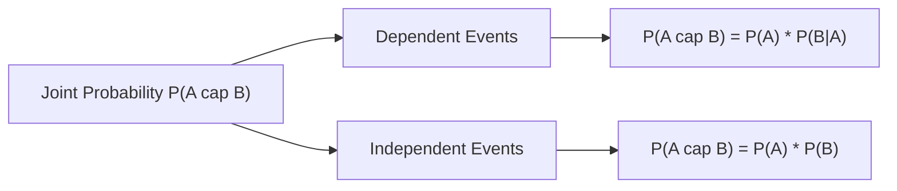

# Day 20 - Lecture 20.8: The Multiplication Rule (Gunan Niyam) [Hinglish]

[](https://www.python.org/)
[](lecture_20_08.ipynb)
[](notes.pdf)

🌐 **Language / भाषा:** [English](README.md) | **हिंदी / Hinglish** | [⬅️ Lecture 20 Module Par Wapas Jayein](../README_HINGLISH.md)

---

## 1. Overview & Concept

**Multiplication Rule** (Product Rule) do ya do se zyada events ke ek sath ghatit hone ($A \cap B$) ki joint probability nikalne ke liye use hota hai. Yeh sequential dependencies aur time-ordered process ko model karta hai.



---

## 2. Ganitiya Sutra

### Dependent Events ke liye General Rule:

$$
\boxed{P(A \cap B) = P(A) \cdot P(B \mid A)}
$$

### Independent Events ke liye Rule:
Agar $A$ aur $B$ aapas me independent hain ($P(B \mid A) = P(B)$):

$$
\boxed{P(A \cap B) = P(A) \cdot P(B)}
$$

### Probability ka Chain Rule ($n$ Events):
Large Language Models (GPT, Transformers) ka pura architecture is chain rule par tika hai:

$$
\boxed{P(w_1, w_2, \dots, w_T) = \prod_{t=1}^T P(w_t \mid w_1, \dots, w_{t-1})}
$$

---

## 3. Real-World Example: Urn Problem

Ek bag me 5 Red aur 3 Green balls hain (Total = 8 balls). Bina replacement ke 2 balls nikali gayi:
- Pehli ball Red aane ki probability: $P(A) = \frac{5}{8}$.
- Doosri ball Red aane ki probability (pehli Red nikalne ke baad): $P(B \mid A) = \frac{4}{7}$.

$$
\boxed{P(A \cap B) = \frac{5}{8} \cdot \frac{4}{7} = \frac{20}{56} = \frac{5}{14} \approx 0.3571}
$$

Agar wapas rakh kar (with replacement) nikala jaye:

$$
\boxed{P(A \cap B) = \frac{5}{8} \cdot \frac{5}{8} = \frac{25}{64} \approx 0.3906}
$$

---

## 4. Python Implementation

```python
import numpy as np

p_without = (5 / 8) * (4 / 7)
p_with = (5 / 8) * (5 / 8)

print(f"Bina Replacement ke: {p_without:.4f} (5/14)")
print(f"Replacement ke sath:  {p_with:.4f} (25/64)")
```

---

## 5. Mukhya Batein (Key Takeaways) & Interview Points
- **Next Token Prediction:** ChatGPT aur LLMs agla word predict karne ke liye isi Multiplication Chain Rule ka prayog karte hain.
- **Replacement:** Replacement ke bina draws hamesha dependent hote hain kyunki denominator badal jata hai.
