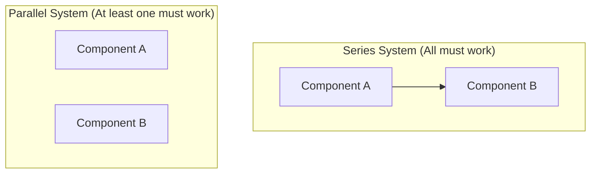

# Day 20 - Lecture 20.9: Solving Probability Rules Practice Problems

[](lecture_20_09.ipynb)
[](notes.pdf)

🌐 **Language:** **English** | [हिंदी / Hinglish](README_HINGLISH.md) | [⬅️ Back to Lecture 20 Module](../README.md)

---

## 1. Complex Compound Systems: Series vs. Parallel Reliability

In cloud infrastructure and distributed AI training systems, failure modeling relies on compound combinations of addition and multiplication rules.



---

## 2. Mathematical Formalism & Problem Deconstructions

### Problem 1: Series Reliability (Zero Fault Tolerance)
For a system to operate, Component $A$ AND Component $B$ must function simultaneously. If components operate independently with reliabilities $R_A = 0.95$ and $R_B = 0.90$:

$$
\boxed{R_{\text{series}} = P(A \cap B) = P(A) \cdot P(B) = 0.95 \cdot 0.90 = 0.855 \quad (85.5\%)}
$$

### Problem 2: Parallel Redundant Reliability (Fault Tolerant)
The system operates if Component $A$ OR Component $B$ functions. By the Complementary Rule:

$$
\boxed{R_{\text{parallel}} = 1 - P(A' \cap B') = 1 - (1 - R_A)(1 - R_B)}
$$

$$
\boxed{R_{\text{parallel}} = 1 - (0.05)(0.10) = 1 - 0.005 = 0.995 \quad (99.5\%)}
$$

### Problem 3: Two-Stage Sequential Transition Probability
A user enters a sales funnel:
- Probability of clicking Ad: $P(\text{Ad}) = 0.08$
- Probability of converting given Ad click: $P(\text{Buy} \mid \text{Ad}) = 0.25$
- Probability of converting via organic search (no Ad): $P(\text{Buy} \mid \text{No Ad}) = 0.02$

Joint probability of clicking ad and converting:

$$
\boxed{P(\text{Ad} \cap \text{Buy}) = P(\text{Ad}) \cdot P(\text{Buy} \mid \text{Ad}) = 0.08 \cdot 0.25 = 0.02 \quad (2.0\%)}
$$

---

## 3. Python Implementation & Monte Carlo Verification

```python
import numpy as np

# Component reliabilities
r_a = 0.95
r_b = 0.90
n_sims = 1_000_000

# Monte Carlo simulation of independent component operation
sim_a = np.random.binomial(1, r_a, size=n_sims)
sim_b = np.random.binomial(1, r_b, size=n_sims)

# Series System: Both must work
series_success = sim_a & sim_b
p_series_sim = np.mean(series_success)

# Parallel System: At least one works
parallel_success = sim_a | sim_b
p_parallel_sim = np.mean(parallel_success)

print(f"Series System:   Analytical = {r_a * r_b:.4f} | Simulated = {p_series_sim:.4f}")
print(f"Parallel System: Analytical = {1 - (1-r_a)*(1-r_b):.4f} | Simulated = {p_parallel_sim:.4f}")
```

---

## 4. Key Takeaways & Interview Points
- **Redundancy Principle:** Series systems degrade reliability ($R_{\text{sys}} \le \min(R_i)$); parallel redundant architectures drastically boost reliability ($R_{\text{sys}} \ge \max(R_i)$).
- **Decomposition:** Always break compound multi-stage problems into orthogonal intersections and unions before computing probabilities.
