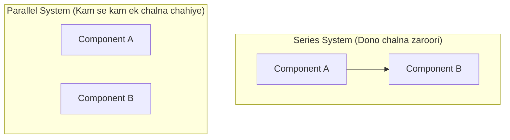

# Day 20 - Lecture 20.9: Probability Rules ke Practice Problems [Hinglish]

[](lecture_20_09.ipynb)
[](notes.pdf)

🌐 **Language / भाषा:** [English](README.md) | **हिंदी / Hinglish** | [⬅️ Lecture 20 Module Par Wapas Jayein](../README_HINGLISH.md)

---

## 1. Overview & Real-World Use Cases

Cloud architecture aur AI server clusters me system reliability calculate karne ke liye Addition, Multiplication aur Complement rules ka complex mixture use hota hai.



---

## 2. Ganitiya Sawal aur Solution

### Problem 1: Series System (Zero Fault Tolerance)
System tabhi chalega jab Component $A$ AUR Component $B$ dono sahi rahein:

$$
\boxed{R_{\text{series}} = P(A \cap B) = P(A) \cdot P(B) = 0.95 \cdot 0.90 = 0.855 \quad (85.5\%)}
$$

### Problem 2: Parallel Redundant System (Fault Tolerant)
System tab chalega jab $A$ YA $B$ me se kam se kam ek sahi kaam kare:

$$
\boxed{R_{\text{parallel}} = 1 - P(A' \cap B') = 1 - (1 - R_A)(1 - R_B)}
$$

$$
\boxed{R_{\text{parallel}} = 1 - (0.05)(0.10) = 1 - 0.005 = 0.995 \quad (99.5\%)}
$$

---

## 3. Python Implementation

```python
r_a = 0.95
r_b = 0.90

r_series = r_a * r_b
r_parallel = 1.0 - (1.0 - r_a) * (1.0 - r_b)

print(f"Series System Reliability:   {r_series:.4f} (85.5%)")
print(f"Parallel System Reliability: {r_parallel:.4f} (99.5%)")
```

---

## 4. Mukhya Batein (Key Takeaways) & Interview Points
- **Series vs Parallel:** Series me reliability kam hoti hai ($0.95 \times 0.90 = 0.855$), jabki parallel backup lagane se reliability $99.5\%$ tak pahunch jati hai.
