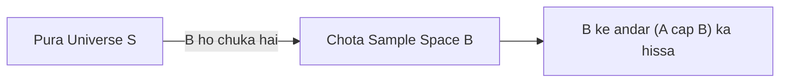

# Day 20 - Lecture 20.10: Conditional Probability (Shartiya Sambhavna) [Hinglish]

[](lecture_20_10.ipynb)
[](notes.pdf)

🌐 **Language / भाषा:** [English](README.md) | **हिंदी / Hinglish** | [⬅️ Lecture 20 Module Par Wapas Jayein](../README_HINGLISH.md)

---

## 1. Overview & Reduced Sample Space

**Conditional Probability** ($P(A \mid B)$) ka matlab hai: Agar event $B$ pehle hi ghatit ho chuka hai, toh uske baad event $A$ hone ki sambhavna kya hai. Geometrically, conditioning lagane se hamara sample space pure $\mathcal{S}$ se chota hokar sirf subset $B$ ban jata hai.



---

## 2. Ganitiya Sutra

### Formal Paribhasha:

$$
\boxed{P(A \mid B) = \frac{P(A \cap B)}{P(B)}}
$$

Discrete counting me:

$$
\boxed{P(A \mid B) = \frac{|A \cap B|}{|B|}}
$$

---

## 3. Real-World Example: Medical Data

1,000 patients ka survey:
- Smoker ($B$): 300 patients
- Non-Smoker ($B'$): 700 patients
- Smoker aur CVD bimari ($A \cap B$): 90 patients

Agar koi vyakti smoker hai, toh usko CVD hone ki probability kya hai?

$$
\boxed{P(\text{CVD} \mid \text{Smoker}) = \frac{90}{300} = 0.30 \quad (30\%)}
$$

Normal janta me CVD ki probability:

$$
\boxed{P(\text{CVD}) = \frac{125}{1000} = 0.125 \quad (12.5\%)}
$$

---

## 4. Python Implementation

```python
import pandas as pd

df = pd.DataFrame({
    'CVD_Yes': [90, 35],
    'CVD_No': [210, 665]
}, index=['Smoker', 'NonSmoker'])

p_cvd_given_smoker = df.loc['Smoker', 'CVD_Yes'] / df.loc['Smoker'].sum()
print(f"P(CVD | Smoker) = {p_cvd_given_smoker:.2f} ({p_cvd_given_smoker*100:.0f}%)")
```

---

## 5. Mukhya Batein (Key Takeaways) & Interview Points
- **Denominator Badalta Hai:** Normal probability me denominator total sample space $|\mathcal{S}|$ hota hai, jabki conditional probability me denominator given condition $|B|$ hota hai.
- **Independence Test:** Agar $P(A \mid B) = P(A)$, toh events independent hain; agar barabar nahi hain toh dependent hain.
