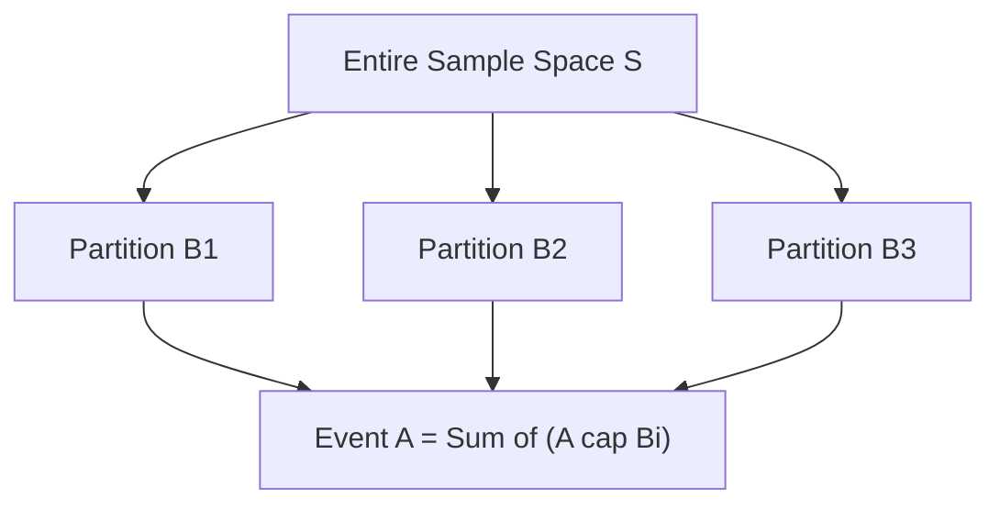

# Day 20 - Lecture 20.11: The Law of Total Probability

[](lecture_20_11.ipynb)
[](notes.pdf)

🌐 **Language:** **English** | [हिंदी / Hinglish](README_HINGLISH.md) | [⬅️ Back to Lecture 20 Module](../README.md)

---

## 1. Overview & Partition Architecture

The **Law of Total Probability** (LTP) provides the mathematical technique of **marginalization**: computing the unconditional probability of an event $A$ by summing over its intersections across an exhaustive set of mutually exclusive scenarios (a partition of the sample space).



---

## 2. Mathematical Formalism

Let $\{B_1, B_2, \dots, B_k\}$ be a partition of the sample space $\mathcal{S}$ such that:

$$
\boxed{B_i \cap B_j = \emptyset \quad \forall i \ne j \qquad\text{and}\qquad \bigcup_{i=1}^k B_i = \mathcal{S}}
$$

For any arbitrary event $A \subseteq \mathcal{S}$:

$$
\boxed{A = \bigcup_{i=1}^k (A \cap B_i)}
$$

Because all $(A \cap B_i)$ are pairwise disjoint, applying Kolmogorov's third axiom and the multiplication rule yields:

$$
\boxed{P(A) = \sum_{i=1}^k P(A \cap B_i) = \sum_{i=1}^k P(A \mid B_i) \cdot P(B_i)}
$$

### Continuous Generalization (Marginal Density in Machine Learning):
For continuous joint distributions $p(x, y)$, marginalization integrates out the nuisance latent variable $y$:

$$
\boxed{p(x) = \int_{-\infty}^\infty p(x, y) \, dy = \int_{-\infty}^\infty p(x \mid y) \, p(y) \, dy}
$$

---

## 3. Real-World Demonstrative Example

An e-commerce company manufactures smart speakers across 3 distinct factories:
- Factory 1 ($B_1$): Produces 50% of units ($P(B_1) = 0.50$), with defect rate $P(D \mid B_1) = 0.01$
- Factory 2 ($B_2$): Produces 30% of units ($P(B_2) = 0.30$), with defect rate $P(D \mid B_2) = 0.02$
- Factory 3 ($B_3$): Produces 20% of units ($P(B_3) = 0.20$), with defect rate $P(D \mid B_3) = 0.05$

What is the overall probability that a randomly purchased speaker is defective ($D$)?

$$
\begin{aligned}
P(D) &= P(D \mid B_1)P(B_1) + P(D \mid B_2)P(B_2) + P(D \mid B_3)P(B_3) \\
     &= (0.01 \cdot 0.50) + (0.02 \cdot 0.30) + (0.05 \cdot 0.20) \\
     &= 0.005 + 0.006 + 0.010 = 0.021 \quad (2.1\%)
\end{aligned}
$$

$$
\boxed{P(D) = 0.021 \quad (2.1\%)}
$$

---

## 4. Python Implementation

```python
import numpy as np

# Factory production probabilities (Partition weights)
p_factories = np.array([0.50, 0.30, 0.20])
# Conditional defect rates
p_defects_given_factory = np.array([0.01, 0.02, 0.05])

# Law of Total Probability via vector dot product
p_total_defect = np.dot(p_factories, p_defects_given_factory)

print(f"Total Defect Rate P(D): {p_total_defect:.4f} ({p_total_defect * 100:.2f}%)")

# Monte Carlo Verification (5,000,000 units)
n_units = 5_000_000
factory_choices = np.random.choice([0, 1, 2], size=n_units, p=p_factories)
defect_probs = p_defects_given_factory[factory_choices]
defects = np.random.rand(n_units) < defect_probs

print(f"Monte Carlo Simulated Defect Rate: {np.mean(defects):.4f}")
```

---

## 5. Key Takeaways & Interview Points
- **Marginalization in ML:** In Variational Autoencoders (VAEs) and Bayesian Neural Networks, calculating data likelihood $p(x)$ requires integrating over latent variables $z$ via the Law of Total Probability: $p(x) = \int p(x|z)p(z)dz$.
- **Denominator of Bayes' Rule:** The Law of Total Probability constitutes the exact denominator (marginal evidence) in Bayes' Theorem.
