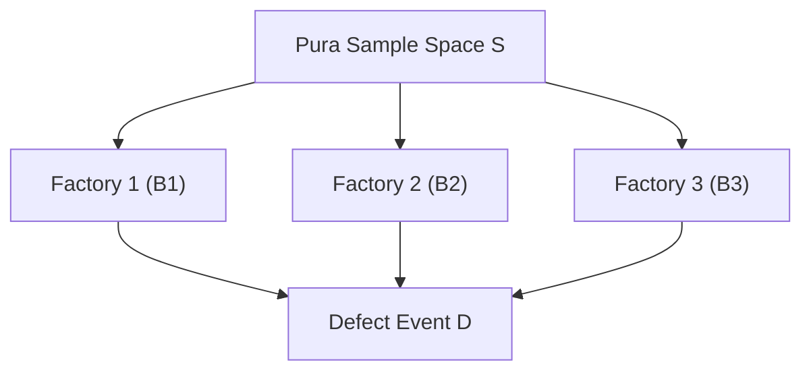

# Day 20 - Lecture 20.11: The Law of Total Probability (Kul Sambhavna ka Niyam) [Hinglish]

[](lecture_20_11.ipynb)
[](notes.pdf)

🌐 **Language / भाषा:** [English](README.md) | **हिंदी / Hinglish** | [⬅️ Lecture 20 Module Par Wapas Jayein](../README_HINGLISH.md)

---

## 1. Overview & Concept

**Law of Total Probability** (LTP) hume kisi event $A$ ki overall (marginal) probability calculate karna sikhata hai, alag-alag mutually exclusive cases (partitions) ke zariye.



---

## 2. Ganitiya Sutra

Agar $\{B_1, \dots, B_k\}$ sample space ka ek valid partition ho:

$$
\boxed{P(A) = \sum_{i=1}^k P(A \cap B_i) = \sum_{i=1}^k P(A \mid B_i) \cdot P(B_i)}
$$

Machine Learning me continuous variables ke liye:

$$
\boxed{p(x) = \int_{-\infty}^\infty p(x \mid y) \, p(y) \, dy}
$$

---

## 3. Real-World Example: 3 Factories Defect Problem

Smart speaker production:
- Factory 1 ($B_1$): $50\%$ banata hai ($P=0.50$), defect rate $1\%$ ($0.01$)
- Factory 2 ($B_2$): $30\%$ banata hai ($P=0.30$), defect rate $2\%$ ($0.02$)
- Factory 3 ($B_3$): $20\%$ banata hai ($P=0.20$), defect rate $5\%$ ($0.05$)

Overall defect probability:

$$
\begin{aligned}
P(D) &= (0.01 \cdot 0.50) + (0.02 \cdot 0.30) + (0.05 \cdot 0.20) \\
     &= 0.005 + 0.006 + 0.010 = 0.021 \quad (2.1\%)
\end{aligned}
$$

---

## 4. Python Implementation

```python
import numpy as np

p_factories = np.array([0.50, 0.30, 0.20])
p_defects = np.array([0.01, 0.02, 0.05])

p_total_defect = np.dot(p_factories, p_defects)
print(f"Total Defect Probability: {p_total_defect:.4f} ({p_total_defect*100:.1f}%)")
```

---

## 5. Mukhya Batein (Key Takeaways) & Interview Points
- **Bayes Theorem ka Har (Denominator):** Bayes Theorem ke denominator me jo total evidence $P(B)$ hota hai, woh isi Law of Total Probability se nikala jata hai.
- **Marginalization:** Machine Learning me unwanted variables ko hatane ke liye marginalization ka prayog hota hai.
