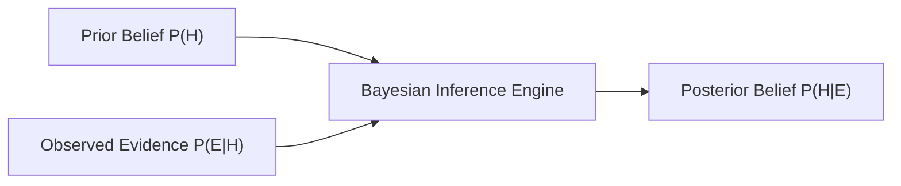

# Day 20 - Lecture 20.12: Bayes' Theorem

[](lecture_20_12.ipynb)
[](notes.pdf)

🌐 **Language:** **English** | [हिंदी / Hinglish](README_HINGLISH.md) | [⬅️ Back to Lecture 20 Module](../README.md)

---

## 1. Overview & Epistemic Belief Updating

**Bayes' Theorem** is the foundational engine of modern Bayesian machine learning, probabilistic inference, and cognitive artificial intelligence. It provides the exact mathematical framework for updating a degree of belief in a hypothesis ($H$) after observing empirical evidence ($E$).



---

## 2. Mathematical Derivation & Formulation

From the definition of conditional probability:

$$
P(H \cap E) = P(H \mid E) \cdot P(E)
$$

$$
P(H \cap E) = P(E \mid H) \cdot P(H)
$$

Equating the right-hand sides yields **Bayes' Theorem**:

$$
\boxed{P(H \mid E) = \frac{P(E \mid H) \cdot P(H)}{P(E)}}
$$

### Decomposition into Scientific Components:
1. **Prior Probability ($P(H)$):** Degree of belief in hypothesis $H$ *before* observing evidence $E$.
2. **Likelihood ($P(E \mid H)$):** Probability of observing evidence $E$ assuming hypothesis $H$ is true.
3. **Marginal Evidence ($P(E)$):** Total probability of observing evidence $E$ across all possible hypotheses, expanded via the Law of Total Probability:

$$
\boxed{P(E) = P(E \mid H)P(H) + P(E \mid H')P(H')}
$$

4. **Posterior Probability ($P(H \mid E)$):** Updated degree of belief in hypothesis $H$ *after* incorporating evidence $E$.

### Full Expanded Formulation:

$$
\boxed{P(H_i \mid E) = \frac{P(E \mid H_i) P(H_i)}{\sum_{j=1}^k P(E \mid H_j) P(H_j)}}
$$

---

## 3. Real-World Demonstrative Example

Continuing our factory example from Lecture 20.11:
- Factory 1 ($B_1$): produces 50% ($P=0.50$), defect rate 1%
- Factory 2 ($B_2$): produces 30% ($P=0.30$), defect rate 2%
- Factory 3 ($B_3$): produces 20% ($P=0.20$), defect rate 5%
- Total Defect Rate: $P(D) = 0.021$

A customer receives a **defective** speaker ($D$). What is the posterior probability that it originated from **Factory 3** ($B_3$)?

$$
\boxed{P(B_3 \mid D) = \frac{P(D \mid B_3) P(B_3)}{P(D)} = \frac{0.05 \cdot 0.20}{0.021} = \frac{0.010}{0.021} \approx 0.4762 \quad (47.62\%)}
$$

Notice the dramatic Bayesian update: Factory 3 only produces 20% of speakers, but accounts for nearly **48%** of all defective units!

---

## 4. Python Implementation

```python
import numpy as np

p_prior = np.array([0.50, 0.30, 0.20])
p_likelihood = np.array([0.01, 0.02, 0.05])

# Marginal evidence
p_evidence = np.sum(p_prior * p_likelihood)

# Posterior distribution
p_posterior = (p_prior * p_likelihood) / p_evidence

print(f"Total Evidence P(D): {p_evidence:.4f}")
print(f"Prior Probabilities:     {p_prior}")
print(f"Posterior Probabilities: {np.round(p_posterior, 4)}")
print(f"P(Factory 3 | Defect):    {p_posterior[2]:.4f} (47.62%)")
```

---

## 5. Key Takeaways & Interview Points
- **Belief Updating:** $\text{Posterior} \propto \text{Prior} \times \text{Likelihood}$.
- **Naive Bayes Classifier:** Foundation of text classification, assuming features are conditionally independent given class labels.
