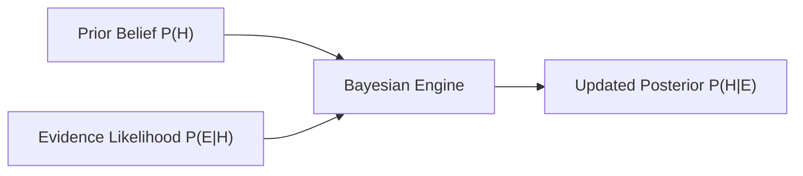

# Day 20 - Lecture 20.12: Bayes' Theorem [Hinglish]

[](lecture_20_12.ipynb)
[](notes.pdf)

🌐 **Language / भाषा:** [English](README.md) | **हिंदी / Hinglish** | [⬅️ Lecture 20 Module Par Wapas Jayein](../README_HINGLISH.md)

---

## 1. Overview & Concept

**Bayes' Theorem** Machine Learning aur Artificial Intelligence ka sabse powerful niyam hai. Yeh hume sikhata hai ki naya evidence ($E$) milne par hamara purana belief (Prior $H$) mathematically kaise update hota hai (Posterior $H \mid E$).



---

## 2. Ganitiya Sutra aur Derivation

Conditional probability se:

$$
\boxed{P(H \mid E) = \frac{P(E \mid H) \cdot P(H)}{P(E)}}
$$

### Chhaar Mukhya Ang:
1. **Prior ($P(H)$):** Evidence aane se pehle hamara belief.
2. **Likelihood ($P(E \mid H)$):** Hypothesis sach hone par is evidence ke aane ki probability.
3. **Marginal Evidence ($P(E)$):** Evidence aane ki total overall probability (Law of Total Probability se).
4. **Posterior ($P(H \mid E)$):** Naya evidence dekhne ke baad updated probability.

---

## 3. Real-World Example

Lecture 20.11 ke 3 factories ka case:
- Factory 3 ($B_3$): $20\%$ speakers banati hai, defect rate $5\%$ hai.
- Overall Defect Probability: $P(D) = 0.021$.

Agar ek defective speaker mila, toh kya probability hai ki woh Factory 3 se aaya tha?

$$
\boxed{P(B_3 \mid D) = \frac{0.05 \cdot 0.20}{0.021} = \frac{0.010}{0.021} \approx 0.4762 \quad (47.62\%)}
$$

Factory 3 sirf $20\%$ speakers banati hai, lekin defective nikle speakers me se lagbhag $48\%$ Factory 3 se hi aate hain!

---

## 4. Python Implementation

```python
import numpy as np

p_prior = np.array([0.50, 0.30, 0.20])
p_likelihood = np.array([0.01, 0.02, 0.05])

p_evidence = np.sum(p_prior * p_likelihood)
p_posterior = (p_prior * p_likelihood) / p_evidence

print(f"P(Factory 3 | Defect) = {p_posterior[2]:.4f} ({p_posterior[2]*100:.2f}%)")
```

---

## 5. Mukhya Batein (Key Takeaways) & Interview Points
- **Core Formula:** $\text{Posterior} \propto \text{Prior} \times \text{Likelihood}$.
- **Naive Bayes:** Text classification, spam filtering aur sentiment analysis ka classical algorithm isi theorem par based hai.
