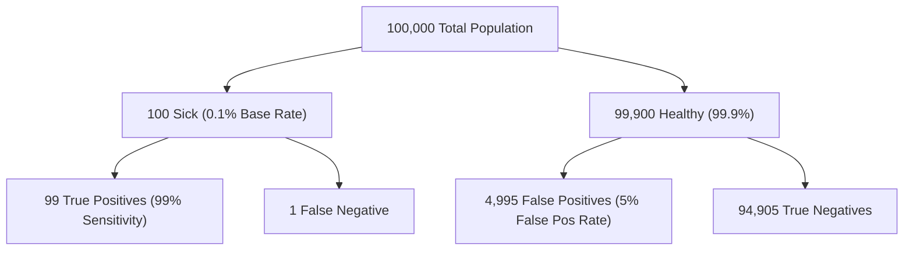

# Day 20 - Lecture 20.13: Solving Bayes' Theorem Practice Problems

[](lecture_20_13.ipynb)
[](notes.pdf)

🌐 **Language:** **English** | [हिंदी / Hinglish](README_HINGLISH.md) | [⬅️ Back to Lecture 20 Module](../README.md)

---

## 1. The Medical Testing Paradox (Base Rate Fallacy)

One of the most famous counter-intuitive applications of Bayes' Theorem is the **False Positive Paradox** in medical diagnosis and rare event fraud detection.



---

## 2. Mathematical Formalism & Problem Formulation

### Clinical Parameters:
- **Prevalence (Base Rate):** $P(D) = 0.001$ (0.1% of population has the rare disease)
- **Sensitivity (True Positive Rate):** $P(+ \mid D) = 0.99$
- **False Positive Rate:** $P(+ \mid D') = 0.05$ (Specificity is 95%)

A patient tests positive ($+$). What is the actual probability that they have the disease ($P(D \mid +)$)?

Applying Bayes' Theorem:

$$
\boxed{P(D \mid +) = \frac{P(+ \mid D) P(D)}{P(+ \mid D) P(D) + P(+ \mid D') P(D')}}
$$

Substituting values:

$$
\boxed{P(D \mid +) = \frac{0.99 \cdot 0.001}{(0.99 \cdot 0.001) + (0.05 \cdot 0.999)} = \frac{0.00099}{0.00099 + 0.04995} = \frac{0.00099}{0.05094} \approx 0.01943 \quad (1.94\%)}
$$

### The Counter-Intuitive Truth:
Even with a 99% accurate test, a positive test result only means a **~1.94% chance** of actually having the disease! Why? Because the overwhelming volume of healthy individuals ($99.9\%$) generates far more false positives ($4,995$) than true sick patients ($99$).

---

## 3. Python Implementation: Simulating the Base Rate Paradox

```python
import numpy as np

# Medical test parameters
p_disease = 0.001
p_pos_given_disease = 0.99
p_pos_given_healthy = 0.05

# Analytical Bayesian computation
numerator = p_pos_given_disease * p_disease
denominator = numerator + p_pos_given_healthy * (1 - p_disease)
p_disease_given_pos = numerator / denominator

print(f"Analytical P(Disease | Positive): {p_disease_given_pos:.4f} ({p_disease_given_pos * 100:.2f}%)")

# Monte Carlo Population Simulation (10,000,000 individuals)
n_pop = 10_000_000
has_disease = np.random.binomial(1, p_disease, size=n_pop)

test_pos = np.where(
    has_disease == 1,
    np.random.binomial(1, p_pos_given_disease, size=n_pop),
    np.random.binomial(1, p_pos_given_healthy, size=n_pop)
)

empirical_p = np.sum((has_disease == 1) & (test_pos == 1)) / np.sum(test_pos == 1)
print(f"Empirical P(Disease | Positive):  {empirical_p:.4f} ({empirical_p * 100:.2f}%)")
```

---

## 4. Key Takeaways & Interview Points
- **Base Rate Fallacy:** Human intuition ignores the prior base rate $P(D)$, focusing only on the test accuracy.
- **FinTech Fraud Parallel:** In credit card transactions, fraud occurs in $<0.01\%$ of cases. An ML model with 99% accuracy will still suffer high false alarm rates unless properly calibrated for the prior.
