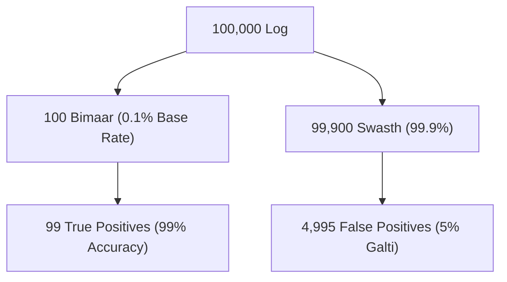

# Day 20 - Lecture 20.13: Bayes' Theorem Practice Problems [Hinglish]

[](lecture_20_13.ipynb)
[](notes.pdf)

🌐 **Language / भाषा:** [English](README.md) | **हिंदी / Hinglish** | [⬅️ Lecture 20 Module Par Wapas Jayein](../README_HINGLISH.md)

---

## 1. Medical Testing Paradox (Base Rate Fallacy)

Bayes' Theorem ka sabse famous interview problem hai **False Positive Paradox**. Yeh batata hai ki ek 99% accurate medical test positive aane par bhi bimari hone ki probability kitni kam ho sakti hai.



---

## 2. Ganitiya Solution

- Bimari ki Base Rate: $P(D) = 0.001$ (sirf $0.1\%$ logo ko hai)
- Test Accuracy: $P(+ \mid D) = 0.99$
- False Positive Rate: $P(+ \mid D') = 0.05$ (5% swasth logo ko bhi positive batata hai)

Agar kisi patient ka test **Positive** aa gaya, toh actual me bimari hone ki probability:

$$
\boxed{P(D \mid +) = \frac{0.99 \cdot 0.001}{(0.99 \cdot 0.001) + (0.05 \cdot 0.999)} = \frac{0.00099}{0.05094} \approx 0.0194 \quad (1.94\%)}
$$

Test 99% accurate hone ke bawajood patient ko bimari hone ka chance sirf **1.94%** hai! Kyunki swasth logo ki sankhya ($99.9\%$) itni badi hai ki unke 5% false alarms asali bimaar logo se bohot zyada hote hain.

---

## 3. Python Implementation

```python
p_disease = 0.001
p_pos_disease = 0.99
p_pos_healthy = 0.05

num = p_pos_disease * p_disease
den = num + p_pos_healthy * (1 - p_disease)
p_actual = num / den

print(f"P(Disease | Positive): {p_actual:.4f} ({p_actual*100:.2f}%)")
```

---

## 4. Mukhya Batein (Key Takeaways) & Interview Points
- **Base Rate Fallacy:** Prior probability ko ignore karna ek bohot badi galti hai.
- **Fraud Detection:** Credit card fraud bhi itna rare hota hai ki model ka precision prior base rate par depend karta hai.
