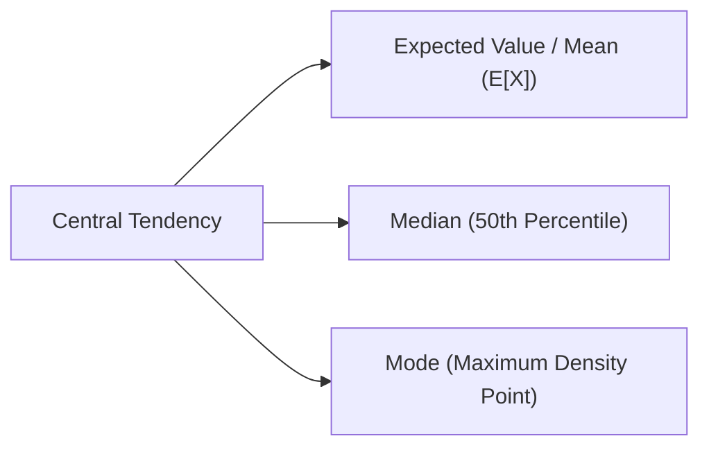
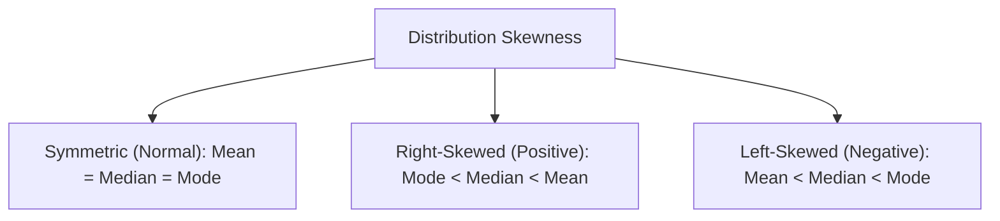

# Day 20 - Lecture 20.15: Mean, Median & Mode

[](lecture_20_15.ipynb)
[](notes.pdf)

🌐 **Language:** **English** | [हिंदी / Hinglish](README_HINGLISH.md) | [⬅️ Back to Lecture 20 Module](../README.md)

---

## 1. Overview & Measures of Central Tendency

Central tendency identifies the single central point or typical representative value within a probability distribution or dataset.



---

## 2. Mathematical Formalism

### Expected Value (Mean $\mu$):
The probability-weighted average of all possible values.

#### Discrete Random Variable:

$$
\boxed{\mathbb{E}[X] = \mu = \sum_{x \in \mathcal{X}} x \cdot p(x)}
$$

#### Continuous Random Variable:

$$
\boxed{\mathbb{E}[X] = \mu = \int_{-\infty}^\infty x \cdot f(x) \, dx}
$$

### Linearity of Expectation (Crucial Machine Learning Property):
For any random variables $X$ and $Y$ and constants $a, b, c \in \mathbb{R}$, **regardless of statistical independence**:

$$
\boxed{\mathbb{E}[aX + bY + c] = a\mathbb{E}[X] + b\mathbb{E}[Y] + c}
$$

### Median ($m$):
The value that splits the probability mass into two equal halves:

$$
\boxed{P(X \le m) \ge 0.5 \qquad\text{and}\qquad P(X \ge m) \ge 0.5}
$$

### Mode:
The value at which the probability function attains its absolute peak:

$$
\boxed{\text{Mode}(X) = \arg\max_x p(x) \quad \text{or} \quad \arg\max_x f(x)}
$$

---

## 3. Impact of Distribution Skewness



In right-skewed data (e.g., household incomes, transaction values, web latency), extreme outlier values pull the Mean upward, making the **Median** a more robust metric for central tendency.

---

## 4. Python Implementation

```python
import numpy as np
from scipy import stats

# Generate right-skewed lognormal data (e.g., web server response times)
np.random.seed(42)
latencies = np.random.lognormal(mean=2.0, sigma=0.8, size=100_000)

mean_val = np.mean(latencies)
median_val = np.median(latencies)
mode_val = stats.mode(np.round(latencies, 1), keepdims=True).mode[0]

print(f"Server Latency Metrics (Right-Skewed):")
print(f"  Mode:   {mode_val:.2f} ms")
print(f"  Median: {median_val:.2f} ms")
print(f"  Mean:   {mean_val:.2f} ms")
print(f"Ordering Holds (Mode < Median < Mean): {mode_val < median_val < mean_val}")
```

---

## 5. Key Takeaways & Interview Points
- **Linearity of Expectation Holds Universally:** $\mathbb{E}[X + Y] = \mathbb{E}[X] + \mathbb{E}[Y]$ requires **zero** assumptions about independence.
- **Robustness in Production:** Mean is sensitive to outliers; Median is immune to extreme values below the 50th percentile.
