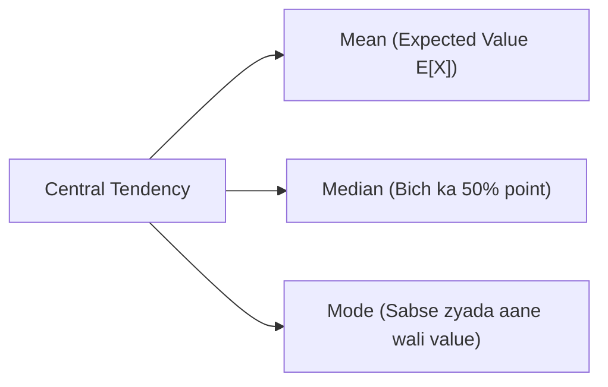

# Day 20 - Lecture 20.15: Mean, Median aur Mode [Hinglish]

[](lecture_20_15.ipynb)
[](notes.pdf)

🌐 **Language / भाषा:** [English](README.md) | **हिंदी / Hinglish** | [⬅️ Lecture 20 Module Par Wapas Jayein](../README_HINGLISH.md)

---

## 1. Overview & Central Tendency

Central Tendency ka matlab hota hai kisi data distribution ka ek representative center point nikalna.



---

## 2. Ganitiya Sutra

### Expected Value (Mean $\mu$):
Probability-weighted average:

$$
\boxed{\mathbb{E}[X] = \mu = \sum x \cdot p(x) \quad \text{(Discrete)}}
$$

$$
\boxed{\mathbb{E}[X] = \mu = \int_{-\infty}^\infty x \cdot f(x) \, dx \quad \text{(Continuous)}}
$$

### Linearity of Expectation:
Chahe variables independent ho ya na ho, yeh hamesha sach hota hai:

$$
\boxed{\mathbb{E}[aX + bY + c] = a\mathbb{E}[X] + b\mathbb{E}[Y] + c}
$$

### Skewness ka Asar:
- **Symmetric Distribution:** $\text{Mean} = \text{Median} = \text{Mode}$
- **Right Skewed (Positively Skewed):** $\text{Mode} < \text{Median} < \text{Mean}$
- **Left Skewed (Negatively Skewed):** $\text{Mean} < \text{Median} < \text{Mode}$

---

## 3. Python Implementation

```python
import numpy as np
from scipy import stats

data = np.random.lognormal(mean=2.0, sigma=0.8, size=10000)

mean_v = np.mean(data)
med_v = np.median(data)
mode_v = stats.mode(np.round(data, 1), keepdims=True).mode[0]

print(f"Mode:   {mode_v:.2f}")
print(f"Median: {med_v:.2f}")
print(f"Mean:   {mean_v:.2f}")
```

---

## 4. Mukhya Batein (Key Takeaways) & Interview Points
- **Linearity:** $\mathbb{E}[X + Y] = \mathbb{E}[X] + \mathbb{E}[Y]$ independent hone ki shart nahi mangta.
- **Outlier Immunity:** Outliers Mean ko distort kar dete hain, isliye financial aur latency data me Median prefer kiya jata hai.
