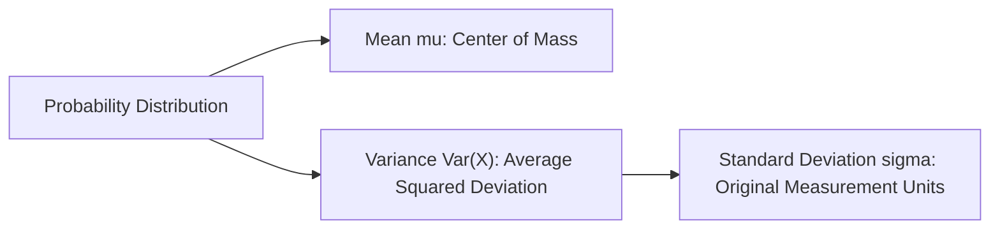

# Day 20 - Lecture 20.16: Variance & Standard Deviation

[](lecture_20_16.ipynb)
[](notes.pdf)

🌐 **Language:** **English** | [हिंदी / Hinglish](README_HINGLISH.md) | [⬅️ Back to Lecture 20 Module](../README.md)

---

## 1. Overview & Measures of Dispersion

While central tendency locates the center of a probability distribution, **Variance** and **Standard Deviation** quantify its **spread**, dispersion, and uncertainty around that center.



---

## 2. Mathematical Formalism

### Variance ($\text{Var}(X)$ or $\sigma^2$):
The expected squared deviation from the mean $\mu = \mathbb{E}[X]$:

$$
\boxed{\text{Var}(X) = \sigma^2 = \mathbb{E}\left[ (X - \mu)^2 \right]}
$$

### Computational Shortcut Theorem:

$$
\boxed{\text{Var}(X) = \mathbb{E}[X^2] - (\mathbb{E}[X])^2}
$$

### Standard Deviation ($\sigma$):
The positive square root of variance, returning the dispersion metric back to the original physical units of the measurement:

$$
\boxed{\sigma = \sqrt{\text{Var}(X)}}
$$

### Algebraic Scaling Properties:
For constants $a, b \in \mathbb{R}$:

$$
\boxed{\text{Var}(aX + b) = a^2 \text{Var}(X) \qquad\text{and}\qquad \text{SD}(aX + b) = |a| \text{SD}(X)}
$$

### Variance of Sums:
For arbitrary random variables $X$ and $Y$:

$$
\boxed{\text{Var}(X + Y) = \text{Var}(X) + \text{Var}(Y) + 2\text{Cov}(X, Y)}
$$

If $X$ and $Y$ are **statistically independent**, then $\text{Cov}(X, Y) = 0$:

$$
\boxed{\text{Var}(X + Y) = \text{Var}(X) + \text{Var}(Y)}
$$

---

## 3. Python Implementation

```python
import numpy as np

# Sample data
x = np.array([10, 12, 14, 16, 18, 20])
mu = np.mean(x)

# Method 1: Direct definition
var_def = np.mean((x - mu) ** 2)

# Method 2: Computational shortcut E[X^2] - (E[X])^2
var_shortcut = np.mean(x ** 2) - (mu ** 2)

# Standard deviation
std_dev = np.sqrt(var_def)

print(f"Mean mu:                   {mu:.2f}")
print(f"Variance (Definition):     {var_def:.4f}")
print(f"Variance (Shortcut):       {var_shortcut:.4f}")
print(f"Standard Deviation sigma:  {std_dev:.4f}")
print(f"Numpy population std check: {np.isclose(std_dev, np.std(x))}")
```

---

## 4. Key Takeaways & Interview Points
- **Units:** Variance is measured in squared units ($\text{units}^2$); Standard Deviation is measured in the original linear units.
- **Additive Shifts do NOT affect Variance:** Adding a constant $b$ shifts the entire distribution without spreading it ($\text{Var}(X + b) = \text{Var}(X)$).
- **Multiplicative Scaling:** Multiplying by $a$ amplifies variance quadratically ($a^2$).
