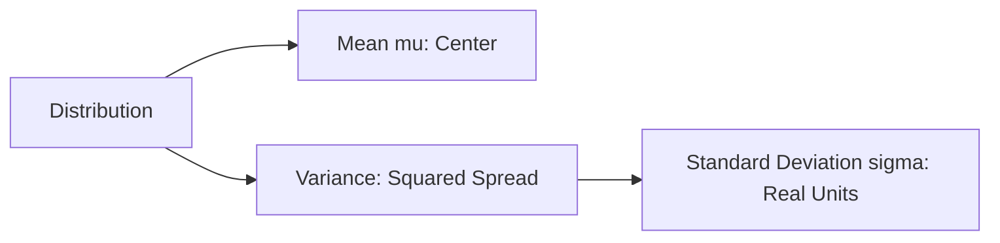

# Day 20 - Lecture 20.16: Variance aur Standard Deviation [Hinglish]

[](lecture_20_16.ipynb)
[](notes.pdf)

🌐 **Language / भाषा:** [English](README.md) | **हिंदी / Hinglish** | [⬅️ Lecture 20 Module Par Wapas Jayein](../README_HINGLISH.md)

---

## 1. Overview & Concept

Mean hume data ka center batata hai, jabki **Variance** aur **Standard Deviation** hume yeh batate hain ki data apne mean se kitna **faila hua (spread out)** hai.



---

## 2. Ganitiya Sutra

### Variance ($\sigma^2$):

$$
\boxed{\text{Var}(X) = \sigma^2 = \mathbb{E}\left[ (X - \mu)^2 \right]}
$$

Calculation shortcut:

$$
\boxed{\text{Var}(X) = \mathbb{E}[X^2] - (\mathbb{E}[X])^2}
$$

### Standard Deviation ($\sigma$):

$$
\boxed{\sigma = \sqrt{\text{Var}(X)}}
$$

### Scaling Properties:
Constants $a, b$ ke liye:

$$
\boxed{\text{Var}(aX + b) = a^2 \text{Var}(X)}
$$

$$
\boxed{\text{SD}(aX + b) = |a| \text{SD}(X)}
$$

Independent variables ke liye:

$$
\boxed{\text{Var}(X + Y) = \text{Var}(X) + \text{Var}(Y)}
$$

---

## 3. Python Implementation

```python
import numpy as np

x = np.array([10, 12, 14, 16, 18, 20])
mu = np.mean(x)
var_val = np.mean((x - mu)**2)
std_val = np.sqrt(var_val)

print(f"Mean:     {mu:.2f}")
print(f"Variance: {var_val:.2f}")
print(f"Std Dev:  {std_val:.2f}")
```

---

## 4. Mukhya Batein (Key Takeaways) & Interview Points
- **Constant Addition:** Data me koi constant jodne ya ghatane se variance nahi badalta ($\text{Var}(X + 5) = \text{Var}(X)$).
- **Constant Multiplication:** Constant multiply karne par variance $a^2$ guna ho jata hai.
