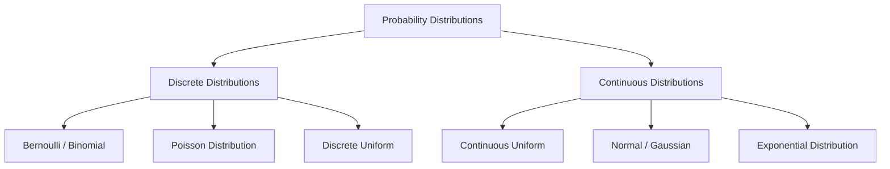

# Day 20 - Lecture 20.17: Probability Distributions & its Types

[](lecture_20_17.ipynb)
[](notes.pdf)

🌐 **Language:** **English** | [हिंदी / Hinglish](README_HINGLISH.md) | [⬅️ Back to Lecture 20 Module](../README.md)

---

## 1. Overview & Distribution Taxonomy

A **Probability Distribution** is a mathematical function that models the probability of occurrence of different possible outcomes in an experiment. It specifies the full probabilistic profile of a random variable.



---

## 2. Mathematical Formalism: PMF vs. PDF Requirements

### 1. Discrete Distributions (Probability Mass Function $p(x)$):
1. **Non-negativity:** $p(x) \ge 0 \quad \forall x \in \mathcal{X}$
2. **Total Mass Normalization:**

$$
\boxed{\sum_{x \in \mathcal{X}} p(x) = 1.0}
$$

### 2. Continuous Distributions (Probability Density Function $f(x)$):
1. **Non-negativity:** $f(x) \ge 0 \quad \forall x \in \mathbb{R}$
2. **Total Density Normalization:**

$$
\boxed{\int_{-\infty}^\infty f(x) \, dx = 1.0}
$$

> [!NOTE]
> For continuous distributions, $f(x)$ can exceed $1.0$ at local points; it is the **integral (area)** over an interval that cannot exceed $1.0$.

---

## 3. Real-World AI Mapping Matrix

| Distribution Family | Parameters | Typical AI / Machine Learning Use Case |
| :--- | :--- | :--- |
| **Bernoulli** | $p$ | Binary classification output (Logistic Regression sigmoid) |
| **Categorical / Multinomial** | $\mathbf{p} \in \Delta^{K-1}$ | Multi-class classification output (Softmax layer) |
| **Binomial** | $n, p$ | A/B testing conversion rates, ensemble voting margins |
| **Poisson** | $\lambda$ | Request arrival rates to API endpoints, traffic modeling |
| **Uniform** | $a, b$ | Weight initialization in neural networks (Xavier Uniform) |
| **Gaussian (Normal)** | $\mu, \sigma^2$ | Residual error modeling, Latent space in VAEs, Diffusion models |

---

## 4. Python Implementation

```python
import numpy as np

# Verify Discrete PMF normalization
discrete_x = np.array([1, 2, 3, 4, 5, 6])
pmf_fair_die = np.full(6, 1/6)
print(f"Discrete PMF Sum: {np.sum(pmf_fair_die):.4f} (Must equal 1.0)")

# Verify Continuous PDF normalization via numerical trapezoidal integration
from scipy.stats import norm
x_grid = np.linspace(-5, 5, 1000)
pdf_vals = norm.pdf(x_grid, loc=0, scale=1)
integral_approx = np.trapezoid(pdf_vals, x_grid)
print(f"Continuous Gaussian PDF Integral: {integral_approx:.6f} (Must approach 1.0)")
```

---

## 5. Key Takeaways & Interview Points
- **PMF vs PDF:** PMF values are probabilities ($P(X=x) \le 1$). PDF values are densities ($f(x)$ can exceed 1, but area integrates to 1).
- **Core Modeling Assumption:** Every supervised learning loss function implies a specific probability distribution on the target variable.
