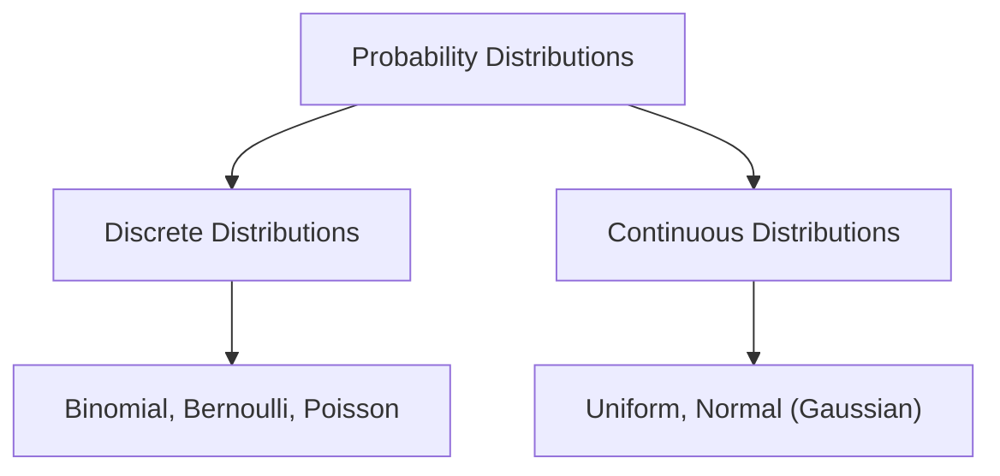

# Day 20 - Lecture 20.17: Probability Distributions aur Uske Types [Hinglish]

[](lecture_20_17.ipynb)
[](notes.pdf)

🌐 **Language / भाषा:** [English](README.md) | **हिंदी / Hinglish** | [⬅️ Lecture 20 Module Par Wapas Jayein](../README_HINGLISH.md)

---

## 1. Overview & Concept

**Probability Distribution** ek ganitiya function hota hai jo random variable ke sabhi possible outcomes aur unki probability ko define karta hai.



---

## 2. Ganitiya Niyam

### Discrete Distributions (PMF):

$$
\boxed{\sum_{x} p(x) = 1.0}
$$

### Continuous Distributions (PDF):

$$
\boxed{\int_{-\infty}^\infty f(x) \, dx = 1.0}
$$

---

## 3. Machine Learning me Use Cases

- **Bernoulli:** Logistic Regression ka sigmoid output ($0$ ya $1$).
- **Categorical:** Neural networks ka Softmax layer ($K$ classes).
- **Uniform:** Weights initialization (Xavier Uniform).
- **Normal (Gaussian):** VAEs ka latent space, Linear Regression ke residuals, Diffusion models.

---

## 4. Python Implementation

```python
import numpy as np
from scipy.stats import norm

# Discrete Sum
pmf = np.array([0.2, 0.3, 0.5])
print(f"Discrete Sum: {np.sum(pmf):.2f}")

# Continuous Integral
x = np.linspace(-5, 5, 1000)
pdf = norm.pdf(x, 0, 1)
print(f"Gaussian Integral: {np.trapezoid(pdf, x):.4f}")
```

---

## 5. Mukhya Batein (Key Takeaways) & Interview Points
- **PDF vs PMF:** PMF me $P(X=x)$ seedhe probability deta hai. PDF me point probability 0 hoti hai aur area probability deta hai.
