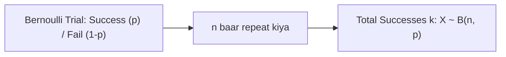

# Day 20 - Lecture 20.18: Binomial Distribution (Dvipad Vantann) [Hinglish]

[](lecture_20_18.ipynb)
[](notes.pdf)

🌐 **Language / भाषा:** [English](README.md) | **हिंदी / Hinglish** | [⬅️ Lecture 20 Module Par Wapas Jayein](../README_HINGLISH.md)

---

## 1. Overview & Concept

**Binomial Distribution** $n$ independent **Bernoulli trials** me $k$ successes aane ki exact probability batata hai, jahan har trial me success ki probability $p$ constant rehti hai.



---

## 2. Ganitiya Sutra

### Probability Mass Function (PMF):

$$
\boxed{P(X = k) = \binom{n}{k} p^k (1 - p)^{n - k}}
$$

### Mean aur Variance:

$$
\boxed{\mathbb{E}[X] = \mu = n \cdot p}
$$

$$
\boxed{\text{Var}(X) = \sigma^2 = n \cdot p \cdot (1 - p)}
$$

---

## 3. Real-World Example

5 users website par aaye ($n = 5$). Har user ke khareedne ki probability $p = 0.5$ hai. Exactly 3 users khareedein ($k = 3$) uski probability:

$$
\boxed{P(X = 3) = \binom{5}{3} (0.5)^3 (0.5)^2 = 10 \times \frac{1}{32} = \frac{5}{16} = 0.3125 \quad (31.25\%)}
$$

---

## 4. Python Implementation

```python
from scipy.stats import binom

n = 5
k = 3
p = 0.5

prob = binom.pmf(k, n, p)
print(f"P(X = 3) = {prob:.4f} (Exact: 5/16)")
```

---

## 5. Mukhya Batein (Key Takeaways) & Interview Points
- **Variance Peak:** Variance sabse zyada tab hota hai jab $p = 0.5$ ho.
- **CLT Connection:** Jab $n$ bada hota hai, Binomial distribution Normal distribution ban jata hai.
