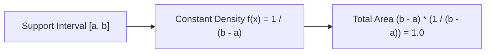

# Day 20 - Lecture 20.19: Uniform Distribution

[](lecture_20_19.ipynb)
[](notes.pdf)

🌐 **Language:** **English** | [हिंदी / Hinglish](README_HINGLISH.md) | [⬅️ Back to Lecture 20 Module](../README.md)

---

## 1. Overview & Principle of Maximum Entropy

The **Continuous Uniform Distribution** $\mathcal{U}(a, b)$ assigns perfectly equal probability density across all sub-intervals of equal length within the support $[a, b]$. Under bounded support with no prior information, the uniform distribution maximizes Shannon entropy.



---

## 2. Mathematical Formalism

### Probability Density Function (PDF):

$$
\boxed{f(x) = \begin{cases} \dfrac{1}{b - a} & \text{for } a \le x \le b \\ 0 & \text{otherwise} \end{cases}}
$$

### Cumulative Distribution Function (CDF):

$$
\boxed{F(x) = \begin{cases} 0 & \text{for } x < a \\ \dfrac{x - a}{b - a} & \text{for } a \le x \le b \\ 1 & \text{for } x > b \end{cases}}
$$

### Mathematical Derivation of Moments:

#### Expected Value (Mean $\mu$):

$$
\boxed{\mathbb{E}[X] = \int_a^b x \cdot \frac{1}{b - a} \, dx = \frac{1}{b - a} \left[ \frac{x^2}{2} \right]_a^b = \frac{b^2 - a^2}{2(b - a)} = \frac{a + b}{2}}
$$

#### Second Moment $\mathbb{E}[X^2]$:

$$
\mathbb{E}[X^2] = \int_a^b x^2 \cdot \frac{1}{b - a} \, dx = \frac{b^3 - a^3}{3(b - a)} = \frac{a^2 + ab + b^2}{3}
$$

#### Variance ($\sigma^2$):

$$
\text{Var}(X) = \mathbb{E}[X^2] - (\mathbb{E}[X])^2 = \frac{a^2 + ab + b^2}{3} - \frac{a^2 + 2ab + b^2}{4}
$$

$$
\boxed{\text{Var}(X) = \frac{(b - a)^2}{12} \qquad\text{and}\qquad \sigma = \frac{b - a}{\sqrt{12}}}
$$

---

## 3. Python Implementation & Simulation

```python
import numpy as np
import matplotlib.pyplot as plt

# Generate 1,000,000 samples from U(0, 10)
a, b = 0.0, 10.0
n_samples = 1_000_000
values = np.random.uniform(a, b, n_samples)

mean_ana = (a + b) / 2
var_ana = ((b - a) ** 2) / 12

print(f"Uniform U({a}, {b}) Parameters:")
print(f"  Analytical Mean:     {mean_ana:.4f} | Empirical: {np.mean(values):.4f}")
print(f"  Analytical Variance: {var_ana:.4f} | Empirical: {np.var(values):.4f}")
print(f"  Theoretical PDF:     1/(b-a) = {1/(b-a):.4f}")
```

---

## 4. Key Takeaways & Interview Points
- **The "Over 12" Divisor:** The denominator $12$ in $\text{Var}(X) = \frac{(b-a)^2}{12}$ is a favorite interview derivation test.
- **Neural Network Weight Initialization:** He and Xavier Uniform initializations sample weights from $\mathcal{U}\left(-\sqrt{\frac{6}{n_{\text{in}} + n_{\text{out}}}}, +\sqrt{\frac{6}{n_{\text{in}} + n_{\text{out}}}}\right)$ to maintain variance across layers.
